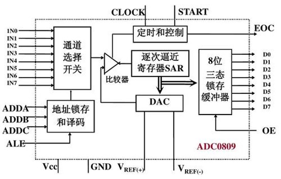
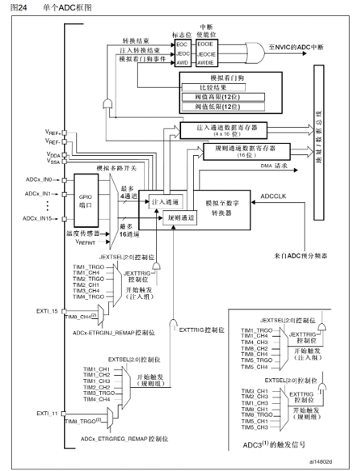
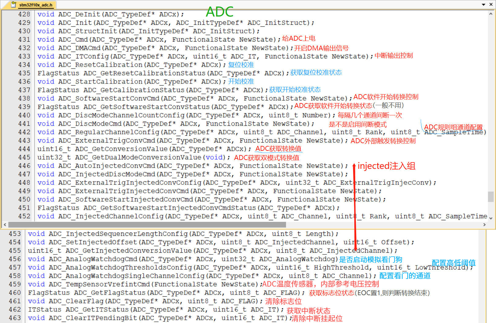

# STM32 ADC

---

## 1. ADC 简介

ADC（Analog-Digital Converter）模拟-数字转换器，是STM32微控制器中用于将模拟信号转换为数字信号的重要外设。

- **功能**：将引脚上连续变化的模拟电压转换为内存中存储的数字变量，建立模拟电路到数字电路的桥梁
- **转换精度**：12位逐次逼近型ADC，转换时间1us
- **输入范围**：0~3.3V，转换结果范围：0~4095
- **输入通道**：18个输入通道，可测量16个外部和2个内部信号源
- **转换单元**：规则组和注入组两个转换单元
- **看门狗**：模拟看门狗自动监测输入电压范围

---

## 2. ADC 基本概念

### 2.1 模拟-数字转换

模拟-数字转换是指将连续的模拟信号转换为离散的数字信号的过程，ADC通过采样、量化和编码三个步骤完成转换。

### 2.2 逐次逼近型ADC

逐次逼近型ADC是一种常用的ADC类型，通过逐次逼近的方式确定模拟电压对应的数字值：

- **转换原理**：从最高位开始，逐位试探，直到确定所有位的值
- **转换时间**：1us
- **转换精度**：12位



### 2.3 ADC转换时间

ADC转换的步骤：采样、保持、量化、编码

STM32ADC的总转换时间为：
Tconv = 采样时间 + 12.5个ADC周期

例如：当ADCCLK=14MHz，采样时间为1.5个ADC周期
Tconv = 1.5 + 12.5 = 14个ADC周期 = 1μs

---

## 3. ADC 结构

### 3.1 ADC 基本结构

ADC的基本结构包括：

- **输入通道**：16个外部输入通道和2个内部信号源
- **采样保持电路**：对输入信号进行采样和保持
- **逐次逼近寄存器**：用于逐次逼近转换
- **数据寄存器**：存储转换结果
- **规则组**：用于常规的ADC转换
- **注入组**：用于紧急的ADC转换
- **模拟看门狗**：监测输入电压范围


### 3.2 ADC 框图



---

## 4. ADC 功能特点

### 4.1 输入通道

- **外部通道**：16个外部输入通道，对应GPIO引脚
- **内部通道**：2个内部信号源（温度传感器、内部参考电压）
- **STM32F103C8T6**：ADC1、ADC2，10个外部输入通道

### 4.2 转换模式

| 模式 | 说明 |
|------|------|
| 单次转换，非扫描模式 | 只转换一个通道，转换一次后停止 |
| 连续转换，非扫描模式 | 只转换一个通道，连续转换 |
| 单次转换，扫描模式 | 转换多个通道，转换一次后停止 |
| 连续转换，扫描模式 | 转换多个通道，连续转换 |

### 4.3 规则组和注入组

- **规则组**：用于常规的ADC转换，最多16个通道
- **注入组**：用于紧急的ADC转换，最多4个通道，可以打断规则组的转换

### 4.4 模拟看门狗

- **功能**：自动监测输入电压范围
- **触发**：当输入电压超出设定范围时触发中断或事件
- **类型**：独立看门狗（监测单个通道）和通用看门狗（监测所有通道）

### 4.5 触发控制

ADC1和ADC2用于规则通道的外部触发：

| 触发源 | 类型 | EXTSEL[2:0] |
|---------|------|--------------|
| TIM1_CC1事件 | 来自片上定时器的内部信号 | 000 |
| TIM1_CC2事件 | 来自片上定时器的内部信号 | 001 |
| TIM1_CC3事件 | 来自片上定时器的内部信号 | 010 |
| TIM2_CC2事件 | 来自片上定时器的内部信号 | 011 |
| TIM3_TRGO事件 | 来自片上定时器的内部信号 | 100 |
| TIM4_CC4事件 | 来自片上定时器的内部信号 | 101 |
| EXTI线11/TIM8_TRGO事件(1x2) | 外部引脚/来自片上定时器的内部信号 | 110 |
| 软件控制位 | SWSTART | 111 |

---

## 5. ADC 相关函数

### 5.1 初始化函数

| 函数名称 | 功能说明 |
|---------|----------|
| ADC_Init() | 初始化ADC配置 |
| ADC_StructInit() | 将ADC结构体初始化为默认值 |

### 5.2 规则组配置函数

| 函数名称 | 功能说明 |
|---------|----------|
| ADC_RegularChannelConfig() | 配置规则组通道 |
| ADC_SoftwareStartConvCmd() | 软件启动ADC转换 |
| ADC_GetConversionValue() | 获取ADC转换结果 |
| ADC_ExternalTrigConvCmd() | 配置外部触发转换 |

### 5.3 注入组配置函数

| 函数名称 | 功能说明 |
|---------|----------|
| ADC_InjectedChannelConfig() | 配置注入组通道 |
| ADC_ExternalTrigInjectedConvConfig() | 配置注入组外部触发 |
| ADC_StartCalibration() | 启动ADC校准 |

### 5.4 状态查询函数

| 函数名称 | 功能说明 |
|---------|----------|
| ADC_GetFlagStatus() | 获取ADC标志位状态 |
| ADC_ClearFlag() | 清除ADC标志位 |
| ADC_GetITStatus() | 获取ADC中断状态 |
| ADC_ClearITPendingBit() | 清除ADC中断挂起位 |

### 5.5 模拟看门狗函数

| 函数名称 | 功能说明 |
|---------|----------|
| ADC_AnalogWatchdogCmd() | 使能或禁用模拟看门狗 |
| ADC_AnalogWatchdogThresholdsConfig() | 配置模拟看门狗阈值 |
| ADC_AnalogWatchdogSingleChannelConfig() | 配置模拟看门狗监测通道 |



---

## 6. ADC 配置步骤

### 6.1 基本配置步骤

1. **使能ADC时钟**：调用`RCC_APB2PeriphClockCmd()`使能ADC时钟
2. **使能GPIO时钟**：调用`RCC_APB2PeriphClockCmd()`使能GPIO时钟
3. **配置GPIO为模拟输入**：设置GPIO为模拟输入模式
4. **初始化ADC**：配置ADC模式、数据对齐、扫描模式等参数
5. **配置规则组通道**：设置要转换的通道和采样时间
6. **使能ADC**：调用`ADC_Cmd()`使能ADC
7. **校准ADC**：调用`ADC_StartCalibration()`校准ADC
8. **启动ADC转换**：调用`ADC_SoftwareStartConvCmd()`启动转换
9. **读取转换结果**：调用`ADC_GetConversionValue()`获取转换结果

### 6.2 多通道配置步骤

1. **使能ADC时钟**：调用`RCC_APB2PeriphClockCmd()`使能ADC时钟
2. **使能GPIO时钟**：调用`RCC_APB2PeriphClockCmd()`使能GPIO时钟
3. **配置GPIO为模拟输入**：设置多个GPIO为模拟输入模式
4. **初始化ADC**：配置ADC模式、数据对齐、扫描模式等参数
5. **配置规则组通道**：设置多个要转换的通道和采样时间
6. **使能DMA**：配置DMA用于自动传输转换结果
7. **使能ADC**：调用`ADC_Cmd()`使能ADC
8. **校准ADC**：调用`ADC_StartCalibration()`校准ADC
9. **启动ADC转换**：调用`ADC_SoftwareStartConvCmd()`启动转换
10. **读取转换结果**：从DMA缓冲区读取转换结果

---

## 7. 示例代码

### 7.1 单通道ADC配置示例

```c
// ADC初始化函数
void ADC1_Init(void)
{
    GPIO_InitTypeDef GPIO_InitStructure;
    ADC_InitTypeDef ADC_InitStructure;
    
    // 使能ADC1和GPIOA时钟
    RCC_APB2PeriphClockCmd(RCC_APB2Periph_ADC1 | RCC_APB2Periph_GPIOA, ENABLE);
    
    // 配置PA0为模拟输入
    GPIO_InitStructure.GPIO_Pin = GPIO_Pin_0;
    GPIO_InitStructure.GPIO_Mode = GPIO_Mode_AIN;
    GPIO_Init(GPIOA, &GPIO_InitStructure);
    
    // 配置ADC1
    ADC_InitStructure.ADC_Mode = ADC_Mode_Independent;
    ADC_InitStructure.ADC_ScanConvMode = DISABLE;
    ADC_InitStructure.ADC_ContinuousConvMode = DISABLE;
    ADC_InitStructure.ADC_ExternalTrigConv = ADC_ExternalTrigConv_None;
    ADC_InitStructure.ADC_DataAlign = ADC_DataAlign_Right;
    ADC_InitStructure.ADC_NbrOfChannel = 1;
    ADC_Init(ADC1, &ADC_InitStructure);
    
    // 配置规则组通道0
    ADC_RegularChannelConfig(ADC1, ADC_Channel_0, 1, ADC_SampleTime_55Cycles5);
    
    // 使能ADC1
    ADC_Cmd(ADC1, ENABLE);
    
    // 校准ADC1
    ADC_ResetCalibration(ADC1);
    while(ADC_GetResetCalibrationStatus(ADC1));
    ADC_StartCalibration(ADC1);
    while(ADC_GetCalibrationStatus(ADC1));
}

// 读取ADC值
uint16_t ADC1_Read(void)
{
    ADC_SoftwareStartConvCmd(ADC1, ENABLE);
    while(!ADC_GetFlagStatus(ADC1, ADC_FLAG_EOC));
    return ADC_GetConversionValue(ADC1);
}

// 将ADC值转换为电压
float ADC1_GetVoltage(uint16_t adc_value)
{
    return (float)adc_value * 3.3 / 4095;
}
```

### 7.2 多通道ADC配置示例

```c
// 多通道ADC初始化函数
void ADC1_MultiChannel_Init(void)
{
    GPIO_InitTypeDef GPIO_InitStructure;
    ADC_InitTypeDef ADC_InitStructure;
    DMA_InitTypeDef DMA_InitStructure;
    
    // 使能ADC1、GPIOA和DMA1时钟
    RCC_APB2PeriphClockCmd(RCC_APB2Periph_ADC1 | RCC_APB2Periph_GPIOA, ENABLE);
    RCC_AHBPeriphClockCmd(RCC_AHBPeriph_DMA1, ENABLE);
    
    // 配置PA0、PA1、PA2为模拟输入
    GPIO_InitStructure.GPIO_Pin = GPIO_Pin_0 | GPIO_Pin_1 | GPIO_Pin_2;
    GPIO_InitStructure.GPIO_Mode = GPIO_Mode_AIN;
    GPIO_Init(GPIOA, &GPIO_InitStructure);
    
    // 配置DMA1通道1
    DMA_DeInit(DMA1_Channel1);
    DMA_InitStructure.DMA_PeripheralBaseAddr = (uint32_t)&(ADC1->DR);
    DMA_InitStructure.DMA_MemoryBaseAddr = (uint32_t)ADC_Value;
    DMA_InitStructure.DMA_DIR = DMA_DIR_PeripheralSRC;
    DMA_InitStructure.DMA_BufferSize = 3;
    DMA_InitStructure.DMA_PeripheralInc = DMA_PeripheralInc_Disable;
    DMA_InitStructure.DMA_MemoryInc = DMA_MemoryInc_Enable;
    DMA_InitStructure.DMA_PeripheralDataSize = DMA_PeripheralDataSize_HalfWord;
    DMA_InitStructure.DMA_MemoryDataSize = DMA_MemoryDataSize_HalfWord;
    DMA_InitStructure.DMA_Mode = DMA_Mode_Circular;
    DMA_InitStructure.DMA_Priority = DMA_Priority_High;
    DMA_InitStructure.DMA_M2M = DMA_M2M_Disable;
    DMA_Init(DMA1_Channel1, &DMA_InitStructure);
    DMA_Cmd(DMA1_Channel1, ENABLE);
    
    // 配置ADC1
    ADC_InitStructure.ADC_Mode = ADC_Mode_Independent;
    ADC_InitStructure.ADC_ScanConvMode = ENABLE;
    ADC_InitStructure.ADC_ContinuousConvMode = ENABLE;
    ADC_InitStructure.ADC_ExternalTrigConv = ADC_ExternalTrigConv_None;
    ADC_InitStructure.ADC_DataAlign = ADC_DataAlign_Right;
    ADC_InitStructure.ADC_NbrOfChannel = 3;
    ADC_Init(ADC1, &ADC_InitStructure);
    
    // 配置规则组通道
    ADC_RegularChannelConfig(ADC1, ADC_Channel_0, 1, ADC_SampleTime_55Cycles5);
    ADC_RegularChannelConfig(ADC1, ADC_Channel_1, 2, ADC_SampleTime_55Cycles5);
    ADC_RegularChannelConfig(ADC1, ADC_Channel_2, 3, ADC_SampleTime_55Cycles5);
    
    // 使能ADC1的DMA
    ADC_DMACmd(ADC1, ENABLE);
    
    // 使能ADC1
    ADC_Cmd(ADC1, ENABLE);
    
    // 校准ADC1
    ADC_ResetCalibration(ADC1);
    while(ADC_GetResetCalibrationStatus(ADC1));
    ADC_StartCalibration(ADC1);
    while(ADC_GetCalibrationStatus(ADC1));
    
    // 启动ADC转换
    ADC_SoftwareStartConvCmd(ADC1, ENABLE);
}
```

### 7.3 模拟看门狗配置示例

```c
// 模拟看门狗初始化函数
void ADC1_AnalogWatchdog_Init(void)
{
    ADC_InitTypeDef ADC_InitStructure;
    NVIC_InitTypeDef NVIC_InitStructure;
    
    // 使能ADC1和GPIOA时钟
    RCC_APB2PeriphClockCmd(RCC_APB2Periph_ADC1 | RCC_APB2Periph_GPIOA, ENABLE);
    
    // 配置PA0为模拟输入
    GPIO_InitStructure.GPIO_Pin = GPIO_Pin_0;
    GPIO_InitStructure.GPIO_Mode = GPIO_Mode_AIN;
    GPIO_Init(GPIOA, &GPIO_InitStructure);
    
    // 配置ADC1
    ADC_InitStructure.ADC_Mode = ADC_Mode_Independent;
    ADC_InitStructure.ADC_ScanConvMode = DISABLE;
    ADC_InitStructure.ADC_ContinuousConvMode = ENABLE;
    ADC_InitStructure.ADC_ExternalTrigConv = ADC_ExternalTrigConv_None;
    ADC_InitStructure.ADC_DataAlign = ADC_DataAlign_Right;
    ADC_InitStructure.ADC_NbrOfChannel = 1;
    ADC_Init(ADC1, &ADC_InitStructure);
    
    // 配置规则组通道0
    ADC_RegularChannelConfig(ADC1, ADC_Channel_0, 1, ADC_SampleTime_55Cycles5);
    
    // 配置模拟看门狗
    ADC_AnalogWatchdogCmd(ADC1, ADC_AnalogWatchdog_SingleRegEnable);
    ADC_AnalogWatchdogSingleChannelConfig(ADC1, ADC_Channel_0);
    ADC_AnalogWatchdogThresholdsConfig(ADC1, 1000, 3000);
    
    // 配置ADC看门狗中断
    ADC_ITConfig(ADC1, ADC_IT_AWD, ENABLE);
    
    // 配置NVIC
    NVIC_InitStructure.NVIC_IRQChannel = ADC1_2_IRQn;
    NVIC_InitStructure.NVIC_IRQChannelPreemptionPriority = 0;
    NVIC_InitStructure.NVIC_IRQChannelSubPriority = 0;
    NVIC_InitStructure.NVIC_IRQChannelCmd = ENABLE;
    NVIC_Init(&NVIC_InitStructure);
    
    // 使能ADC1
    ADC_Cmd(ADC1, ENABLE);
    
    // 校准ADC1
    ADC_ResetCalibration(ADC1);
    while(ADC_GetResetCalibrationStatus(ADC1));
    ADC_StartCalibration(ADC1);
    while(ADC_GetCalibrationStatus(ADC1));
    
    // 启动ADC转换
    ADC_SoftwareStartConvCmd(ADC1, ENABLE);
}

// ADC1_2中断服务函数
void ADC1_2_IRQHandler(void)
{
    if (ADC_GetITStatus(ADC1, ADC_IT_AWD) != RESET)
    {
        // 模拟看门狗触发，处理电压异常
        LED_On();
        
        // 清除中断标志位
        ADC_ClearITPendingBit(ADC1, ADC_IT_AWD);
    }
}
```

---

## 8. 总结

ADC是STM32微控制器中用于模拟-数字转换的重要外设，通过合理配置ADC，可以实现：

- **模拟信号采集**：采集各种传感器的模拟信号
- **电压测量**：测量电压值，用于电压监控
- **温度测量**：使用内部温度传感器测量芯片温度
- **电池电量检测**：检测电池电量，用于电源管理

掌握ADC的配置和使用方法，对于STM32的模拟信号处理非常重要。通过本文档的学习，希望读者能够熟练掌握ADC的使用技巧，为STM32项目开发提供可靠的模拟-数字转换支持。