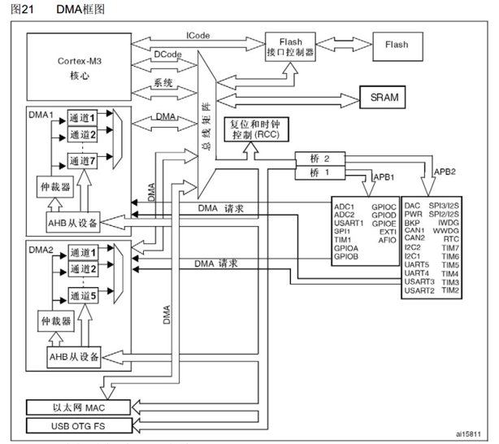
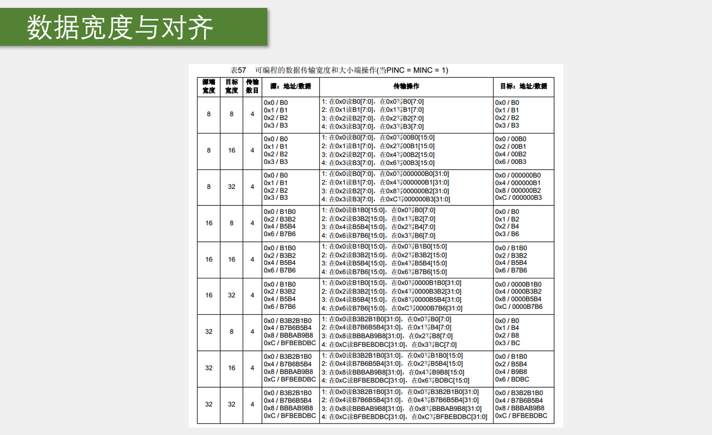
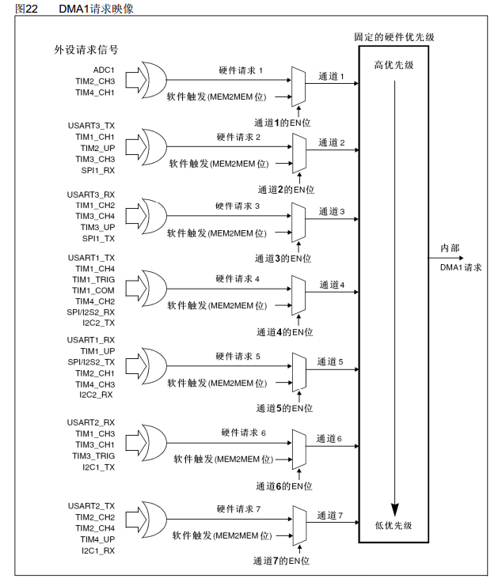
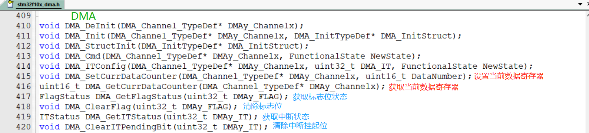
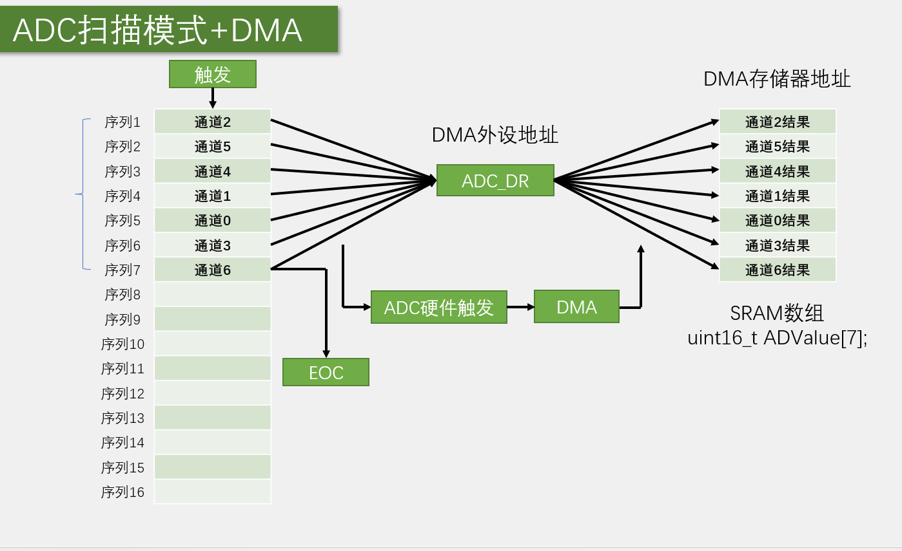
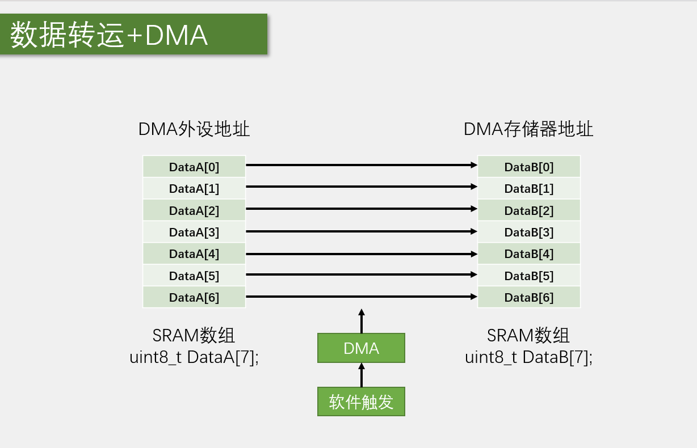

# STM32 DMA

---

## 1. DMA 简介

DMA（Direct Memory Access）直接存储器存取，是STM32微控制器中用于高速数据传输的重要外设。

- **功能**：提供外设和存储器或者存储器和存储器之间的高速数据传输，无须CPU干预，节省了CPU的资源
- **通道数量**：12个独立可配置的通道，DMA1（7个通道），DMA2（5个通道）
- **触发方式**：每个通道都支持软件触发和特定的硬件触发
- **STM32F103C8T6**：DMA1（7个通道）

---

## 2. DMA 基本概念

### 2.1 直接存储器存取

直接存储器存取（DMA）是一种数据传输技术，允许外设直接访问存储器，而不需要CPU的干预，从而大大提高了数据传输效率。

### 2.2 DMA优势

- **节省CPU资源**：CPU不需要参与数据传输，可以执行其他任务
- **提高传输效率**：DMA可以以更高的速度进行数据传输
- **降低功耗**：减少CPU的运行时间，降低系统功耗
- **支持多种传输模式**：支持存储器到存储器、存储器到外设、外设到存储器等传输模式

---

## 3. DMA 结构

### 3.1 DMA 基本结构

DMA的基本结构包括：

- **通道控制器**：控制DMA通道的配置和操作
- **地址寄存器**：存储源地址和目的地址
- **数据计数器**：记录剩余要传输的数据量
- **配置寄存器**：配置传输方向、数据宽度、传输模式等参数
- **中断控制器**：管理DMA中断


### 3.2 DMA 框图



---

## 4. DMA 存储器映像

STM32的存储器映像如下：

| 存储器 | 起始地址 | 结束地址 | 类型 | 用途 |
|---------|----------|----------|------|------|
| 程序存储器Flash | 0x0800 0000 | 0x1FFF F000 | ROM | 存储C语言编译后的程序代码 |
| 系统存储器 | 0x1FFF F800 | 0x1FFF FFFF | ROM | 存储BootLoader，用于串口下载 |
| 选项字节 | 0x1FFF F800 | 0x1FFF FFFF | ROM | 存储一些独立于程序代码的配置参数 |
| 运行内存SRAM | 0x2000 0000 | 0x2000 4FFF | RAM | 存储运行过程中的临时变量 |
| 外设寄存器 | 0x4000 0000 | 0x5FFF FFFF | - | 存储各个外设的配置参数 |
| 内核外设寄存器 | 0xE000 0000 | 0xE00F FFFF | - | 存储内核各个外设的配置参数 |

---

## 5. DMA 功能特点

### 5.1 通道配置

- **DMA1**：7个通道（DMA1_Channel1~DMA1_Channel7）
- **DMA2**：5个通道（DMA2_Channel1~DMA2_Channel5）
- **独立配置**：每个通道都可以独立配置传输参数
- **优先级**：支持软件配置通道优先级

### 5.2 传输方向

| 传输方向 | 说明 |
|---------|------|
| 存储器到存储器 | 从一个存储器地址传输数据到另一个存储器地址 |
| 存储器到外设 | 从存储器传输数据到外设寄存器 |
| 外设到存储器 | 从外设寄存器传输数据到存储器 |

### 5.3 数据传输模式

- **正常模式**：传输指定数量的数据后停止
- **循环模式**：传输指定数量的数据后自动重新开始，适用于循环缓冲区

### 5.4 数据宽度和对齐



- **数据宽度**：支持8位、16位、32位数据宽度
- **地址增量**：源地址和目的地址可以配置为自动递增或固定
- **对齐要求**：数据传输时需要考虑地址对齐

### 5.5 DMA请求



每个DMA通道都有特定的硬件触发源，常见的触发源包括：

- **ADC**：ADC转换完成
- **USART**：USART接收/发送
- **SPI**：SPI接收/发送
- **I2C**：I2C接收/发送
- **TIM**：定时器更新、捕获/比较事件

---

## 6. DMA 相关函数

### 6.1 初始化函数

| 函数名称 | 功能说明 |
|---------|----------|
| DMA_DeInit() | 将DMA通道寄存器重置为默认值 |
| DMA_Init() | 初始化DMA通道配置 |
| DMA_StructInit() | 将DMA结构体初始化为默认值 |

### 6.2 控制函数

| 函数名称 | 功能说明 |
|---------|----------|
| DMA_Cmd() | 使能或禁用DMA通道 |
| DMA_SetCurrDataCounter() | 设置当前数据传输计数器 |
| DMA_GetCurrDataCounter() | 获取当前数据传输计数器值 |

### 6.3 中断配置函数

| 函数名称 | 功能说明 |
|---------|----------|
| DMA_ITConfig() | 配置DMA中断 |
| DMA_GetFlagStatus() | 获取DMA标志位状态 |
| DMA_ClearFlag() | 清除DMA标志位 |
| DMA_GetITStatus() | 获取DMA中断状态 |
| DMA_ClearITPendingBit() | 清除DMA中断挂起位 |



---

## 7. DMA 配置步骤

### 7.1 基本配置步骤

1. **使能DMA时钟**：调用`RCC_AHBPeriphClockCmd()`使能DMA时钟
2. **配置DMA通道**：设置外设基地址、存储器基地址、传输方向、数据宽度等参数
3. **配置DMA中断**：根据需要配置DMA中断
4. **使能DMA通道**：调用`DMA_Cmd()`使能DMA通道
5. **启动DMA传输**：通过软件触发或硬件触发启动DMA传输
6. **等待传输完成**：查询标志位或等待中断

### 7.2 ADC+DMA配置步骤

1. **使能DMA时钟**：调用`RCC_AHBPeriphClockCmd()`使能DMA时钟
2. **使能ADC时钟**：调用`RCC_APB2PeriphClockCmd()`使能ADC时钟
3. **配置ADC**：配置ADC为扫描模式、连续转换模式
4. **配置DMA通道**：设置DMA通道为外设到存储器传输
5. **使能ADC的DMA**：调用`ADC_DMACmd()`使能ADC的DMA请求
6. **使能DMA通道**：调用`DMA_Cmd()`使能DMA通道
7. **启动ADC转换**：调用`ADC_SoftwareStartConvCmd()`启动ADC转换

---

## 8. 示例代码

### 8.1 存储器到存储器传输示例

```c
// 存储器到存储器传输函数
void DMA_MemToMem_Transfer(uint32_t *src, uint32_t *dst, uint16_t size)
{
    DMA_InitTypeDef DMA_InitStructure;
    
    // 使能DMA1时钟
    RCC_AHBPeriphClockCmd(RCC_AHBPeriph_DMA1, ENABLE);
    
    // 配置DMA1通道6
    DMA_DeInit(DMA1_Channel6);
    DMA_InitStructure.DMA_PeripheralBaseAddr = (uint32_t)src;
    DMA_InitStructure.DMA_MemoryBaseAddr = (uint32_t)dst;
    DMA_InitStructure.DMA_DIR = DMA_DIR_PeripheralSRC;
    DMA_InitStructure.DMA_BufferSize = size;
    DMA_InitStructure.DMA_PeripheralInc = DMA_PeripheralInc_Enable;
    DMA_InitStructure.DMA_MemoryInc = DMA_MemoryInc_Enable;
    DMA_InitStructure.DMA_PeripheralDataSize = DMA_PeripheralDataSize_Word;
    DMA_InitStructure.DMA_MemoryDataSize = DMA_MemoryDataSize_Word;
    DMA_InitStructure.DMA_Mode = DMA_Mode_Normal;
    DMA_InitStructure.DMA_Priority = DMA_Priority_High;
    DMA_InitStructure.DMA_M2M = DMA_M2M_Enable;
    DMA_Init(DMA1_Channel6, &DMA_InitStructure);
    
    // 使能DMA1通道6
    DMA_Cmd(DMA1_Channel6, ENABLE);
    
    // 等待传输完成
    while(DMA_GetFlagStatus(DMA1_FLAG_TC6) == RESET);
    
    // 清除传输完成标志
    DMA_ClearFlag(DMA1_FLAG_TC6);
}
```

### 8.2 ADC+DMA配置示例

```c
// ADC+DMA配置函数
void ADC_DMA_Config(void)
{
    GPIO_InitTypeDef GPIO_InitStructure;
    ADC_InitTypeDef ADC_InitStructure;
    DMA_InitTypeDef DMA_InitStructure;
    
    // 使能ADC1、GPIOA和DMA1时钟
    RCC_APB2PeriphClockCmd(RCC_APB2Periph_ADC1 | RCC_APB2Periph_GPIOA, ENABLE);
    RCC_AHBPeriphClockCmd(RCC_AHBPeriph_DMA1, ENABLE);
    
    // 配置PA0、PA1、PA2为模拟输入
    GPIO_InitStructure.GPIO_Pin = GPIO_Pin_0 | GPIO_Pin_1 | GPIO_Pin_2;
    GPIO_InitStructure.GPIO_Mode = GPIO_Mode_AIN;
    GPIO_Init(GPIOA, &GPIO_InitStructure);
    
    // 配置DMA1通道1
    DMA_DeInit(DMA1_Channel1);
    DMA_InitStructure.DMA_PeripheralBaseAddr = (uint32_t)&(ADC1->DR);
    DMA_InitStructure.DMA_MemoryBaseAddr = (uint32_t)ADC_Value;
    DMA_InitStructure.DMA_DIR = DMA_DIR_PeripheralSRC;
    DMA_InitStructure.DMA_BufferSize = 3;
    DMA_InitStructure.DMA_PeripheralInc = DMA_PeripheralInc_Disable;
    DMA_InitStructure.DMA_MemoryInc = DMA_MemoryInc_Enable;
    DMA_InitStructure.DMA_PeripheralDataSize = DMA_PeripheralDataSize_HalfWord;
    DMA_InitStructure.DMA_MemoryDataSize = DMA_MemoryDataSize_HalfWord;
    DMA_InitStructure.DMA_Mode = DMA_Mode_Circular;
    DMA_InitStructure.DMA_Priority = DMA_Priority_High;
    DMA_InitStructure.DMA_M2M = DMA_M2M_Disable;
    DMA_Init(DMA1_Channel1, &DMA_InitStructure);
    
    // 配置ADC1
    ADC_InitStructure.ADC_Mode = ADC_Mode_Independent;
    ADC_InitStructure.ADC_ScanConvMode = ENABLE;
    ADC_InitStructure.ADC_ContinuousConvMode = ENABLE;
    ADC_InitStructure.ADC_ExternalTrigConv = ADC_ExternalTrigConv_None;
    ADC_InitStructure.ADC_DataAlign = ADC_DataAlign_Right;
    ADC_InitStructure.ADC_NbrOfChannel = 3;
    ADC_Init(ADC1, &ADC_InitStructure);
    
    // 配置规则组通道
    ADC_RegularChannelConfig(ADC1, ADC_Channel_0, 1, ADC_SampleTime_55Cycles5);
    ADC_RegularChannelConfig(ADC1, ADC_Channel_1, 2, ADC_SampleTime_55Cycles5);
    ADC_RegularChannelConfig(ADC1, ADC_Channel_2, 3, ADC_SampleTime_55Cycles5);
    
    // 使能ADC1的DMA
    ADC_DMACmd(ADC1, ENABLE);
    
    // 使能DMA1通道1
    DMA_Cmd(DMA1_Channel1, ENABLE);
    
    // 使能ADC1
    ADC_Cmd(ADC1, ENABLE);
    
    // 校准ADC1
    ADC_ResetCalibration(ADC1);
    while(ADC_GetResetCalibrationStatus(ADC1));
    ADC_StartCalibration(ADC1);
    while(ADC_GetCalibrationStatus(ADC1));
    
    // 启动ADC转换
    ADC_SoftwareStartConvCmd(ADC1, ENABLE);
}
```



### 8.3 USART+DMA发送示例

```c
// USART+DMA发送配置函数
void USART_DMA_Send(uint8_t *data, uint16_t size)
{
    DMA_InitTypeDef DMA_InitStructure;
    
    // 使能DMA1时钟
    RCC_AHBPeriphClockCmd(RCC_AHBPeriph_DMA1, ENABLE);
    
    // 配置DMA1通道4
    DMA_DeInit(DMA1_Channel4);
    DMA_InitStructure.DMA_PeripheralBaseAddr = (uint32_t)&(USART1->DR);
    DMA_InitStructure.DMA_MemoryBaseAddr = (uint32_t)data;
    DMA_InitStructure.DMA_DIR = DMA_DIR_PeripheralDST;
    DMA_InitStructure.DMA_BufferSize = size;
    DMA_InitStructure.DMA_PeripheralInc = DMA_PeripheralInc_Disable;
    DMA_InitStructure.DMA_MemoryInc = DMA_MemoryInc_Enable;
    DMA_InitStructure.DMA_PeripheralDataSize = DMA_PeripheralDataSize_Byte;
    DMA_InitStructure.DMA_MemoryDataSize = DMA_MemoryDataSize_Byte;
    DMA_InitStructure.DMA_Mode = DMA_Mode_Normal;
    DMA_InitStructure.DMA_Priority = DMA_Priority_Medium;
    DMA_InitStructure.DMA_M2M = DMA_M2M_Disable;
    DMA_Init(DMA1_Channel4, &DMA_InitStructure);
    
    // 使能USART1的DMA发送
    USART_DMACmd(USART1, USART_DMAReq_Tx, ENABLE);
    
    // 使能DMA1通道4
    DMA_Cmd(DMA1_Channel4, ENABLE);
}
```



---

## 9. 总结

DMA是STM32微控制器中用于高速数据传输的重要外设，通过合理配置DMA，可以实现：

- **高速数据传输**：在外设和存储器之间进行高速数据传输
- **节省CPU资源**：减少CPU的参与，提高系统效率
- **降低功耗**：减少CPU运行时间，降低系统功耗
- **支持多种传输模式**：满足不同应用场景的需求

掌握DMA的配置和使用方法，对于STM32的数据传输优化非常重要。通过本文档的学习，希望读者能够熟练掌握DMA的使用技巧，为STM32项目开发提供高效的数据传输支持。