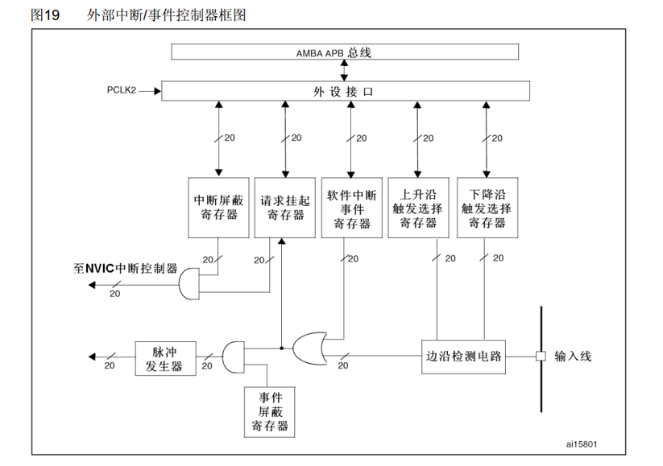
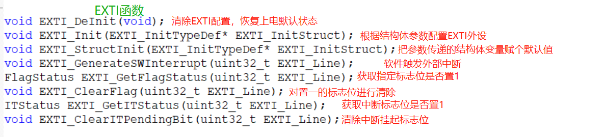

# STM32 EXTI

---

## 1. EXTI 简介

EXTI（Extern Interrupt）外部中断，是STM32微控制器中用于检测外部信号变化的重要外设。

- **功能**：监测指定GPIO口的电平信号，当其指定的GPIO口产生电平变化时，EXTI将立即向NVIC发出中断申请
- **触发方式**：支持上升沿、下降沿、双边沿和软件触发
- **支持GPIO口**：所有GPIO口，但相同的Pin不能同时触发中断
- **通道数**：16个GPIO_Pin，外加PVD输出、RTC闹钟、USB唤醒、以太网唤醒
- **响应方式**：中断响应和事件响应

---

## 2. EXTI 基本概念

### 2.1 外部中断

外部中断是指由外部设备通过GPIO引脚触发的中断，当GPIO引脚的电平发生变化时，会触发相应的中断服务程序。

### 2.2 AFIO 复用IO口

AFIO（Alternate Function I/O）复用IO口，主要用于引脚复用功能的选择和重定义：

- **复用功能引脚重映射**：将外设的功能映射到不同的GPIO引脚
- **中断引脚选择**：选择哪个GPIO引脚作为外部中断源


---

## 3. EXTI 结构

### 3.1 EXTI 基本结构

EXTI的基本结构包括：

- **输入线**：16个GPIO输入线和其他特殊输入线
- **边沿检测电路**：检测上升沿和下降沿
- **中断屏蔽寄存器**：控制是否允许中断
- **事件屏蔽寄存器**：控制是否允许事件
- **挂起寄存器**：标记中断是否挂起


### 3.2 EXTI 框图



---

## 4. EXTI 功能特点

### 4.1 触发方式

- **上升沿触发**：当GPIO引脚的电平从低变高时触发
- **下降沿触发**：当GPIO引脚的电平从高变低时触发
- **双边沿触发**：当GPIO引脚的电平发生变化时触发
- **软件触发**：通过软件向EXTI_SWIER寄存器写入1来触发

### 4.2 响应方式

- **中断响应**：触发中断，执行中断服务程序
- **事件响应**：触发事件，可用于唤醒低功耗模式或启动其他外设

### 4.3 通道分配

- **16个GPIO通道**：对应GPIOA~GPIOG的16个Pin
- **特殊通道**：PVD输出、RTC闹钟、USB唤醒、以太网唤醒

---

## 5. EXTI 相关函数

### 5.1 初始化函数

| 函数名称 | 功能说明 |
|---------|----------|
| EXTI_Init() | 初始化EXTI配置 |
| EXTI_StructInit() | 将EXTI结构体初始化为默认值 |

### 5.2 触发控制函数

| 函数名称 | 功能说明 |
|---------|----------|
| EXTI_GenerateSWInterrupt() | 软件触发外部中断 |

### 5.3 状态查询函数

| 函数名称 | 功能说明 |
|---------|----------|
| EXTI_GetFlagStatus() | 获取EXTI标志位状态 |
| EXTI_ClearFlag() | 清除EXTI标志位 |
| EXTI_GetITStatus() | 获取EXTI中断状态 |
| EXTI_ClearITPendingBit() | 清除EXTI中断挂起位 |



### 5.4 AFIO相关函数

| 函数名称 | 功能说明 |
|---------|----------|
| GPIO_EXTILineConfig() | 配置EXTI线与GPIO的映射关系 |

---

## 6. EXTI 配置步骤

### 6.1 基本配置步骤

1. **使能GPIO时钟**：调用`RCC_APB2PeriphClockCmd()`使能GPIO时钟
2. **使能AFIO时钟**：调用`RCC_APB2PeriphClockCmd()`使能AFIO时钟
3. **配置GPIO为输入模式**：设置GPIO为浮空输入、上拉输入或下拉输入
4. **配置EXTI线映射**：调用`GPIO_EXTILineConfig()`配置EXTI线与GPIO的映射关系
5. **初始化EXTI**：配置EXTI线、触发方式、响应方式等
6. **配置NVIC**：设置中断优先级，使能中断
7. **编写中断服务函数**：处理中断事件

### 6.2 中断服务函数命名规则

EXTI的中断服务函数名称如下：

- EXTI0_IRQHandler
- EXTI1_IRQHandler
- ...
- EXTI15_10_IRQHandler（处理EXTI10-EXTI15的中断）

---

## 7. 示例代码

### 7.1 外部中断配置示例

```c
// 外部中断配置函数
void EXTI_Config(void)
{
    GPIO_InitTypeDef GPIO_InitStructure;
    EXTI_InitTypeDef EXTI_InitStructure;
    NVIC_InitTypeDef NVIC_InitStructure;
    
    // 使能GPIOA和AFIO时钟
    RCC_APB2PeriphClockCmd(RCC_APB2Periph_GPIOA | RCC_APB2Periph_AFIO, ENABLE);
    
    // 配置PA0为浮空输入
    GPIO_InitStructure.GPIO_Pin = GPIO_Pin_0;
    GPIO_InitStructure.GPIO_Mode = GPIO_Mode_IN_FLOATING;
    GPIO_Init(GPIOA, &GPIO_InitStructure);
    
    // 配置EXTI线0，将PA0映射到EXTI0
    GPIO_EXTILineConfig(GPIO_PortSourceGPIOA, GPIO_PinSource0);
    
    // 初始化EXTI线0
    EXTI_InitStructure.EXTI_Line = EXTI_Line0;
    EXTI_InitStructure.EXTI_Mode = EXTI_Mode_Interrupt;
    EXTI_InitStructure.EXTI_Trigger = EXTI_Trigger_Falling; // 下降沿触发
    EXTI_InitStructure.EXTI_LineCmd = ENABLE;
    EXTI_Init(&EXTI_InitStructure);
    
    // 配置NVIC
    NVIC_PriorityGroupConfig(NVIC_PriorityGroup_2);
    
    NVIC_InitStructure.NVIC_IRQChannel = EXTI0_IRQn;
    NVIC_InitStructure.NVIC_IRQChannelPreemptionPriority = 0;
    NVIC_InitStructure.NVIC_IRQChannelSubPriority = 0;
    NVIC_InitStructure.NVIC_IRQChannelCmd = ENABLE;
    NVIC_Init(&NVIC_InitStructure);
}
```

### 7.2 中断服务函数示例

```c
// EXTI0中断服务函数
void EXTI0_IRQHandler(void)
{
    if (EXTI_GetITStatus(EXTI_Line0) != RESET)
    {
        // 延时消抖
        delay_ms(10);
        if (GPIO_ReadInputDataBit(GPIOA, GPIO_Pin_0) == 0)
        {
            // 按键按下，执行相应操作
            LED_Toggle();
        }
        
        // 清除中断标志位
        EXTI_ClearITPendingBit(EXTI_Line0);
    }
}
```

### 7.3 双边沿触发示例

```c
// 双边沿触发配置
void EXTI_BothEdgeConfig(void)
{
    GPIO_InitTypeDef GPIO_InitStructure;
    EXTI_InitTypeDef EXTI_InitStructure;
    NVIC_InitTypeDef NVIC_InitStructure;
    
    // 使能GPIOB和AFIO时钟
    RCC_APB2PeriphClockCmd(RCC_APB2Periph_GPIOB | RCC_APB2Periph_AFIO, ENABLE);
    
    // 配置PB1为浮空输入
    GPIO_InitStructure.GPIO_Pin = GPIO_Pin_1;
    GPIO_InitStructure.GPIO_Mode = GPIO_Mode_IN_FLOATING;
    GPIO_Init(GPIOB, &GPIO_InitStructure);
    
    // 配置EXTI线1，将PB1映射到EXTI1
    GPIO_EXTILineConfig(GPIO_PortSourceGPIOB, GPIO_PinSource1);
    
    // 初始化EXTI线1
    EXTI_InitStructure.EXTI_Line = EXTI_Line1;
    EXTI_InitStructure.EXTI_Mode = EXTI_Mode_Interrupt;
    EXTI_InitStructure.EXTI_Trigger = EXTI_Trigger_Rising_Falling; // 双边沿触发
    EXTI_InitStructure.EXTI_LineCmd = ENABLE;
    EXTI_Init(&EXTI_InitStructure);
    
    // 配置NVIC
    NVIC_PriorityGroupConfig(NVIC_PriorityGroup_2);
    
    NVIC_InitStructure.NVIC_IRQChannel = EXTI1_IRQn;
    NVIC_InitStructure.NVIC_IRQChannelPreemptionPriority = 1;
    NVIC_InitStructure.NVIC_IRQChannelSubPriority = 1;
    NVIC_InitStructure.NVIC_IRQChannelCmd = ENABLE;
    NVIC_Init(&NVIC_InitStructure);
}

// EXTI1中断服务函数
void EXTI1_IRQHandler(void)
{
    if (EXTI_GetITStatus(EXTI_Line1) != RESET)
    {
        // 检测当前电平状态
        if (GPIO_ReadInputDataBit(GPIOB, GPIO_Pin_1) == 1)
        {
            // 上升沿触发
            LED1_On();
        }
        else
        {
            // 下降沿触发
            LED1_Off();
        }
        
        // 清除中断标志位
        EXTI_ClearITPendingBit(EXTI_Line1);
    }
}
```

### 7.4 软件触发示例

```c
// 软件触发外部中断
void EXTI_SoftTrigger(void)
{
    // 软件触发EXTI线2
    EXTI_GenerateSWInterrupt(EXTI_Line2);
}

// EXTI2中断服务函数
void EXTI2_IRQHandler(void)
{
    if (EXTI_GetITStatus(EXTI_Line2) != RESET)
    {
        // 处理软件触发的中断
        Beep_Toggle();
        
        // 清除中断标志位
        EXTI_ClearITPendingBit(EXTI_Line2);
    }
}
```

---

## 8. 总结

EXTI是STM32微控制器中用于检测外部信号变化的重要外设，通过合理配置EXTI，可以实现：

- **外部事件检测**：检测外部设备的状态变化
- **按键输入处理**：处理按键的按下和释放
- **外部信号采集**：采集外部传感器的信号
- **系统唤醒**：从低功耗模式中唤醒系统

掌握EXTI的配置和使用方法，对于STM32的外部事件处理非常重要。通过本文档的学习，希望读者能够熟练掌握EXTI的使用技巧，为STM32项目开发提供可靠的外部中断支持。