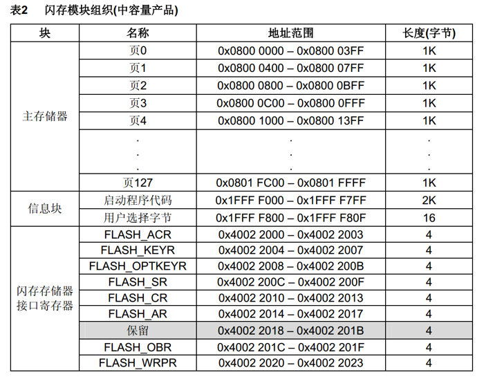
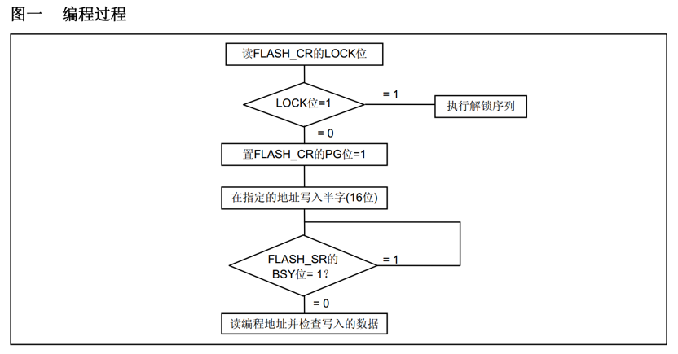
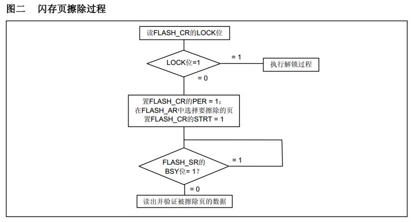
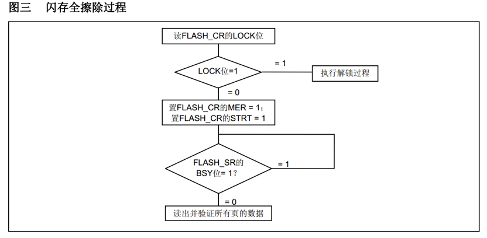
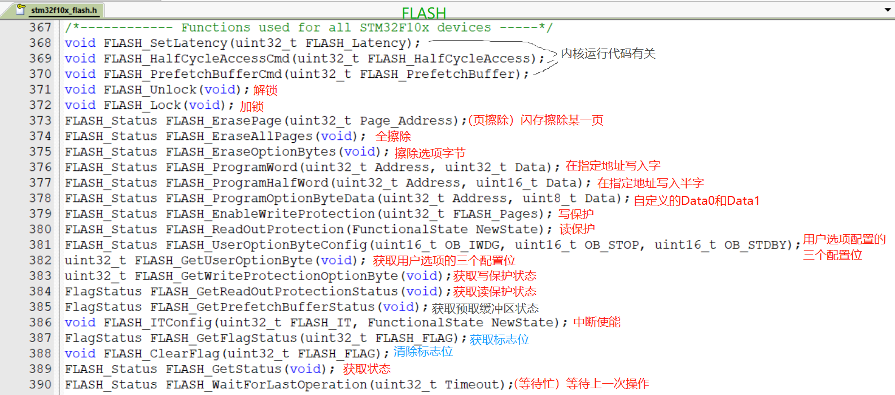

# STM32 FLASH

---

## 1. FLASH 简介

STM32F1系列的FLASH包含程序存储器、系统存储器和选项字节三个部分，通过闪存存储器接口（Flash Memory Interface，FPEC）可以对程序存储器和选项字节进行擦除和编程。

### 1.1 FLASH 组成

| 组成部分 | 功能说明 |
|---------|----------|
| **程序存储器** | 存储用户应用程序代码，可利用剩余空间保存掉电不丢失的用户数据 |
| **系统存储器** | 存储Bootloader，用于通过串口等接口进行程序下载 |
| **选项字节** | 配置芯片的读写保护、硬件看门狗等选项 |

### 1.2 编程方式

STM32支持两种主要的编程方式：

| 编程方式 | 说明 | 使用场景 |
|---------|------|----------|
| **ICP（In-Circuit Programming）** | 在线编程，通过JTAG、SWD协议或系统加载程序（Bootloader）下载程序 | 开发阶段程序下载、量产烧录 |
| **IAP（In-Application Programming）** | 在程序中编程，使用微控制器支持的任一种通信接口下载程序 | 产品OTA升级、远程更新 |

### 1.3 读写FLASH的用途

- **数据存储**：利用程序存储器的剩余空间来保存掉电不丢失的用户数据
- **程序更新**：通过在程序中编程（IAP），实现程序的自我更新

### 1.4 FLASH 基本结构


---

## 2. 闪存模块组织

### 2.1 中容量产品闪存组织

STM32中容量产品（如STM32F103C8T6，64KB FLASH）的闪存模块组织结构如下：



| 区域 | 起始地址 | 结束地址 | 大小 | 说明 |
|------|----------|----------|------|------|
| **程序存储器** | 0x08000000 | 0x0800FFFF | 64KB | 主存储区，存放程序代码和数据 |
| **系统存储器** | 0x1FFFF000 | 0x1FFFF7FF | 2KB | Bootloader区域 |
| **选项字节** | 0x1FFFF800 | 0x1FFFF80F | 16字节 | 配置选项字节 |

### 2.2 闪存页组织

中容量产品的FLASH被划分为若干页，每页大小为1KB（1024字节）：

| 页号 | 起始地址 | 结束地址 |
|------|----------|----------|
| 页0 | 0x08000000 | 0x080003FF |
| 页1 | 0x08000400 | 0x080007FF |
| ... | ... | ... |
| 页63 | 0x0800FC00 | 0x0800FFFF |

---

## 3. FLASH 控制寄存器

### 3.1 FLASH 控制寄存器（FLASH_CR）

FLASH_CR寄存器用于控制FLASH的擦除和编程操作：

| 位 | 名称 | 功能说明 |
|----|------|----------|
| 0 | PER | 页擦除使能位 |
| 1 | MER | 全片擦除使能位 |
| 2 | OPTPG | 选项字节编程使能位 |
| 3 | OPTER | 选项字节擦除使能位 |
| 4 | 保留 | 保留 |
| 5 | 保留 | 保留 |
| 6 | 保留 | 保留 |
| 7 | 保留 | 保留 |
| 9 | OPTWRE | 选项字节写使能位 |
| 31 | LOCK | 锁定位 |

### 3.2 FLASH 状态寄存器（FLASH_SR）

FLASH_SR寄存器用于查询FLASH操作状态：

| 位 | 名称 | 功能说明 |
|----|------|----------|
| 0 | BSY | 忙标志位，1表示FLASH正在编程/擦除 |
| 2 | PGERR | 编程错误标志位 |
| 4 | WRPRTERR | 写保护错误标志位 |
| 5 | EOP | 操作结束标志位 |

---

## 4. FLASH 解锁与加锁

### 4.1 FPEC 锁定机制

FPEC（Flash Program and Erase Controller）是FLASH编程和擦除控制器，共有三个键值用于解锁：

| 键值 | 作用 |
|------|------|
| RDPRT键 = 0x000000A5 | 用于解除读保护 |
| KEY1 = 0x45670123 | 解锁第一个键值 |
| KEY2 = 0xCDEF89AB | 解锁第二个键值 |

### 4.2 解锁流程

1. 复位后，FPEC被保护，不能写入FLASH_CR
2. 在FLASH_KEYR先写入KEY1（0x45670123）
3. 再写入KEY2（0xCDEF89AB）完成解锁
4. 错误的操作序列会在下次复位前锁死FPEC和FLASH_CR

### 4.3 加锁流程

设置FLASH_CR中的LOCK位即可锁住FPEC和FLASH_CR，防止误操作。

### 4.4 解锁示例代码

```c
// FLASH解锁函数
void FLASH_Unlock(void)
{
    // 写入KEY1
    FLASH->KEYR = 0x45670123;
    // 写入KEY2
    FLASH->KEYR = 0xCDEF89AB;
}

// FLASH加锁函数
void FLASH_Lock(void)
{
    // 设置LOCK位
    FLASH->CR |= FLASH_CR_LOCK;
}
```

---

## 5. 使用指针访问存储器

### 5.1 指针读写操作

STM32的FLASH存储器可以直接通过指针进行读写访问：

```c
// 宏定义
#define __IO volatile

// 使用指针读指定地址下的存储器
uint16_t Data = *((__IO uint16_t *)(0x08000000));

// 使用指针写指定地址下的存储器（注意：写入前必须擦除）
*((__IO uint16_t *)(0x08000000)) = 0x1234;
```

### 5.2 注意事项

- **读取操作**：任何时候都可以读取FLASH
- **写入操作**：必须先解锁，并确保目标区域已擦除
- **半字写入**：FLASH编程以半字（16位）为单位进行
- **对齐要求**：写入地址必须对齐到半字边界（偶数地址）

---

## 6. 选项字节

### 6.1 选项字节组织结构

选项字节用于配置芯片的各种特性，存放在固定地址区域：

**信息块的组织结构：**

| 地址 | [31:24] | [23:16] | [15:8] | [7:0] |
|------|---------|----------|---------|--------|
| 0x1FFFF800 | nUSER | nRDP | RDP | USER |
| 0x1FFFF804 | nData1 | Data1 | nData0 | Data0 |
| 0x1FFFF808 | nWRP1 | WRP1 | nWRP0 | WRP0 |
| 0x1FFFF80C | nWRP3 | WRP3 | nWRP2 | WRP2 |

### 6.2 选项字节说明

| 选项字节 | 功能说明 |
|---------|----------|
| **RDP** | 读保护位，写入RDPRT键（0x000000A5）后解除读保护 |
| **USER** | 配置硬件看门狗和进入停机/待机模式是否产生复位 |
| **Data0/1** | 用户可自定义使用 |
| **WRP0/1/2/3** | 配置写保护，每一个位对应保护4个存储页（中容量产品） |

### 6.3 选项字节编程流程

1. 检查FLASH_SR的BSY位，以确认没有其他正在进行的编程操作
2. 解锁FLASH_CR的OPTWRE位
3. 设置FLASH_CR的OPTPG位为1
4. 写入要编程的半字到指定的地址
5. 等待BSY位变为0
6. 读出写入的地址并验证数据

### 6.4 选项字节擦除流程

1. 检查FLASH_SR的BSY位，以确认没有其他正在进行的闪存操作
2. 解锁FLASH_CR的OPTWRE位
3. 设置FLASH_CR的OPTER位为1
4. 设置FLASH_CR的STRT位为1
5. 等待BSY位变为0
6. 读出被擦除的选择字节并做验证

---

## 7. FLASH 编程与擦除

### 7.1 程序存储器编程过程



**编程步骤：**

1. 检查FLASH_SR的BSY位
2. 解锁FLASH_CR
3. 设置FLASH_CR的PG位
4. 写入要编程的半字
5. 等待BSY位变为0
6. 验证编程结果

### 7.2 程序存储器页擦除过程



**页擦除步骤：**

1. 检查FLASH_SR的BSY位
2. 解锁FLASH_CR
3. 设置FLASH_CR的PER位
4. 设置要擦除的页地址到FLASH_AR
5. 设置FLASH_CR的STRT位
6. 等待BSY位变为0
7. 验证擦除结果（读出数据应为0xFFFF）

### 7.3 程序存储器全片擦除



**全片擦除步骤：**

1. 检查FLASH_SR的BSY位
2. 解锁FLASH_CR
3. 设置FLASH_CR的MER位
4. 设置FLASH_CR的STRT位
5. 等待BSY位变为0
6. 验证擦除结果（读出数据应为0xFFFF）

---

## 8. FLASH 相关函数



### 8.1 初始化与控制函数

| 函数名称 | 功能说明 |
|---------|----------|
| FLASH_SetLatency() | 设置FLASH存储器延迟周期 |
| FLASH_HalfCycleAccessCmd() | 使能或禁用半周期访问 |
| FLASH_PrefetchBufferCmd() | 使能或禁用预取缓冲 |

### 8.2 解锁与锁定函数

| 函数名称 | 功能说明 |
|---------|----------|
| FLASH_Unlock() | 解锁FLASH编程擦除控制器 |
| FLASH_Lock() | 锁定FLASH编程擦除控制器 |

### 8.3 编程函数

| 函数名称 | 功能说明 |
|---------|----------|
| FLASH_ErasePage() | 擦除指定的FLASH页 |
| FLASH_EraseAllPages() | 擦除所有FLASH页 |
| FLASH_ProgramHalfWord() | 编程指定地址的半字 |
| FLASH_ProgramOptionByteData() | 编程选项字节数据 |
| FLASH_EnableWriteProtection() | 使能指定页的写保护 |

### 8.4 状态与标志位函数

| 函数名称 | 功能说明 |
|---------|----------|
| FLASH_GetBank1Status() | 获取FLASH Bank1状态 |
| FLASH_WaitForLastOperation() | 等待最后一次操作完成 |
| FLASH_GetFlagStatus() | 获取指定FLASH标志位状态 |
| FLASH_ClearFlag() | 清除指定FLASH标志位 |

### 8.5 中断函数

| 函数名称 | 功能说明 |
|---------|----------|
| FLASH_ITConfig() | 使能或禁用指定的FLASH中断 |

---

## 9. FLASH 配置步骤

### 9.1 编程前配置

在使用FLASH进行编程前，需要进行以下配置：

1. **解锁FLASH**：调用`FLASH_Unlock()`
2. **等待空闲**：调用`FLASH_WaitForLastOperation()`确保没有正在进行操作
3. **设置延迟**：根据系统时钟设置适当的延迟周期

### 9.2 页擦除配置步骤

1. 解锁FLASH
2. 等待上次操作完成
3. 调用`FLASH_ErasePage()`擦除指定页
4. 等待擦除完成
5. 验证擦除结果
6. 锁定FLASH

### 9.3 数据编程配置步骤

1. 解锁FLASH
2. 等待上次操作完成
3. 调用`FLASH_ProgramHalfWord()`写入数据
4. 等待编程完成
5. 验证编程结果
6. 锁定FLASH

---

## 10. 示例代码

### 10.1 读取FLASH数据

```c
// 读取FLASH指定地址的半字数据
uint16_t FLASH_ReadHalfWord(uint32_t Address)
{
    return *(__IO uint16_t *)Address;
}

// 读取FLASH指定地址的字数据（32位）
uint32_t FLASH_ReadWord(uint32_t Address)
{
    return *(__IO uint32_t *)Address;
}

// 使用示例
uint16_t data = FLASH_ReadHalfWord(0x0800F000);
```

### 10.2 写入FLASH数据

```c
// 写入FLASH指定地址的半字数据
FLASH_Status FLASH_WriteHalfWord(uint32_t Address, uint16_t Data)
{
    FLASH_Status status = FLASH_COMPLETE;

    // 解锁FLASH
    FLASH_Unlock();

    // 等待上次操作完成
    status = FLASH_WaitForLastOperation(ProgramTimeout);

    if(status == FLASH_COMPLETE)
    {
        // 编程数据
        FLASH_ProgramHalfWord(Address, Data);

        // 等待编程完成
        status = FLASH_WaitForLastOperation(ProgramTimeout);
    }

    // 锁定FLASH
    FLASH_Lock();

    return status;
}

// 使用示例（写入前必须先擦除）
FLASH_WriteHalfWord(0x0800F000, 0x1234);
```

### 10.3 擦除FLASH页

```c
// 擦除FLASH指定页
FLASH_Status FLASH_ErasePage_Safe(uint32_t Page_Address)
{
    FLASH_Status status = FLASH_COMPLETE;

    // 解锁FLASH
    FLASH_Unlock();

    // 等待上次操作完成
    status = FLASH_WaitForLastOperation(EraseTimeout);

    if(status == FLASH_COMPLETE)
    {
        // 擦除指定页
        status = FLASH_ErasePage(Page_Address);

        // 等待擦除完成
        status = FLASH_WaitForLastOperation(EraseTimeout);
    }

    // 锁定FLASH
    FLASH_Lock();

    return status;
}

// 使用示例（擦除最后一页）
FLASH_ErasePage_Safe(0x0800FC00);
```

### 10.4 完整的数据存储示例

```c
#define FLASH_USER_START_ADDR   0x0800F000  // 用户数据起始地址
#define FLASH_USER_END_ADDR     0x0800FFFF  // 用户数据结束地址

// 将数据写入FLASH
void FLASH_WriteUserData(uint16_t *pData, uint16_t Length)
{
    uint32_t i;
    uint32_t Address = FLASH_USER_START_ADDR;

    // 解锁FLASH
    FLASH_Unlock();

    // 擦除用户数据区域（需要擦除的页）
    FLASH_ErasePage(FLASH_USER_START_ADDR);
    FLASH_ErasePage(FLASH_USER_START_ADDR + 0x400);

    // 写入数据
    for(i = 0; i < Length; i++)
    {
        FLASH_ProgramHalfWord(Address, pData[i]);
        Address += 2;
    }

    // 锁定FLASH
    FLASH_Lock();
}

// 从FLASH读取数据
void FLASH_ReadUserData(uint16_t *pData, uint16_t Length)
{
    uint32_t i;
    uint32_t Address = FLASH_USER_START_ADDR;

    for(i = 0; i < Length; i++)
    {
        pData[i] = *(__IO uint16_t *)Address;
        Address += 2;
    }
}
```

---

## 11. 器件电子签名

### 11.1 电子签名概述

电子签名存放在闪存存储器模块的系统存储区域，包含的芯片识别信息在出厂时编写，不可更改。使用指针读指定地址下的存储器可获取电子签名。

### 11.2 闪存容量寄存器

| 项目 | 说明 |
|------|------|
| **基地址** | 0x1FFF F7E0 |
| **大小** | 16位 |
| **功能** | 存储FLASH容量信息 |

```c
// 读取FLASH容量
uint16_t FLASH_GetCapacity(void)
{
    return *(__IO uint16_t *)0x1FFFF7E0;
}
```

### 11.3 产品唯一身份标识寄存器

| 项目 | 说明 |
|------|------|
| **基地址** | 0x1FFF F7E8 |
| **大小** | 96位（12字节） |
| **功能** | 唯一标识每颗芯片 |

```c
// 读取产品唯一ID
void FLASH_GetUniqueID(uint8_t *pUID)
{
    uint32_t *pAddr = (uint32_t *)0x1FFFF7E8;

    pUID[0]  = (pAddr[0] >> 0)  & 0xFF;
    pUID[1]  = (pAddr[0] >> 8)  & 0xFF;
    pUID[2]  = (pAddr[0] >> 16) & 0xFF;
    pUID[3]  = (pAddr[0] >> 24) & 0xFF;
    pUID[4]  = (pAddr[1] >> 0)  & 0xFF;
    pUID[5]  = (pAddr[1] >> 8)  & 0xFF;
    pUID[6]  = (pAddr[1] >> 16) & 0xFF;
    pUID[7]  = (pAddr[1] >> 24) & 0xFF;
    pUID[8]  = (pAddr[2] >> 0)  & 0xFF;
    pUID[9]  = (pAddr[2] >> 8)  & 0xFF;
    pUID[10] = (pAddr[2] >> 16) & 0xFF;
    pUID[11] = (pAddr[2] >> 24) & 0xFF;
}
```

---

## 12. 应用场景

### 12.1 数据存储

利用FLASH存储区域保存用户配置数据、校准参数等需要掉电保持的数据：

```c
// 保存配置参数
typedef struct {
    uint16_t brightness;
    uint16_t volume;
    uint16_t language;
} Config_t;

Config_t g_Config;

void Save_Config(void)
{
    FLASH_WriteUserData((uint16_t *)&g_Config, sizeof(Config_t) / 2);
}

void Load_Config(void)
{
    FLASH_ReadUserData((uint16_t *)&g_Config, sizeof(Config_t) / 2);
}
```

### 12.2 IAP 在线升级

通过IAP功能实现程序的远程升级：

```c
// IAP升级流程
1. Bootloader检测是否有新程序
2. Bootloader通过串口/网络接收新程序
3. Bootloader将新程序写入FLASH
4. Bootloader跳转到新程序
```

---

## 13. 注意事项

### 13.1 编程注意事项

1. **擦除要求**：写入数据前必须先擦除对应区域
2. **对齐要求**：写入地址必须对齐到半字边界（偶数地址）
3. **写入单位**：FLASH编程以半字（16位）为单位进行
4. **解锁锁定**：操作完成后应及时锁定FLASH
5. **等待完成**：每次操作后应等待操作完成
6. **错误检查**：应检查编程和擦除操作的状态

### 13.2 读写注意事项

1. **读取安全**：任何时候都可以读取FLASH，无需解锁
2. **写入危险**：错误的写入操作可能导致程序损坏
3. **页边界**：注意页边界，跨页写入需要擦除多页
4. **擦除限制**：FLASH有擦除次数限制（约10万次）

### 13.3 安全注意事项

1. **读保护**：启用读保护可以防止程序被读取
2. **写保护**：可以对特定页启用写保护
3. **备份程序**：在进行IAP升级前应备份原程序
4. **断电保护**：擦除和编程过程中避免断电

---

## 14. 总结

FLASH是STM32中重要的存储资源，具有以下特点：

- **存储组成**：包含程序存储器、系统存储器和选项字节三部分
- **编程方式**：支持ICP（在线编程）和IAP（在程序中编程）两种方式
- **数据存储**：可利用程序存储器剩余空间保存掉电不丢失的用户数据
- **自更新能力**：通过IAP实现程序的自我更新和远程升级
- **配置灵活**：选项字节支持多种配置选项（读保护、写保护、看门狗等）
- **唯一标识**：每颗芯片都有唯一的96位身份标识

掌握FLASH的编程和擦除方法，对于需要数据存储和远程升级的STM32项目非常重要。通过本文档的学习，希望读者能够熟练掌握FLASH的使用技巧，为项目开发提供可靠的存储支持。
