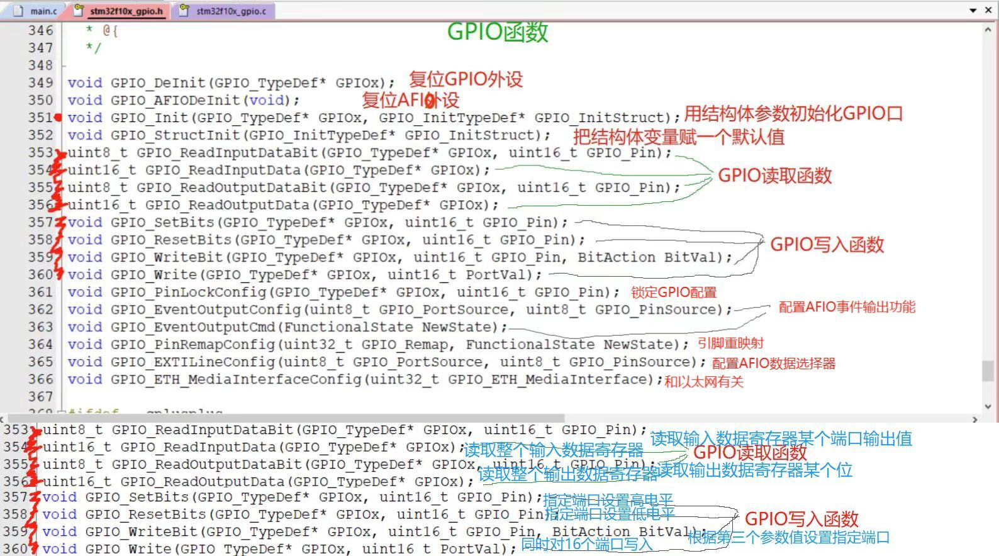
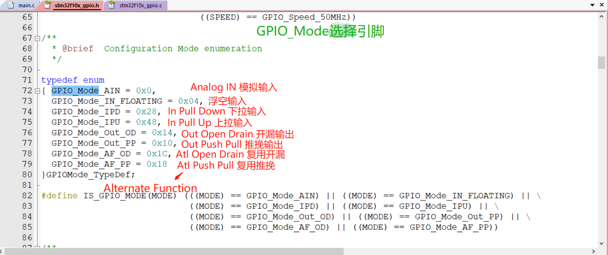

# STM32 GPIO

---

## 1. GPIO 简介

GPIO（General Purpose Input Output）通用输入输出口是STM32微控制器中最基本、最常用的外设之一：

- **多种工作模式**：可配置为8种输入输出模式
- **电平范围**：0V~3.3V，部分引脚可容忍5V输入
- **输出功能**：可控制端口输出高低电平，用于驱动LED、控制蜂鸣器、模拟通信协议输出时序等
- **输入功能**：可读取端口的高低电平或电压，用于读取按键输入、外接模块电平信号输入、ADC电压采集、模拟通信协议接收数据等

---

## 2. GPIO 主要功能

- **输入输出控制**：基本的高低电平控制
- **中断触发**：支持外部中断触发
- **复用功能映射**：可映射到其他外设功能
- **速度配置**：可配置不同的输出速度
- **上拉下拉电阻配置**：可配置内部上拉或下拉电阻

---

## 3. GPIO 结构

GPIO的内部结构主要包括：

- **保护二极管**：防止引脚电压过高或过低
- **上拉/下拉电阻**：可配置的内部电阻
- **施密特触发器**：用于信号整形
- **输出控制电路**：包括推挽和开漏两种模式
- **复用功能选择器**：用于选择引脚的复用功能


---

## 4. GPIO 工作模式

### 4.1 输入模式

| 模式 | 说明 | 应用场景 |
|------|------|----------|
| AIN | 模拟输入 | 用于ADC采集 |
| IN_FLOATING | 浮空输入 | 用于外部信号输入，需要外部上拉/下拉 |
| IPD | 下拉输入 | 用于需要默认低电平的场景 |
| IPU | 上拉输入 | 用于需要默认高电平的场景，如按键输入 |

### 4.2 输出模式

| 模式 | 说明 | 应用场景 |
|------|------|----------|
| Out_OD | 开漏输出 | 用于需要线与功能的场景，如I2C通信 |
| Out_PP | 推挽输出 | 用于需要强驱动能力的场景，如LED驱动 |
| AF_OD | 复用开漏 | 用于复用功能的开漏输出，如I2C通信 |
| AF_PP | 复用推挽 | 用于复用功能的推挽输出，如UART、SPI通信 |

---

## 5. GPIO 相关函数

### 5.1 初始化函数

| 函数名称 | 功能说明 |
|---------|----------|
| GPIO_Init() | 初始化GPIO端口，配置工作模式、速度等参数 |
| RCC_APB2PeriphClockCmd() | 使能GPIO端口的时钟 |

### 5.2 输入输出操作函数

| 函数名称 | 功能说明 |
|---------|----------|
| GPIO_SetBits() | 设置GPIO端口为高电平 |
| GPIO_ResetBits() | 设置GPIO端口为低电平 |
| GPIO_WriteBit() | 写入单个位的值 |
| GPIO_Write() | 写入整个端口的值 |
| GPIO_ReadInputDataBit() | 读取单个输入位的值 |
| GPIO_ReadInputData() | 读取整个端口的输入值 |
| GPIO_ReadOutputDataBit() | 读取单个输出位的值 |
| GPIO_ReadOutputData() | 读取整个端口的输出值 |

### 5.3 其他函数

| 函数名称 | 功能说明 |
|---------|----------|
| GPIO_PinLockConfig() | 锁定GPIO配置，防止意外修改 |



---

## 6. GPIO 模式配置

GPIO的模式配置主要通过`GPIO_InitTypeDef`结构体来完成，包括以下参数：

- **GPIO_Pin**：要配置的引脚
- **GPIO_Mode**：工作模式（输入/输出/复用）
- **GPIO_Speed**：输出速度（10MHz/2MHz/50MHz）
- **GPIO_OType**：输出类型（推挽/开漏）
- **GPIO_PuPd**：上拉/下拉配置



---

## 7. GPIO 中断

### 7.1 中断类型

- **EXTI线中断**：每个GPIO引脚都可以映射到EXTI线
- **触发方式**：支持上升沿、下降沿、双边沿触发

### 7.2 中断配置步骤

1. **配置GPIO为输入模式**
2. **使能AFIO时钟**
3. **配置EXTI线映射**
4. **配置EXTI中断触发方式**
5. **配置NVIC中断优先级**
6. **编写中断服务函数**

---

## 8. GPIO 配置步骤

### 8.1 输出模式配置步骤

1. **使能GPIO时钟**：调用`RCC_APB2PeriphClockCmd()`
2. **初始化GPIO**：配置工作模式、速度等参数
3. **控制GPIO输出**：使用`GPIO_SetBits()`或`GPIO_ResetBits()`控制输出电平

### 8.2 输入模式配置步骤

1. **使能GPIO时钟**：调用`RCC_APB2PeriphClockCmd()`
2. **初始化GPIO**：配置工作模式、上拉/下拉等参数
3. **读取GPIO输入**：使用`GPIO_ReadInputDataBit()`读取输入电平

---

## 9. 示例代码

### 9.1 输出模式示例（LED控制）

```c
// LED初始化函数
void LED_Init(void)
{
    GPIO_InitTypeDef GPIO_InitStructure;
    
    RCC_APB2PeriphClockCmd(RCC_APB2Periph_GPIOC, ENABLE); // 使能GPIOC时钟
    
    GPIO_InitStructure.GPIO_Pin = GPIO_Pin_13; // PC13引脚
    GPIO_InitStructure.GPIO_Mode = GPIO_Mode_Out_PP; // 推挽输出
    GPIO_InitStructure.GPIO_Speed = GPIO_Speed_50MHz; // 输出速度50MHz
    GPIO_Init(GPIOC, &GPIO_InitStructure); // 初始化GPIOC
    
    GPIO_SetBits(GPIOC, GPIO_Pin_13); // 初始化为高电平，LED熄灭
}

// LED控制函数
void LED_On(void)
{
    GPIO_ResetBits(GPIOC, GPIO_Pin_13); // 低电平，LED点亮
}

void LED_Off(void)
{
    GPIO_SetBits(GPIOC, GPIO_Pin_13); // 高电平，LED熄灭
}

void LED_Toggle(void)
{
    if(GPIO_ReadOutputDataBit(GPIOC, GPIO_Pin_13))
    {
        GPIO_ResetBits(GPIOC, GPIO_Pin_13); // 低电平，LED点亮
    }
    else
    {
        GPIO_SetBits(GPIOC, GPIO_Pin_13); // 高电平，LED熄灭
    }
}
```

### 9.2 输入模式示例（按键读取）

```c
// 按键初始化函数
void Key_Init(void)
{
    GPIO_InitTypeDef GPIO_InitStructure;
    
    RCC_APB2PeriphClockCmd(RCC_APB2Periph_GPIOA, ENABLE); // 使能GPIOA时钟
    
    GPIO_InitStructure.GPIO_Pin = GPIO_Pin_0; // PA0引脚
    GPIO_InitStructure.GPIO_Mode = GPIO_Mode_IPU; // 上拉输入
    GPIO_Init(GPIOA, &GPIO_InitStructure); // 初始化GPIOA
}

// 按键读取函数
uint8_t Key_Scan(void)
{
    if(GPIO_ReadInputDataBit(GPIOA, GPIO_Pin_0) == 0) // 检测按键是否按下
    {
        while(GPIO_ReadInputDataBit(GPIOA, GPIO_Pin_0) == 0); // 等待按键释放
        return 1; // 按键按下
    }
    return 0; // 按键未按下
}
```

### 9.3 中断模式示例（外部中断）

```c
// 外部中断初始化函数
void EXTI_Init(void)
{
    GPIO_InitTypeDef GPIO_InitStructure;
    EXTI_InitTypeDef EXTI_InitStructure;
    NVIC_InitTypeDef NVIC_InitStructure;
    
    RCC_APB2PeriphClockCmd(RCC_APB2Periph_GPIOA | RCC_APB2Periph_AFIO, ENABLE); // 使能GPIOA和AFIO时钟
    
    // 配置PA0为输入模式
    GPIO_InitStructure.GPIO_Pin = GPIO_Pin_0;
    GPIO_InitStructure.GPIO_Mode = GPIO_Mode_IN_FLOATING;
    GPIO_Init(GPIOA, &GPIO_InitStructure);
    
    // 配置EXTI线0
    GPIO_EXTILineConfig(GPIO_PortSourceGPIOA, GPIO_PinSource0);
    
    EXTI_InitStructure.EXTI_Line = EXTI_Line0;
    EXTI_InitStructure.EXTI_Mode = EXTI_Mode_Interrupt;
    EXTI_InitStructure.EXTI_Trigger = EXTI_Trigger_Falling; // 下降沿触发
    EXTI_InitStructure.EXTI_LineCmd = ENABLE;
    EXTI_Init(&EXTI_InitStructure);
    
    // 配置NVIC
    NVIC_InitStructure.NVIC_IRQChannel = EXTI0_IRQn;
    NVIC_InitStructure.NVIC_IRQChannelPreemptionPriority = 0;
    NVIC_InitStructure.NVIC_IRQChannelSubPriority = 0;
    NVIC_InitStructure.NVIC_IRQChannelCmd = ENABLE;
    NVIC_Init(&NVIC_InitStructure);
}

// EXTI0中断服务函数
void EXTI0_IRQHandler(void)
{
    if(EXTI_GetITStatus(EXTI_Line0) != RESET)
    {
        // 在这里添加中断处理代码
        LED_Toggle(); // 翻转LED状态
        
        EXTI_ClearITPendingBit(EXTI_Line0); // 清除中断标志位
    }
}
```

---

## 10. 总结

GPIO是STM32微控制器中最基础、最常用的外设之一，通过合理配置和使用GPIO，可以实现各种输入输出功能：

- **基本IO控制**：控制LED、读取按键等
- **模拟通信协议**：如I2C、SPI、UART等
- **外部中断触发**：响应外部事件
- **复用功能**：作为其他外设的引脚

掌握GPIO的配置和使用方法，是STM32开发的基础，也是实现各种功能的前提。通过本文档的学习，希望读者能够熟练掌握GPIO的使用技巧，为STM32项目开发打下坚实的基础。