# STM32 I2C

---

## 1. I2C 简介

I2C（Inter IC Bus）是由Philips公司开发的一种通用数据总线，用于连接微控制器及其外围设备。

- **通信线**：两根通信线：SCL（Serial Clock）、SDA（Serial Data）
- **通信特点**：同步，半双工，带数据应答
- **设备支持**：支持总线挂载多设备（一主多从、多主多从）
- **STM32F103C8T6**：I2C1、I2C2

---

## 2. I2C 基本概念

### 2.1 I2C 总线

I2C总线是一种串行通信总线，使用两条线在设备之间传输数据：

- **SCL（Serial Clock）**：时钟线，由主设备产生，用于同步数据传输
- **SDA（Serial Data）**：数据线，用于传输数据

### 2.2 I2C 通信特点

- **同步通信**：使用时钟信号进行同步
- **半双工通信**：同一时间只能发送或接收数据
- **带数据应答**：接收方在收到数据后会发送应答信号
- **多设备支持**：总线上可以挂载多个设备，通过地址区分

### 2.3 I2C 设备类型

- **主设备（Master）**：产生时钟信号，控制通信流程
- **从设备（Slave）**：响应主设备的命令，根据地址识别自己

---

## 3. I2C 硬件连接

### 3.1 硬件连接方式

- **所有I2C设备的SCL连在一起，SDA连在一起**
- **设备的SCL和SDA均要配置成开漏输出模式**
- **SCL和SDA各添加一个上拉电阻，阻值一般为4.7KΩ左右**

### 3.2 硬件电路

硬件连接电路通常包含以下部分：
- **SCL线**：连接所有设备的时钟线，添加4.7KΩ上拉电阻
- **SDA线**：连接所有设备的数据线，添加4.7KΩ上拉电阻
- **开漏输出**：所有设备的SCL和SDA引脚均配置为开漏输出模式
- **电源和接地**：为每个设备提供适当的电源和接地

---

## 4. I2C 时序

### 4.1 基本时序单元

#### 4.1.1 起始条件和终止条件

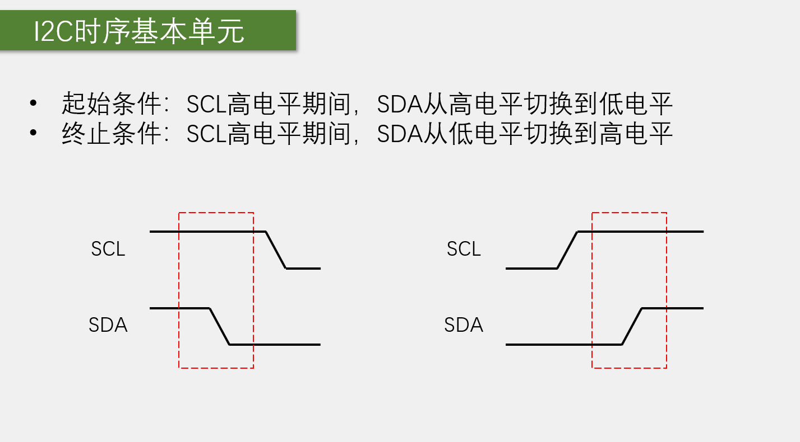

- **起始条件（S）**：SCL为高电平时，SDA由高电平变为低电平
- **终止条件（P）**：SCL为高电平时，SDA由低电平变为高电平

#### 4.1.2 发送一个字节

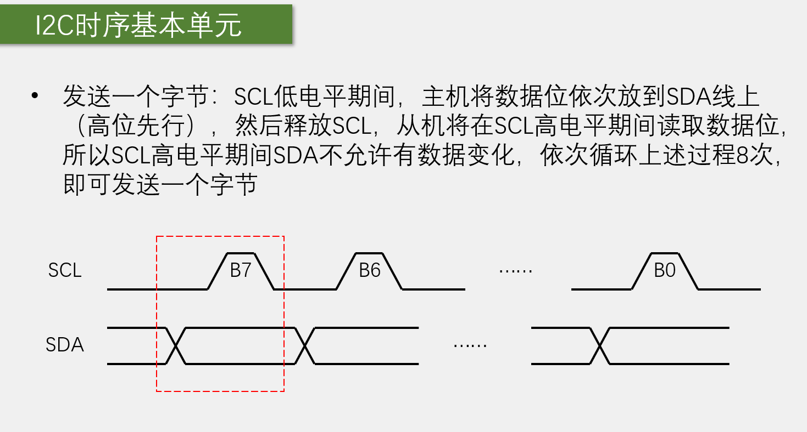

- **数据位**：在SCL的高电平期间，SDA的状态表示数据位
- **低位先行**：数据传输从最低位开始

#### 4.1.3 发送应答和接收应答

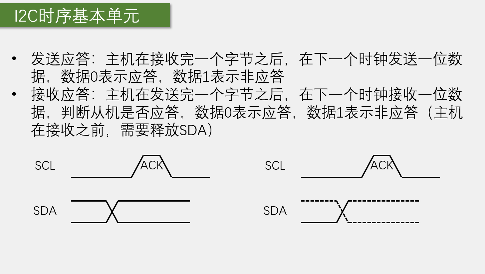

- **应答位（ACK）**：接收方在收到8位数据后，在第9个时钟周期将SDA拉低
- **非应答位（NACK）**：接收方在收到8位数据后，在第9个时钟周期保持SDA为高电平

#### 4.1.4 接收一个字节

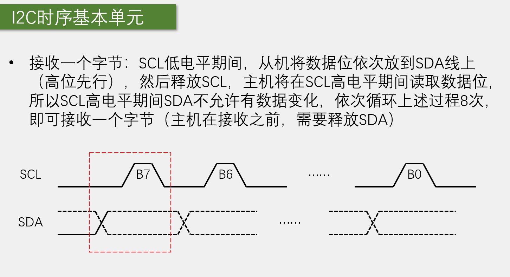

### 4.2 通信时序

#### 4.2.1 指定地址写

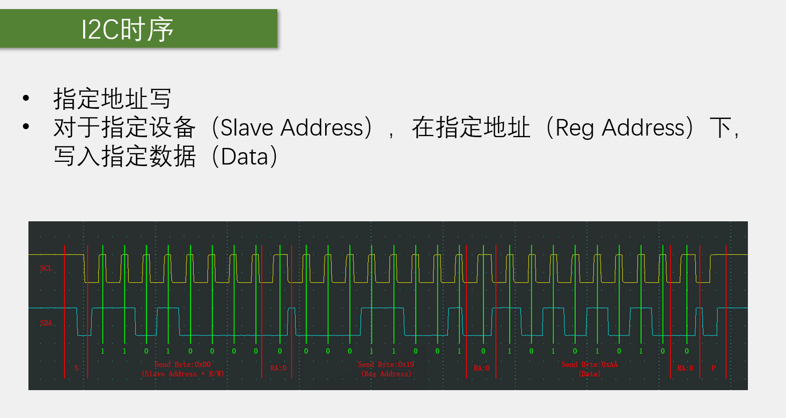

#### 4.2.2 当前地址读

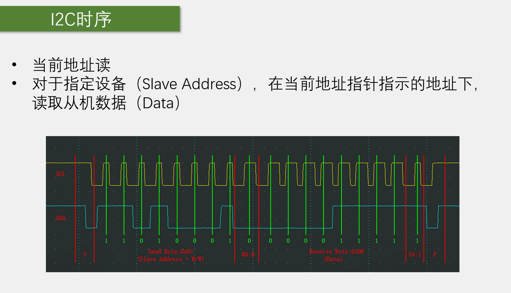

#### 4.2.3 指定地址读

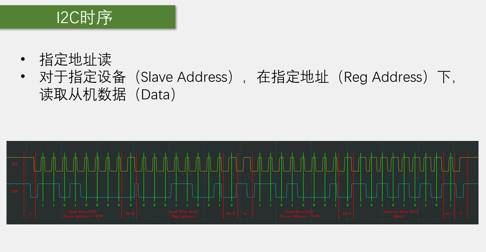

---

## 5. STM32 I2C 结构

### 5.1 I2C 基本结构

I2C基本结构包含以下部分：

- **SCL**：串行时钟线
- **时钟控制器**：控制SCL线的时序
- **GPIO**：通用输入输出引脚，用于连接SCL和SDA
- **移位寄存器**：用于数据的串行和并行转换
- **SDA**：串行数据线
- **数据控制器**：控制SDA线的数据传输
- **数据寄存器DR**：存储待发送或接收的数据
- **开关控制**：控制数据的流向


### 5.2 I2C 框图

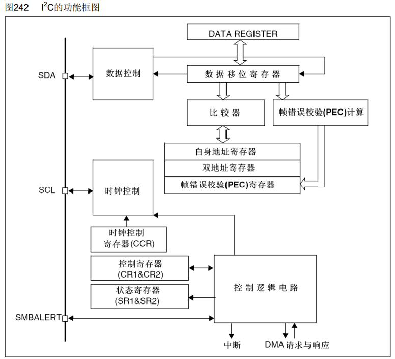

### 5.3 主发送器传送序列

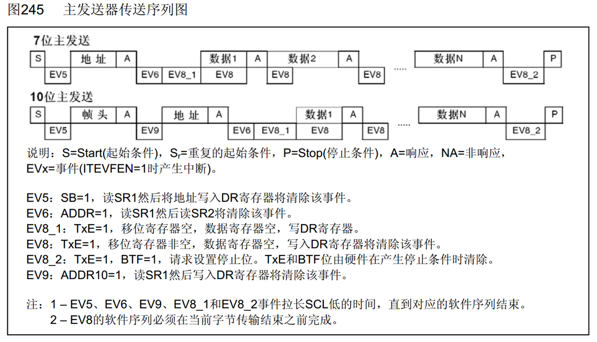

### 5.4 主接收器传送序列

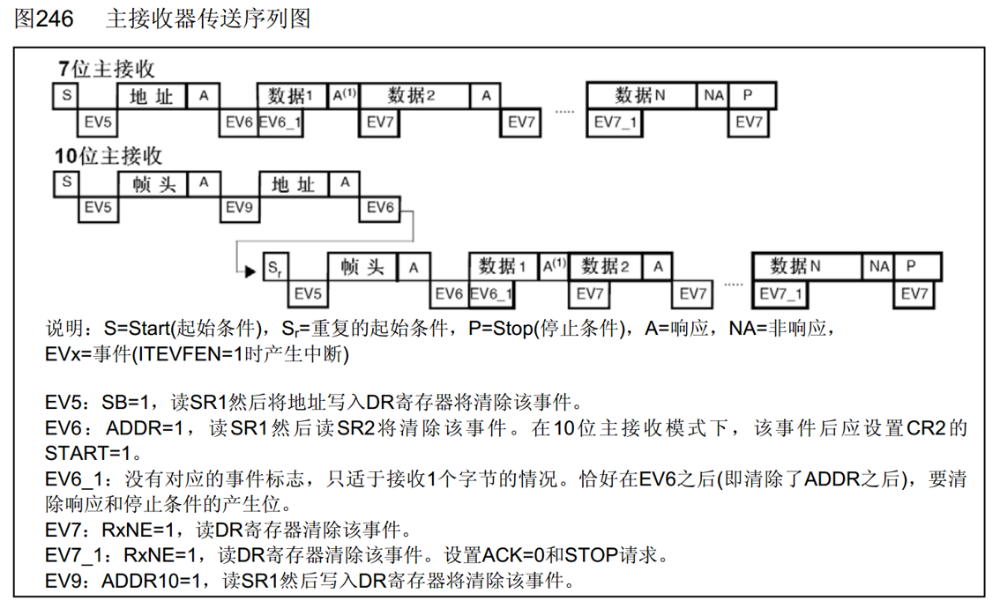

---

## 6. STM32 I2C 功能特点

### 6.1 硬件I2C特点

- **硬件自动执行**：由硬件自动执行时钟生成、起始终止条件生成、应答位收发、数据收发等功能，减轻CPU的负担
- **多主机模型**：支持多个主设备
- **地址模式**：支持7位/10位地址模式
- **通讯速度**：支持不同的通讯速度
  - 标准速度(高达100 kHz)
  - 快速(高达400 kHz)
- **DMA支持**：支持DMA传输
- **SMBus兼容**：兼容SMBus协议

### 6.2 软件与硬件I2C对比

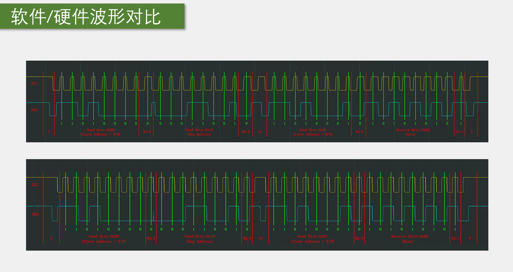

- **软件I2C**：使用GPIO模拟I2C时序，灵活性高，但占用CPU资源
- **硬件I2C**：由硬件自动执行，效率高，节省CPU资源

---

## 7. I2C 相关函数

### 7.1 初始化函数

| 函数名称 | 功能说明 |
|---------|----------|
| I2C_DeInit() | 将I2C寄存器重置为默认值 |
| I2C_Init() | 初始化I2C配置 |
| I2C_StructInit() | 将I2C结构体初始化为默认值 |

### 7.2 控制函数

| 函数名称 | 功能说明 |
|---------|----------|
| I2C_Cmd() | 使能或禁用I2C |
| I2C_ITConfig() | 配置I2C中断 |
| I2C_DMACmd() | 使能或禁用I2C的DMA |
| I2C_GenerateSTART() | 生成起始条件 |
| I2C_GenerateSTOP() | 生成终止条件 |
| I2C_Send7bitAddress() | 发送7位地址 |
| I2C_SendData() | 发送数据 |
| I2C_ReceiveData() | 接收数据 |
| I2C_AcknowledgeConfig() | 配置应答位 |

### 7.3 状态函数

| 函数名称 | 功能说明 |
|---------|----------|
| I2C_GetFlagStatus() | 获取I2C标志位状态 |
| I2C_ClearFlag() | 清除I2C标志位 |
| I2C_GetITStatus() | 获取I2C中断状态 |
| I2C_ClearITPendingBit() | 清除I2C中断挂起位 |

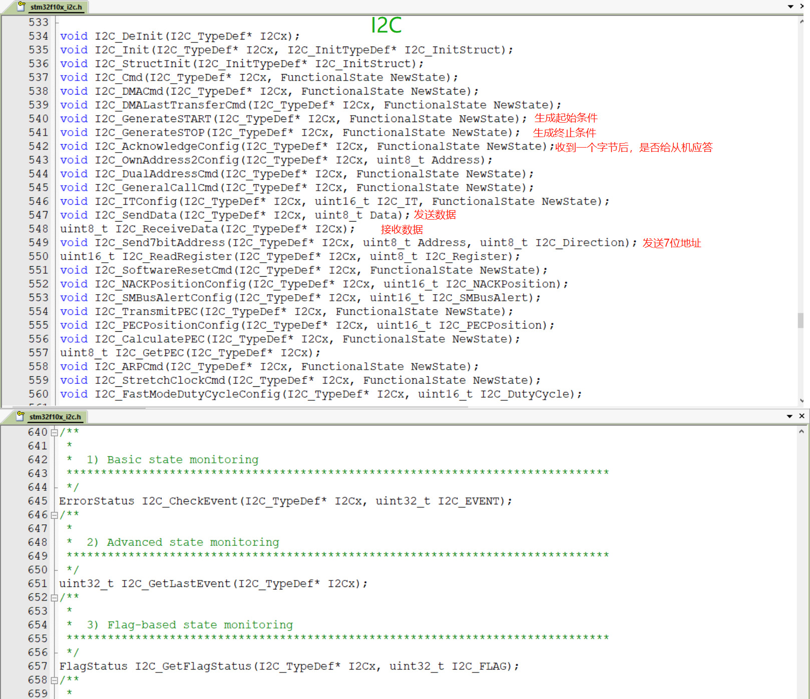

---

## 8. I2C 配置步骤

### 8.1 基本配置步骤

1. **使能I2C时钟**：调用`RCC_APB1PeriphClockCmd()`使能I2C时钟
2. **配置GPIO**：将SCL和SDA引脚配置为开漏输出模式
3. **配置I2C**：设置I2C模式、时钟频率、地址等参数
4. **配置中断**：根据需要配置I2C中断
5. **使能I2C**：调用`I2C_Cmd()`使能I2C

### 8.2 主设备发送数据步骤

1. **生成起始条件**：调用`I2C_GenerateSTART()`
2. **发送从设备地址**：调用`I2C_Send7bitAddress()`，设置为写模式
3. **等待应答**：等待`I2C_FLAG_ADDR`标志
4. **清除ADDR标志**：读取SR1和SR2寄存器
5. **发送数据**：调用`I2C_SendData()`
6. **等待数据发送完成**：等待`I2C_FLAG_TXE`标志
7. **生成终止条件**：调用`I2C_GenerateSTOP()`

### 8.3 主设备接收数据步骤

1. **生成起始条件**：调用`I2C_GenerateSTART()`
2. **发送从设备地址**：调用`I2C_Send7bitAddress()`，设置为读模式
3. **等待应答**：等待`I2C_FLAG_ADDR`标志
4. **清除ADDR标志**：读取SR1和SR2寄存器
5. **配置应答**：调用`I2C_AcknowledgeConfig()`
6. **接收数据**：调用`I2C_ReceiveData()`
7. **生成终止条件**：调用`I2C_GenerateSTOP()`

---

## 9. 示例代码

### 9.1 I2C初始化示例

```c
// I2C1初始化函数
void I2C1_Init(void)
{
    GPIO_InitTypeDef GPIO_InitStructure;
    I2C_InitTypeDef I2C_InitStructure;
    
    // 使能I2C1和GPIOB时钟
    RCC_APB1PeriphClockCmd(RCC_APB1Periph_I2C1, ENABLE);
    RCC_APB2PeriphClockCmd(RCC_APB2Periph_GPIOB, ENABLE);
    
    // 配置PB6(SCL)和PB7(SDA)为开漏输出
    GPIO_InitStructure.GPIO_Pin = GPIO_Pin_6 | GPIO_Pin_7;
    GPIO_InitStructure.GPIO_Mode = GPIO_Mode_AF_OD;
    GPIO_InitStructure.GPIO_Speed = GPIO_Speed_50MHz;
    GPIO_Init(GPIOB, &GPIO_InitStructure);
    
    // 配置I2C1
    I2C_InitStructure.I2C_Mode = I2C_Mode_I2C;
    I2C_InitStructure.I2C_DutyCycle = I2C_DutyCycle_2;
    I2C_InitStructure.I2C_OwnAddress1 = 0x00;
    I2C_InitStructure.I2C_Ack = I2C_Ack_Enable;
    I2C_InitStructure.I2C_AcknowledgedAddress = I2C_AcknowledgedAddress_7bit;
    I2C_InitStructure.I2C_ClockSpeed = 100000; // 100kHz
    I2C_Init(I2C1, &I2C_InitStructure);
    
    // 使能I2C1
    I2C_Cmd(I2C1, ENABLE);
}
```

### 9.2 主设备发送数据示例

```c
// I2C发送数据函数
void I2C_SendData(uint8_t slaveAddr, uint8_t regAddr, uint8_t data)
{
    // 生成起始条件
    I2C_GenerateSTART(I2C1, ENABLE);
    while(!I2C_CheckEvent(I2C1, I2C_EVENT_MASTER_MODE_SELECT));
    
    // 发送从设备地址（写模式）
    I2C_Send7bitAddress(I2C1, slaveAddr << 1, I2C_Direction_Transmitter);
    while(!I2C_CheckEvent(I2C1, I2C_EVENT_MASTER_TRANSMITTER_MODE_SELECTED));
    
    // 发送寄存器地址
    I2C_SendData(I2C1, regAddr);
    while(!I2C_CheckEvent(I2C1, I2C_EVENT_MASTER_BYTE_TRANSMITTING));
    
    // 发送数据
    I2C_SendData(I2C1, data);
    while(!I2C_CheckEvent(I2C1, I2C_EVENT_MASTER_BYTE_TRANSMITTED));
    
    // 生成终止条件
    I2C_GenerateSTOP(I2C1, ENABLE);
}
```

### 9.3 主设备接收数据示例

```c
// I2C接收数据函数
uint8_t I2C_ReceiveData(uint8_t slaveAddr, uint8_t regAddr)
{
    uint8_t data;
    
    // 生成起始条件
    I2C_GenerateSTART(I2C1, ENABLE);
    while(!I2C_CheckEvent(I2C1, I2C_EVENT_MASTER_MODE_SELECT));
    
    // 发送从设备地址（写模式）
    I2C_Send7bitAddress(I2C1, slaveAddr << 1, I2C_Direction_Transmitter);
    while(!I2C_CheckEvent(I2C1, I2C_EVENT_MASTER_TRANSMITTER_MODE_SELECTED));
    
    // 发送寄存器地址
    I2C_SendData(I2C1, regAddr);
    while(!I2C_CheckEvent(I2C1, I2C_EVENT_MASTER_BYTE_TRANSMITTING));
    
    // 重新生成起始条件
    I2C_GenerateSTART(I2C1, ENABLE);
    while(!I2C_CheckEvent(I2C1, I2C_EVENT_MASTER_MODE_SELECT));
    
    // 发送从设备地址（读模式）
    I2C_Send7bitAddress(I2C1, slaveAddr << 1, I2C_Direction_Receiver);
    while(!I2C_CheckEvent(I2C1, I2C_EVENT_MASTER_RECEIVER_MODE_SELECTED));
    
    // 配置为非应答
    I2C_AcknowledgeConfig(I2C1, DISABLE);
    
    // 生成终止条件
    I2C_GenerateSTOP(I2C1, ENABLE);
    
    // 接收数据
    while(!I2C_CheckEvent(I2C1, I2C_EVENT_MASTER_BYTE_RECEIVED));
    data = I2C_ReceiveData(I2C1);
    
    // 重新配置为应答
    I2C_AcknowledgeConfig(I2C1, ENABLE);
    
    return data;
}
```

---

## 10. 总结

I2C是一种常用的串行通信总线，具有以下特点：

- **简单可靠**：只需要两根线即可实现设备间通信
- **多设备支持**：总线上可以挂载多个设备
- **灵活配置**：支持不同的通信速度和地址模式
- **硬件支持**：STM32内部集成了硬件I2C，减轻CPU负担

掌握I2C的配置和使用方法，对于STM32项目开发非常重要。通过本文档的学习，希望读者能够熟练掌握I2C的使用技巧，为STM32项目开发提供可靠的通信支持。