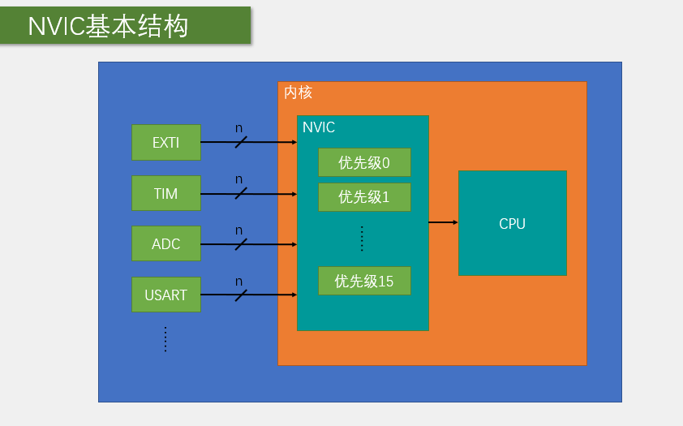
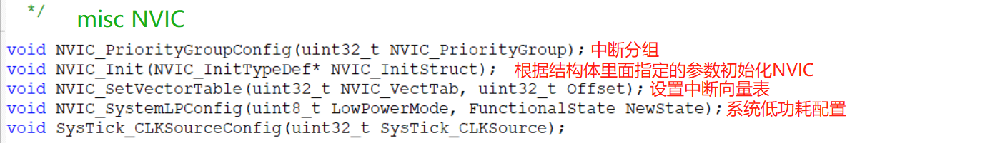

# STM32 NVIC

---

## 1. NVIC 简介

NVIC（Nested Vectored Interrupt Controller）嵌套向量中断控制器，是ARM Cortex-M3/M4内核中的一个重要组件，用于管理和控制STM32微控制器的中断系统。

- **中断管理**：统一管理STM32的所有可屏蔽中断
- **优先级控制**：支持16级可编程中断优先级
- **中断嵌套**：支持高优先级中断打断低优先级中断的嵌套机制
- **向量表**：使用向量表进行中断服务程序的快速跳转

---

## 2. 中断系统基本概念

### 2.1 中断定义

中断：在主程序运行过程中，出现了特定的中断触发条件（中断源），使得CPU暂停当前正在运行的程序，转而去处理中断程序，处理完成后又返回原来被暂停的位置继续运行。

### 2.2 中断优先级

中断优先级：当有多个中断源同时申请中断时，CPU会根据中断源的轻重缓急进行裁决，优先响应更加紧急的中断源。

### 2.3 中断嵌套

中断嵌套：当一个中断程序正在运行时，又有新的更高优先级的中断源申请中断，CPU再次暂停当前中断程序，转而去处理新的中断程序，处理完成后依次进行返回。

---

## 3. STM32 中断特点

### 3.1 中断通道

- **68个可屏蔽中断通道**，包含EXTI、TIM、ADC、USART、SPI、I2C、RTC等多个外设
- **使用NVIC统一管理中断**，每个中断通道都拥有16个可编程的优先等级
- **可对优先级进行分组**，进一步设置抢占优先级和响应优先级

### 3.2 中断向量表

STM32的中断向量表存储了各个中断的入口地址，当中断发生时，CPU会根据中断号从向量表中找到对应的中断服务程序入口地址，然后跳转到该地址执行中断服务程序。

---

## 4. NVIC 基本结构

NVIC的基本结构包括：

- **中断优先级寄存器**：用于设置中断的优先级
- **中断使能寄存器**：用于使能或禁用中断
- **中断挂起寄存器**：用于挂起或解除挂起中断
- **中断激活寄存器**：用于标识当前正在处理的中断



---

## 5. NVIC 优先级分组

### 5.1 优先级寄存器

NVIC的中断优先级由优先级寄存器的4位（0~15）决定，这4位可以进行切分，分为高n位的抢占优先级和低4-n位的响应优先级。

### 5.2 优先级分组方式

| 分组方式 | 抢占优先级 | 响应优先级 |
|---------|----------|----------|
| 分组0 | 0位，取值为0 | 4位，取值为0~15 |
| 分组1 | 1位，取值为0~1 | 3位，取值为0~7 |
| 分组2 | 2位，取值为0~3 | 2位，取值为0~3 |
| 分组3 | 3位，取值为0~7 | 1位，取值为0~1 |
| 分组4 | 4位，取值为0~15 | 0位，取值为0 |

### 5.3 优先级判断规则

- **抢占优先级高的可以中断嵌套**
- **响应优先级高的可以优先排队**
- **抢占优先级和响应优先级均相同的按中断号排队**

---

## 6. NVIC 相关函数

### 6.1 优先级分组函数

| 函数名称 | 功能说明 |
|---------|----------|
| NVIC_PriorityGroupConfig() | 设置NVIC优先级分组 |

### 6.2 中断初始化函数

| 函数名称 | 功能说明 |
|---------|----------|
| NVIC_Init() | 初始化NVIC中断配置 |

### 6.3 其他函数

| 函数名称 | 功能说明 |
|---------|----------|
| NVIC_SetVectorTable() | 设置中断向量表地址 |
| NVIC_SystemLPConfig() | 配置系统低功耗模式 |



---

## 7. NVIC 配置步骤

### 7.1 基本配置步骤

1. **设置优先级分组**：调用`NVIC_PriorityGroupConfig()`函数设置优先级分组方式
2. **初始化NVIC结构体**：配置中断通道、抢占优先级、响应优先级等参数
3. **调用NVIC_Init()**：应用NVIC配置
4. **编写中断服务函数**：在中断向量表中注册中断服务函数

### 7.2 中断服务函数命名规则

STM32的中断服务函数名称必须与启动文件中的中断向量表中的名称一致，例如：

- EXTI0_IRQHandler
- TIM2_IRQHandler
- USART1_IRQHandler

---

## 8. 示例代码

### 8.1 NVIC配置示例

```c
// 配置NVIC函数
void NVIC_Config(void)
{
    NVIC_InitTypeDef NVIC_InitStructure;
    
    // 设置优先级分组为分组2
    // 抢占优先级2位，响应优先级2位
    NVIC_PriorityGroupConfig(NVIC_PriorityGroup_2);
    
    // 配置TIM3中断
    NVIC_InitStructure.NVIC_IRQChannel = TIM3_IRQn;
    NVIC_InitStructure.NVIC_IRQChannelPreemptionPriority = 0; // 抢占优先级0
    NVIC_InitStructure.NVIC_IRQChannelSubPriority = 1; // 响应优先级1
    NVIC_InitStructure.NVIC_IRQChannelCmd = ENABLE;
    NVIC_Init(&NVIC_InitStructure);
    
    // 配置EXTI0中断
    NVIC_InitStructure.NVIC_IRQChannel = EXTI0_IRQn;
    NVIC_InitStructure.NVIC_IRQChannelPreemptionPriority = 1; // 抢占优先级1
    NVIC_InitStructure.NVIC_IRQChannelSubPriority = 0; // 响应优先级0
    NVIC_InitStructure.NVIC_IRQChannelCmd = ENABLE;
    NVIC_Init(&NVIC_InitStructure);
}
```

### 8.2 中断服务函数示例

```c
// TIM3中断服务函数
void TIM3_IRQHandler(void)
{
    if (TIM_GetITStatus(TIM3, TIM_IT_Update) != RESET)
    {
        // 中断处理代码
        LED_Toggle(); // 翻转LED状态
        
        TIM_ClearITPendingBit(TIM3, TIM_IT_Update); // 清除中断标志位
    }
}

// EXTI0中断服务函数
void EXTI0_IRQHandler(void)
{
    if (EXTI_GetITStatus(EXTI_Line0) != RESET)
    {
        // 中断处理代码
        Beep_Toggle(); // 翻转蜂鸣器状态
        
        EXTI_ClearITPendingBit(EXTI_Line0); // 清除中断标志位
    }
}
```

### 8.3 完整配置示例

```c
// 外部中断配置函数
void EXTI_Config(void)
{
    GPIO_InitTypeDef GPIO_InitStructure;
    EXTI_InitTypeDef EXTI_InitStructure;
    NVIC_InitTypeDef NVIC_InitStructure;
    
    // 使能GPIOA时钟
    RCC_APB2PeriphClockCmd(RCC_APB2Periph_GPIOA | RCC_APB2Periph_AFIO, ENABLE);
    
    // 配置PA0为输入模式
    GPIO_InitStructure.GPIO_Pin = GPIO_Pin_0;
    GPIO_InitStructure.GPIO_Mode = GPIO_Mode_IN_FLOATING;
    GPIO_Init(GPIOA, &GPIO_InitStructure);
    
    // 配置EXTI线0
    GPIO_EXTILineConfig(GPIO_PortSourceGPIOA, GPIO_PinSource0);
    
    EXTI_InitStructure.EXTI_Line = EXTI_Line0;
    EXTI_InitStructure.EXTI_Mode = EXTI_Mode_Interrupt;
    EXTI_InitStructure.EXTI_Trigger = EXTI_Trigger_Falling;
    EXTI_InitStructure.EXTI_LineCmd = ENABLE;
    EXTI_Init(&EXTI_InitStructure);
    
    // 配置NVIC
    NVIC_PriorityGroupConfig(NVIC_PriorityGroup_2);
    
    NVIC_InitStructure.NVIC_IRQChannel = EXTI0_IRQn;
    NVIC_InitStructure.NVIC_IRQChannelPreemptionPriority = 0;
    NVIC_InitStructure.NVIC_IRQChannelSubPriority = 0;
    NVIC_InitStructure.NVIC_IRQChannelCmd = ENABLE;
    NVIC_Init(&NVIC_InitStructure);
}

// EXTI0中断服务函数
void EXTI0_IRQHandler(void)
{
    if (EXTI_GetITStatus(EXTI_Line0) != RESET)
    {
        // 延时消抖
        delay_ms(10);
        if (GPIO_ReadInputDataBit(GPIOA, GPIO_Pin_0) == 0)
        {
            // 按键按下，执行相应操作
            LED_Toggle();
        }
        
        EXTI_ClearITPendingBit(EXTI_Line0); // 清除中断标志位
    }
}
```

---

## 9. 总结

NVIC是STM32微控制器中断系统的核心组件，通过合理配置NVIC，可以实现：

- **中断优先级管理**：根据系统需求设置不同中断的优先级
- **中断嵌套**：实现高优先级中断打断低优先级中断的功能
- **中断响应优化**：提高系统对紧急事件的响应速度
- **系统稳定性**：合理的中断优先级配置可以避免中断风暴，提高系统稳定性

掌握NVIC的配置和使用方法，对于STM32的中断系统开发至关重要。通过本文档的学习，希望读者能够熟练掌握NVIC的使用技巧，为STM32项目开发提供可靠的中断支持。