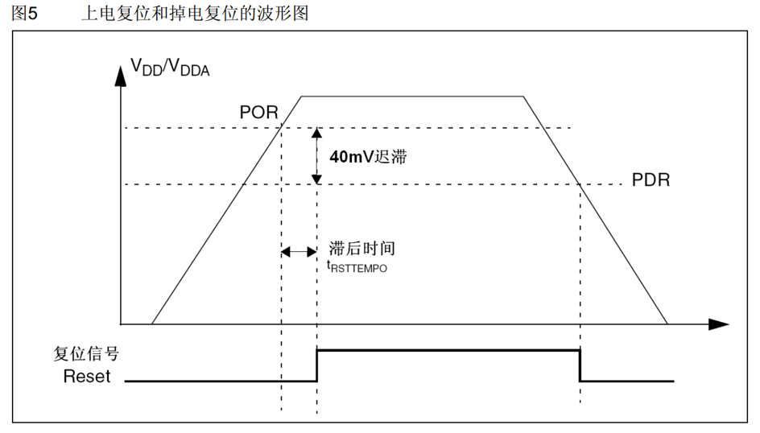
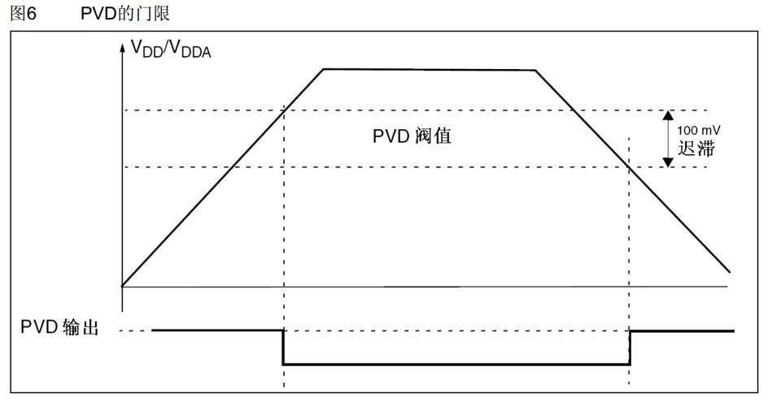
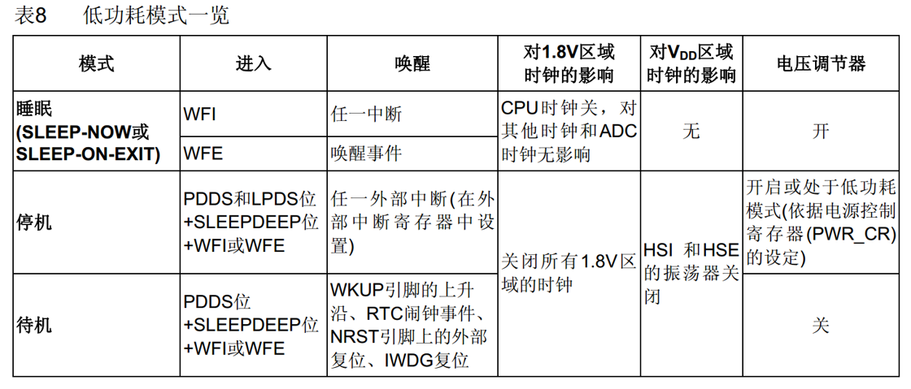
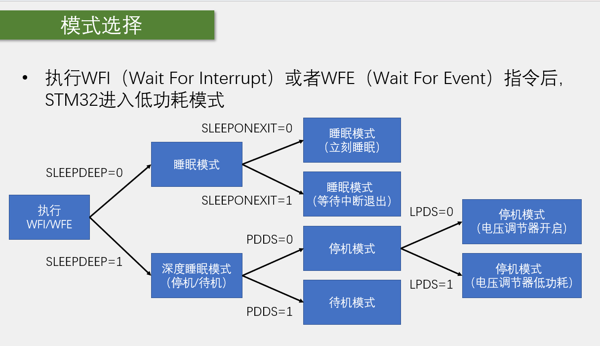
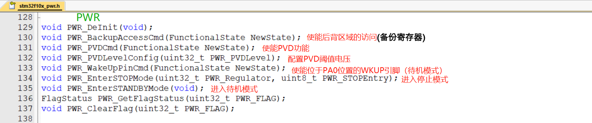

# STM32 PWR

---

## 1. PWR 简介

PWR（Power Control）电源控制负责管理STM32内部的电源供电部分，可以实现可编程电压监测器和低功耗模式的功能。

- **可编程电压监测器（PVD）**：可以监控VDD电源电压，当VDD下降到PVD阀值以下或上升到PVD阀值之上时，PVD会触发中断，用于执行紧急关闭任务
- **低功耗模式**：包括睡眠模式（Sleep）、停机模式（Stop）和待机模式（Standby），可在系统空闲时，降低STM32的功耗，延长设备使用时间

### 1.1 电源框图


---

## 2. 上电复位和掉电复位

### 2.1 复位机制

上电复位（POR）和掉电复位（PDR）是STM32的基本电源监控机制。



- **上电复位（POR）**：当VDD电压上升到某个阈值时，系统自动复位
- **掉电复位（PDR）**：当VDD电压下降到某个阈值时，系统自动复位

---

## 3. 可编程电压监测器（PVD）

### 3.1 PVD 概述

可编程电压监测器（PVD）可以监控VDD电源电压，当VDD下降到PVD阀值以下或上升到PVD阀值之上时，PVD会触发中断，用于执行紧急关闭任务。

### 3.2 PVD 门限



PVD门限可以通过PWR_CR寄存器的PLS位配置，共有7个可选等级。

---

## 4. 低功耗模式

### 4.1 低功耗模式一览



STM32提供三种低功耗模式，根据功耗和唤醒需求进行选择：

| 模式 | 功耗 | 唤醒时间 | 保留内容 |
|------|------|----------|----------|
| 睡眠模式 | 中等 | 短 | 全部寄存器和SRAM |
| 停机模式 | 低 | 中等 | SRAM和寄存器 |
| 待机模式 | 最低 | 长 | 仅备份寄存器 |

### 4.2 模式选择流程



---

## 5. 睡眠模式

### 5.1 睡眠模式概述

执行完WFI/WFE指令后，STM32进入睡眠模式，程序暂停运行，唤醒后程序从暂停的地方继续运行。

### 5.2 睡眠模式特点

- **SLEEPONEXIT位**：决定STM32执行完WFI或WFE后，是立刻进入睡眠，还是等STM32从最低优先级的中断处理程序中退出时进入睡眠
- **I/O引脚状态**：在睡眠模式下，所有的I/O引脚都保持它们在运行模式时的状态
- **唤醒方式**：
  - WFI指令进入睡眠模式，可被任意一个NVIC响应的中断唤醒
  - WFE指令进入睡眠模式，可被唤醒事件唤醒

---

## 6. 停止模式

### 6.1 停止模式概述

执行完WFI/WFE指令后，STM32进入停止模式，程序暂停运行，唤醒后程序从暂停的地方继续运行。

### 6.2 停止模式特点

- **时钟状态**：1.8V供电区域的所有时钟都被停止，PLL、HSI和HSE被禁止
- **内容保留**：SRAM和寄存器内容被保留下来
- **I/O引脚状态**：在停止模式下，所有的I/O引脚都保持它们在运行模式时的状态
- **唤醒时钟**：当一个中断或唤醒事件导致退出停止模式时，HSI被选为系统时钟
- **启动延时**：当电压调节器处于低功耗模式下，系统从停止模式退出时，会有一段额外的启动延时
- **唤醒方式**：
  - WFI指令进入停止模式，可被任意一个EXTI中断唤醒
  - WFE指令进入停止模式，可被任意一个EXTI事件唤醒

---

## 7. 待机模式

### 7.1 待机模式概述

执行完WFI/WFE指令后，STM32进入待机模式，唤醒后程序从头开始运行。

### 7.2 待机模式特点

- **电源状态**：整个1.8V供电区域被断电，PLL、HSI和HSE也被断电
- **内容丢失**：SRAM和寄存器内容丢失，只有备份的寄存器和待机电路维持供电
- **I/O引脚状态**：在待机模式下，所有的I/O引脚变为高阻态（浮空输入）
- **唤醒方式**：
  - WKUP引脚的上升沿
  - RTC闹钟事件的上升沿
  - NRST引脚上外部复位
  - IWDG复位退出待机模式

---

## 8. PWR 相关函数



### 8.1 初始化与控制函数

| 函数名称 | 功能说明 |
|---------|----------|
| PWR_DeInit() | 将PWR寄存器重置为默认值 |
| PWR_BackupAccessCmd() | 使能或禁用对BKP和RTC的访问 |
| PWR_PVDCmd() | 使能或禁用PVD功能 |
| PWR_PVDLevelConfig() | 配置PVD检测电平 |
| PWR_WakeUpPinCmd() | 使能或禁用WKUP引脚 |

### 8.2 低功耗模式函数

| 函数名称 | 功能说明 |
|---------|----------|
| PWR_EnterSleepMode() | 进入睡眠模式 |
| PWR_EnterSTOPMode() | 进入停止模式 |
| PWR_EnterSTANDBYMode() | 进入待机模式 |

### 8.3 状态函数

| 函数名称 | 功能说明 |
|---------|----------|
| PWR_GetFlagStatus() | 获取PWR标志位状态 |
| PWR_ClearFlag() | 清除PWR标志位 |

---

## 9. PWR 配置步骤

### 9.1 PVD 配置步骤

1. **使能PWR时钟**：调用`RCC_APB1PeriphClockCmd()`使能PWR时钟
2. **配置PVD电平**：调用`PWR_PVDLevelConfig()`设置PVD检测电平
3. **配置PVD中断**：根据需要配置EXTI和NVIC
4. **使能PVD**：调用`PWR_PVDCmd(ENABLE)`使能PVD功能

### 9.2 睡眠模式配置步骤

1. **配置SLEEPONEXIT**：根据需要配置`SLEEPONEXIT`位
2. **进入睡眠模式**：调用`WFI()`或`WFE()`指令，或使用`PWR_EnterSleepMode()`函数
3. **等待唤醒**：等待中断或事件唤醒

### 9.3 停止模式配置步骤

1. **配置EXTI中断**：配置用于唤醒的EXTI中断
2. **配置电压调节器**：根据需要配置电压调节器模式
3. **进入停止模式**：调用`PWR_EnterSTOPMode()`函数
4. **等待唤醒**：等待EXTI中断或事件唤醒

### 9.4 待机模式配置步骤

1. **清除唤醒标志**：调用`PWR_ClearFlag()`清除唤醒标志
2. **使能WKUP引脚**：如果需要，调用`PWR_WakeUpPinCmd(ENABLE)`使能WKUP引脚
3. **配置RTC闹钟**：如果需要，配置RTC闹钟
4. **进入待机模式**：调用`PWR_EnterSTANDBYMode()`函数
5. **等待唤醒**：等待WKUP引脚、RTC闹钟或复位唤醒

---

## 10. 示例代码

### 10.1 PVD 配置示例

```c
// PVD初始化函数
void PVD_Init(void)
{
    // 使能PWR时钟
    RCC_APB1PeriphClockCmd(RCC_APB1Periph_PWR, ENABLE);
    
    // 配置PVD检测电平 (2.8V)
    PWR_PVDLevelConfig(PWR_PVDLevel_2V8);
    
    // 配置EXTI线16 (PVD输出)
    EXTI_InitTypeDef EXTI_InitStructure;
    EXTI_InitStructure.EXTI_Line = EXTI_Line16;
    EXTI_InitStructure.EXTI_Mode = EXTI_Mode_Interrupt;
    EXTI_InitStructure.EXTI_Trigger = EXTI_Trigger_Rising_Falling;
    EXTI_InitStructure.EXTI_LineCmd = ENABLE;
    EXTI_Init(&amp;EXTI_InitStructure);
    
    // 配置NVIC
    NVIC_InitTypeDef NVIC_InitStructure;
    NVIC_InitStructure.NVIC_IRQChannel = PVD_IRQn;
    NVIC_InitStructure.NVIC_IRQChannelPreemptionPriority = 0;
    NVIC_InitStructure.NVIC_IRQChannelSubPriority = 0;
    NVIC_InitStructure.NVIC_IRQChannelCmd = ENABLE;
    NVIC_Init(&amp;NVIC_InitStructure);
    
    // 使能PVD
    PWR_PVDCmd(ENABLE);
}

// PVD中断处理函数
void PVD_IRQHandler(void)
{
    if(EXTI_GetITStatus(EXTI_Line16) != RESET)
    {
        // 检查PVD状态
        if(PWR_GetFlagStatus(PWR_FLAG_PVDO) != RESET)
        {
            // VDD低于PVD阀值，执行紧急任务
        }
        else
        {
            // VDD高于PVD阀值
        }
        
        // 清除中断标志
        EXTI_ClearITPendingBit(EXTI_Line16);
    }
}
```

### 10.2 睡眠模式示例

```c
// 进入睡眠模式
void Enter_SleepMode(void)
{
    // 进入睡眠模式，WFI指令
    __WFI();
}
```

### 10.3 停止模式示例

```c
// 进入停止模式
void Enter_StopMode(void)
{
    // 进入停止模式，电压调节器低功耗模式，WFI指令
    PWR_EnterSTOPMode(PWR_Regulator_LowPower, PWR_STOPEntry_WFI);
    
    // 唤醒后重新配置系统时钟
    SystemInit();
}
```

### 10.4 待机模式示例

```c
// 进入待机模式
void Enter_StandbyMode(void)
{
    // 清除唤醒标志
    PWR_ClearFlag(PWR_FLAG_WU);
    
    // 使能WKUP引脚
    PWR_WakeUpPinCmd(ENABLE);
    
    // 进入待机模式
    PWR_EnterSTANDBYMode();
}
```

---

## 11. 总结

PWR（电源控制）是STM32中重要的外设，具有以下特点：

- **PVD功能**：可编程电压监测器，可监控VDD电压，在电压异常时触发中断
- **低功耗模式**：提供睡眠模式、停止模式和待机模式三种低功耗模式，满足不同的功耗需求
- **电源管理**：负责管理STM32内部的电源供电部分
- **灵活配置**：可根据应用需求选择合适的低功耗模式和PVD电平

掌握PWR的配置和使用方法，对于需要低功耗设计的STM32项目非常重要。通过本文档的学习，希望读者能够熟练掌握PWR的使用技巧，为项目开发提供可靠的电源管理支持。
