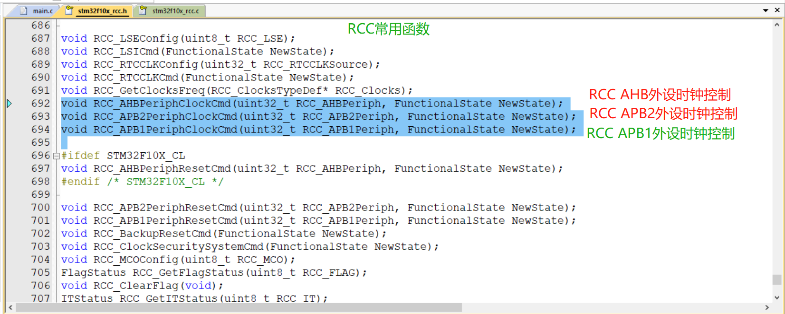

# STM32 RCC

---

## 1. RCC 简介

RCC（Reset and Clock Control）复位和时钟控制，是STM32微控制器中的一个重要外设，负责管理和控制整个系统的时钟。

- **时钟管理**：配置和管理系统时钟、外设时钟
- **复位控制**：控制系统复位和外设复位
- **时钟安全**：提供时钟监控和安全机制
- **低功耗管理**：支持各种低功耗模式的时钟配置

---

## 2. RCC 系统结构

STM32的时钟系统结构主要包括：

- **时钟源**：内部高速时钟（HSI）、外部高速时钟（HSE）、内部低速时钟（LSI）、外部低速时钟（LSE）
- **时钟树**：PLL倍频器、AHB总线预分频器、APB1/APB2总线预分频器
- **时钟输出**：系统时钟（SYSCLK）、AHB总线时钟（HCLK）、APB1总线时钟（PCLK1）、APB2总线时钟（PCLK2）


---

## 3. RCC 时钟源

### 3.1 时钟源类型

| 时钟源 | 频率 | 特点 | 应用场景 |
|-------|------|------|----------|
| HSI | 8MHz | 内部时钟，精度不高 | 系统启动时使用，或作为备用时钟 |
| HSE | 4-16MHz | 外部晶体振荡器，精度高 | 系统主时钟，需要高精度时钟的场景 |
| LSI | 40kHz | 内部低速时钟 | RTC时钟，看门狗时钟 |
| LSE | 32.768kHz | 外部低速晶体振荡器 | RTC时钟，需要高精度低功耗时钟的场景 |

### 3.2 PLL倍频器

PLL（Phase-Locked Loop）锁相环，用于将输入时钟倍频到更高的频率：

- **输入源**：可以选择HSI/2、HSE或HSE/2
- **倍频系数**：2-16倍
- **输出频率**：最高72MHz

---

## 4. RCC 时钟树

### 4.1 时钟树路径

1. **时钟源选择**：选择HSI、HSE或PLL作为系统时钟源
2. **PLL配置**：设置PLL输入源和倍频系数
3. **AHB预分频**：将系统时钟分频后作为AHB总线时钟
4. **APB1预分频**：将AHB总线时钟分频后作为APB1总线时钟（最高36MHz）
5. **APB2预分频**：将AHB总线时钟分频后作为APB2总线时钟（最高72MHz）
6. **外设时钟**：各外设根据所属总线获取时钟

### 4.2 时钟分配

- **SYSCLK**：系统时钟，最高72MHz
- **HCLK**：AHB总线时钟，最高72MHz
- **PCLK1**：APB1总线时钟，最高36MHz
- **PCLK2**：APB2总线时钟，最高72MHz
- **ADC时钟**：由PCLK2分频得到，最高14MHz
- **RTC时钟**：由LSI或LSE提供
- **I2S时钟**：由外部时钟或内部PLL提供

---

## 5. RCC 相关函数

### 5.1 时钟源配置函数

| 函数名称 | 功能说明 |
|---------|----------|
| RCC_HSEConfig() | 配置HSE外部高速时钟 |
| RCC_HSICmd() | 使能或禁用HSI内部高速时钟 |
| RCC_LSEConfig() | 配置LSE外部低速时钟 |
| RCC_LSICmd() | 使能或禁用LSI内部低速时钟 |
| RCC_PLLConfig() | 配置PLL时钟源和倍频系数 |
| RCC_PLLCmd() | 使能或禁用PLL |

### 5.2 系统时钟配置函数

| 函数名称 | 功能说明 |
|---------|----------|
| RCC_SYSCLKConfig() | 选择系统时钟源 |
| RCC_GetSYSCLKSource() | 获取当前系统时钟源 |
| RCC_HCLKConfig() | 配置AHB总线预分频器 |
| RCC_PCLK1Config() | 配置APB1总线预分频器 |
| RCC_PCLK2Config() | 配置APB2总线预分频器 |
| RCC_ADCCLKConfig() | 配置ADC时钟分频器 |

### 5.3 外设时钟控制函数

| 函数名称 | 功能说明 |
|---------|----------|
| RCC_AHBPeriphClockCmd() | 控制AHB总线上的外设时钟 |
| RCC_APB2PeriphClockCmd() | 控制APB2总线上的外设时钟 |
| RCC_APB1PeriphClockCmd() | 控制APB1总线上的外设时钟 |

### 5.4 复位控制函数

| 函数名称 | 功能说明 |
|---------|----------|
| RCC_AHBPeriphResetCmd() | 控制AHB总线上的外设复位 |
| RCC_APB2PeriphResetCmd() | 控制APB2总线上的外设复位 |
| RCC_APB1PeriphResetCmd() | 控制APB1总线上的外设复位 |

### 5.5 其他函数

| 函数名称 | 功能说明 |
|---------|----------|
| RCC_ITConfig() | 配置RCC中断 |
| RCC_GetFlagStatus() | 获取RCC标志位状态 |
| RCC_ClearFlag() | 清除RCC标志位 |
| RCC_GetClocksFreq() | 获取各时钟频率 |



---

## 6. RCC 配置步骤

### 6.1 系统时钟配置步骤

1. **使能HSE**：调用`RCC_HSEConfig()`使能外部高速时钟
2. **等待HSE就绪**：等待HSE稳定
3. **配置PLL**：设置PLL输入源和倍频系数
4. **使能PLL**：调用`RCC_PLLCmd()`使能PLL
5. **等待PLL就绪**：等待PLL稳定
6. **选择系统时钟源**：将PLL设置为系统时钟源
7. **配置总线预分频器**：设置AHB、APB1、APB2的预分频系数
8. **等待系统时钟切换完成**：确保系统时钟已经切换到PLL

### 6.2 外设时钟配置步骤

1. **使能外设时钟**：根据外设所在总线，调用相应的时钟使能函数
2. **配置外设**：初始化外设的各项参数
3. **使用外设**：开始使用外设功能

---

## 7. 示例代码

### 7.1 系统时钟配置示例（72MHz）

```c
// 系统时钟配置函数
void SystemClock_Config(void)
{
    ErrorStatus HSEStatus;
    
    // 使能HSE
    RCC_HSEConfig(RCC_HSE_ON);
    HSEStatus = RCC_WaitForHSEStartUp();
    
    if (HSEStatus == SUCCESS)
    {
        // 配置PLL：HSE作为输入源，倍频系数为9，得到72MHz
        RCC_PLLConfig(RCC_PLLSource_HSE_Div1, RCC_PLLMul_9);
        
        // 使能PLL
        RCC_PLLCmd(ENABLE);
        
        // 等待PLL就绪
        while (RCC_GetFlagStatus(RCC_FLAG_PLLRDY) == RESET);
        
        // 选择PLL作为系统时钟源
        RCC_SYSCLKConfig(RCC_SYSCLKSource_PLLCLK);
        
        // 等待系统时钟切换完成
        while (RCC_GetSYSCLKSource() != 0x08);
        
        // 配置AHB预分频器：不分频
        RCC_HCLKConfig(RCC_SYSCLK_Div1);
        
        // 配置APB1预分频器：2分频，得到36MHz
        RCC_PCLK1Config(RCC_HCLK_Div2);
        
        // 配置APB2预分频器：不分频，得到72MHz
        RCC_PCLK2Config(RCC_HCLK_Div1);
        
        // 配置ADC时钟：6分频，得到12MHz
        RCC_ADCCLKConfig(RCC_PCLK2_Div6);
    }
    else
    {
        // HSE启动失败，使用HSI作为系统时钟
        // 配置AHB预分频器：不分频
        RCC_HCLKConfig(RCC_SYSCLK_Div1);
        
        // 配置APB1预分频器：2分频
        RCC_PCLK1Config(RCC_HCLK_Div2);
        
        // 配置APB2预分频器：不分频
        RCC_PCLK2Config(RCC_HCLK_Div1);
        
        // 配置ADC时钟：6分频
        RCC_ADCCLKConfig(RCC_PCLK2_Div6);
    }
}
```

### 7.2 外设时钟配置示例

```c
// GPIO时钟使能
RCC_APB2PeriphClockCmd(RCC_APB2Periph_GPIOA | RCC_APB2Periph_GPIOB, ENABLE);

// USART1时钟使能（USART1位于APB2总线）
RCC_APB2PeriphClockCmd(RCC_APB2Periph_USART1, ENABLE);

// TIM2时钟使能（TIM2位于APB1总线）
RCC_APB1PeriphClockCmd(RCC_APB1Periph_TIM2, ENABLE);

// DMA1时钟使能（DMA1位于AHB总线）
RCC_AHBPeriphClockCmd(RCC_AHBPeriph_DMA1, ENABLE);
```

### 7.3 时钟频率获取示例

```c
// 获取各时钟频率
RCC_ClocksTypeDef RCC_Clocks;
RCC_GetClocksFreq(&RCC_Clocks);

// 打印各时钟频率
printf("SYSCLK: %ld Hz\n", RCC_Clocks.SYSCLK_Frequency);
printf("HCLK: %ld Hz\n", RCC_Clocks.HCLK_Frequency);
printf("PCLK1: %ld Hz\n", RCC_Clocks.PCLK1_Frequency);
printf("PCLK2: %ld Hz\n", RCC_Clocks.PCLK2_Frequency);
printf("ADCCLK: %ld Hz\n", RCC_Clocks.ADCCLK_Frequency);
```

---

## 8. 总结

RCC是STM32微控制器中负责时钟管理的核心外设，通过合理配置RCC，可以实现：

- **系统时钟优化**：根据系统需求配置合适的时钟频率
- **外设时钟管理**：按需使能和禁用外设时钟，降低功耗
- **低功耗模式支持**：配置适合低功耗模式的时钟方案
- **时钟安全**：提供时钟监控和故障检测机制

掌握RCC的配置和使用方法，对于STM32的系统设计和性能优化非常重要。通过本文档的学习，希望读者能够熟练掌握RCC的使用技巧，为STM32项目开发提供可靠的时钟支持。