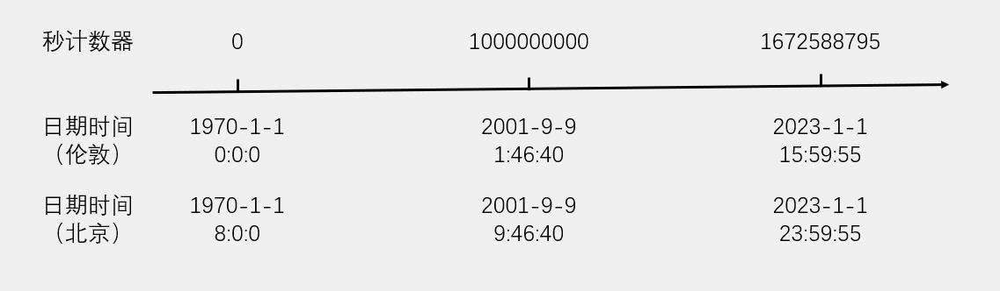
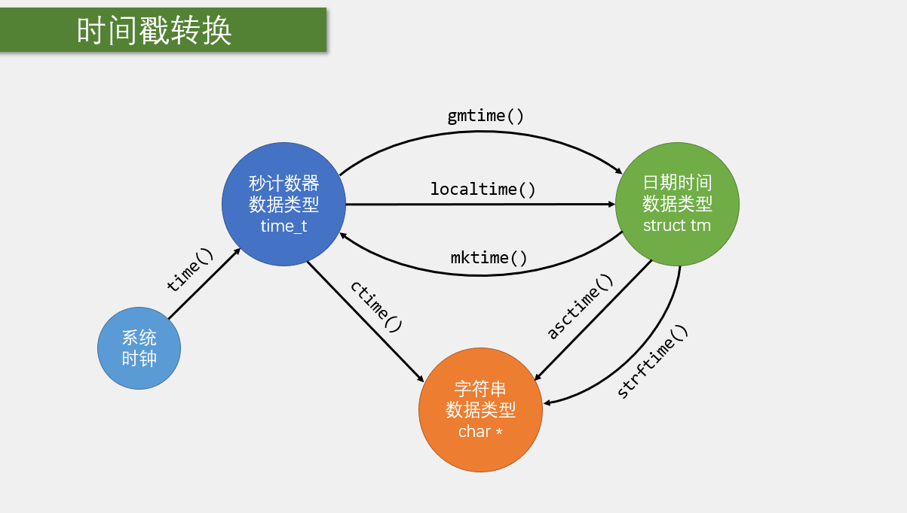
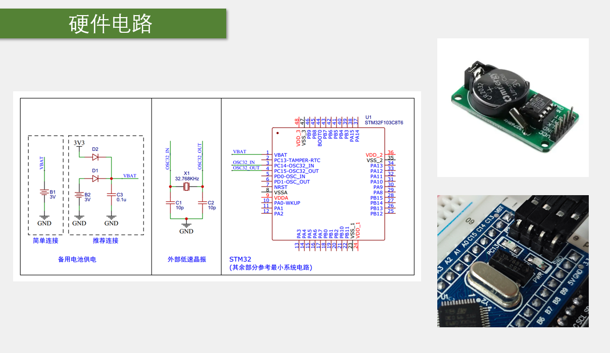
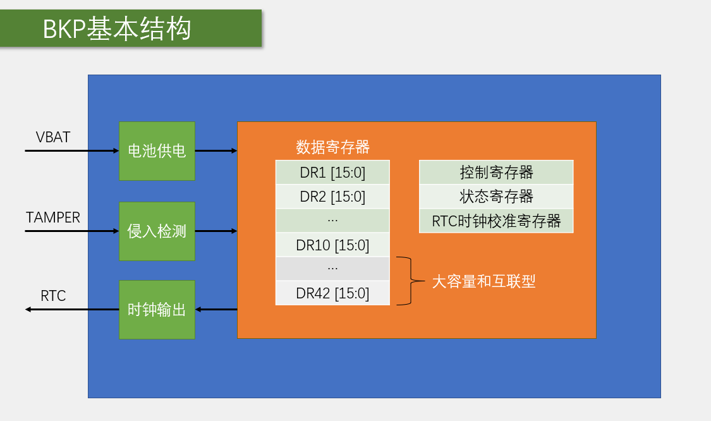
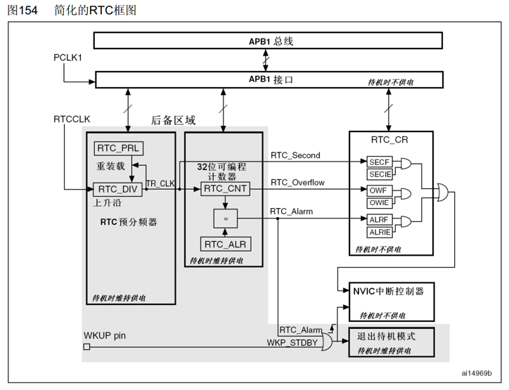
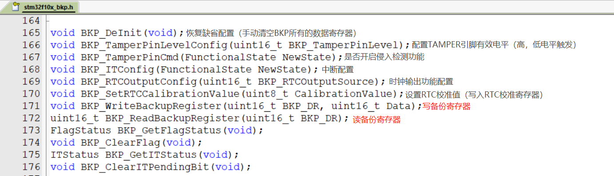
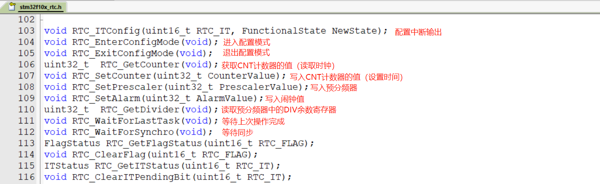

# STM32 RTC &amp; BKP

---

## 1. 时间与时间戳

### 1.1 Unix 时间戳

Unix 时间戳（Unix Timestamp）定义为从UTC/GMT的1970年1月1日0时0分0秒开始所经过的秒数，不考虑闰秒。

- 时间戳存储在一个秒计数器中，秒计数器为32位/64位的整型变量
- 世界上所有时区的秒计数器相同，不同时区通过添加偏移来得到当地时间



### 1.2 UTC/GMT

**GMT（Greenwich Mean Time）** 格林尼治标准时间是一种以地球自转为基础的时间计量系统。它将地球自转一周的时间间隔等分为24小时，以此确定计时标准。

**UTC（Universal Time Coordinated）** 协调世界时是一种以原子钟为基础的时间计量系统。它规定铯133原子基态的两个超精细能级间在零磁场下跃迁辐射9,192,631,770周所持续的时间为1秒。当原子钟计时一天的时间与地球自转一周的时间相差超过0.9秒时，UTC会执行闰秒来保证其计时与地球自转的协调一致。

### 1.3 时间戳转换

C语言的time.h模块提供了时间获取和时间戳转换的相关函数，可以方便地进行秒计数器、日期时间和字符串之间的转换。



| 函数 | 作用 |
|------|------|
| time_t time(time_t*); | 获取系统时钟 |
| struct tm* gmtime(const time_t*); | 秒计数器转换为日期时间（格林尼治时间） |
| struct tm* localtime(const time_t*); | 秒计数器转换为日期时间（当地时间） |
| time_t mktime(struct tm*); | 日期时间转换为秒计数器（当地时间） |
| char* ctime(const time_t*); | 秒计数器转换为字符串（默认格式） |
| char* asctime(const struct tm*); | 日期时间转换为字符串（默认格式） |
| size_t strftime(char*, size_t, const char*, const struct tm*); | 日期时间转换为字符串（自定义格式） |

---

## 2. 硬件电路

### 2.1 VBAT供电与硬件连接

硬件电路展示了STM32 RTC和BKP系统的完整硬件连接，包括VBAT备用电池供电、外部低速晶振（LSE）、TAMPER-RTC引脚等关键部分。



硬件电路主要包含以下部分：

- **VBAT备用电池供电**：为RTC和BKP提供断电后的持续供电
- **外部低速晶振（LSE）**：32.768KHz晶振连接到OSC32_IN和OSC32_OUT引脚
- **TAMPER-RTC引脚**：PC13-TAMPER-RTC用于入侵检测和RTC功能
- **简单连接、推荐连接、备用电池供电**：三种不同的连接方式

---

## 3. BKP 简介

### 3.1 BKP 概述

BKP（Backup Registers）备份寄存器，可用于存储用户应用程序数据。当VDD（2.0~3.6V）电源被切断，他们仍然由VBAT（1.8~3.6V）维持供电。当系统在待机模式下被唤醒，或系统复位或电源复位时，他们也不会被复位。

- TAMPER引脚产生的侵入事件将所有备份寄存器内容清除
- RTC引脚输出RTC校准时钟、RTC闹钟脉冲或者秒脉冲
- 存储RTC时钟校准寄存器

### 3.2 用户数据存储容量

| 芯片类型 | 存储容量 |
|----------|----------|
| 中容量和小容量 | 20字节 |
| 大容量和互联型 | 84字节 |

### 3.3 BKP 基本结构



---

## 4. RTC 简介

### 4.1 RTC 概述

RTC（Real Time Clock）实时时钟是一个独立的定时器，可为系统提供时钟和日历的功能。

- RTC和时钟配置系统处于后备区域，系统复位时数据不清零，VDD（2.0~3.6V）断电后可借助VBAT（1.8~3.6V）供电继续走时
- 32位的可编程计数器，可对应Unix时间戳的秒计数器
- 20位的可编程预分频器，可适配不同频率的输入时钟

### 4.2 RTC 时钟源

可选择三种RTC时钟源：

- HSE时钟除以128（通常为8MHz/128）
- LSE振荡器时钟（通常为32.768KHz）
- LSI振荡器时钟（40KHz）

### 4.3 RTC 基本结构


### 4.4 RTC 框图



---

## 5. RTC 操作注意事项

### 5.1 使能对BKP和RTC的访问

执行以下操作将使能对BKP和RTC的访问：

1. 设置RCC_APB1ENR的PWREN和BKPEN，使能PWR和BKP时钟
2. 设置PWR_CR的DBP，使能对BKP和RTC的访问

### 5.2 寄存器同步

若在读取RTC寄存器时，RTC的APB1接口曾经处于禁止状态，则软件首先必须等待RTC_CRL寄存器中的RSF位（寄存器同步标志）被硬件置1。

### 5.3 配置模式

必须设置RTC_CRL寄存器中的CNF位，使RTC进入配置模式后，才能写入RTC_PRL、RTC_CNT、RTC_ALR寄存器。

### 5.4 写操作

对RTC任何寄存器的写操作，都必须在前一次写操作结束后进行。可以通过查询RTC_CR寄存器中的RTOFF状态位，判断RTC寄存器是否处于更新中。仅当RTOFF状态位是1时，才可以写入RTC寄存器。

---

## 6. BKP 相关函数



### 6.1 初始化与控制函数

| 函数名称 | 功能说明 |
|---------|----------|
| BKP_DeInit() | 将BKP寄存器重置为默认值 |
| BKP_TamperPinLevelConfig() | 配置入侵检测引脚的触发电平 |
| BKP_TamperPinCmd() | 使能或禁用入侵检测功能 |
| BKP_ITConfig() | 配置入侵检测中断 |
| BKP_RTCOutputConfig() | 配置RTC输出 |

### 6.2 数据读写函数

| 函数名称 | 功能说明 |
|---------|----------|
| BKP_WriteBackupRegister() | 写入备份寄存器 |
| BKP_ReadBackupRegister() | 读取备份寄存器 |

### 6.3 状态函数

| 函数名称 | 功能说明 |
|---------|----------|
| BKP_GetFlagStatus() | 获取BKP标志位状态 |
| BKP_ClearFlag() | 清除BKP标志位 |
| BKP_GetITStatus() | 获取BKP中断状态 |
| BKP_ClearITPendingBit() | 清除BKP中断挂起位 |

---

## 7. RTC 相关函数



### 7.1 初始化函数

| 函数名称 | 功能说明 |
|---------|----------|
| RTC_DeInit() | 将RTC寄存器重置为默认值 |
| RTC_SetPrescaler() | 设置RTC预分频器 |
| RTC_SetCounter() | 设置RTC计数器值 |
| RTC_SetAlarm() | 设置RTC闹钟值 |

### 7.2 控制函数

| 函数名称 | 功能说明 |
|---------|----------|
| RTC_WaitForLastTask() | 等待上一次写操作完成 |
| RTC_WaitForSynchro() | 等待RTC寄存器同步 |
| RTC_EnterConfigMode() | 进入配置模式 |
| RTC_ExitConfigMode() | 退出配置模式 |
| RTC_ITConfig() | 配置RTC中断 |

### 7.3 状态函数

| 函数名称 | 功能说明 |
|---------|----------|
| RTC_GetCounter() | 获取RTC计数器值 |
| RTC_GetDivider() | 获取RTC预分频值 |
| RTC_GetFlagStatus() | 获取RTC标志位状态 |
| RTC_ClearFlag() | 清除RTC标志位 |
| RTC_GetITStatus() | 获取RTC中断状态 |
| RTC_ClearITPendingBit() | 清除RTC中断挂起位 |

---

## 8. RTC &amp; BKP 配置步骤

### 8.1 基本配置步骤

1. **使能时钟**：调用`RCC_APB1PeriphClockCmd()`使能PWR和BKP时钟
2. **使能访问**：调用`PWR_BackupAccessCmd(ENABLE)`使能对BKP和RTC的访问
3. **配置RTC时钟源**：选择LSE、LSI或HSE/128作为RTC时钟源
4. **配置预分频器**：根据时钟频率设置预分频值
5. **设置计数器初始值**：设置RTC计数器的初始值（时间戳）
6. **配置闹钟（可选）**：如果需要闹钟功能，设置闹钟值
7. **使能中断（可选）**：根据需要配置RTC中断
8. **退出配置模式**：配置完成后退出配置模式

### 8.2 读取时间步骤

1. **等待同步**：调用`RTC_WaitForSynchro()`等待寄存器同步
2. **读取计数器**：调用`RTC_GetCounter()`获取当前时间戳
3. **转换时间**：使用time.h函数将时间戳转换为日期时间

### 8.3 设置时间步骤

1. **使能访问**：确保已使能对BKP和RTC的访问
2. **等待写完成**：调用`RTC_WaitForLastTask()`等待上一次操作完成
3. **进入配置模式**：调用`RTC_EnterConfigMode()`进入配置模式
4. **设置计数器**：调用`RTC_SetCounter()`设置时间戳
5. **退出配置模式**：调用`RTC_ExitConfigMode()`退出配置模式

---

## 9. 示例代码

### 9.1 RTC初始化示例

```c
#include &lt;time.h&gt;

// RTC初始化函数
void RTC_Init(void)
{
    // 使能PWR和BKP时钟
    RCC_APB1PeriphClockCmd(RCC_APB1Periph_PWR | RCC_APB1Periph_BKP, ENABLE);
    
    // 使能对BKP和RTC的访问
    PWR_BackupAccessCmd(ENABLE);
    
    // 检查是否首次配置
    if (BKP_ReadBackupRegister(BKP_DR1) != 0x5050)
    {
        // 复位BKP
        BKP_DeInit();
        
        // 使能LSE
        RCC_LSEConfig(RCC_LSE_ON);
        while(RCC_GetFlagStatus(RCC_FLAG_LSERDY) == RESET);
        
        // 选择LSE作为RTC时钟源
        RCC_RTCCLKConfig(RCC_RTCCLKSource_LSE);
        
        // 使能RTC时钟
        RCC_RTCCLKCmd(ENABLE);
        
        // 等待同步
        RTC_WaitForSynchro();
        RTC_WaitForLastTask();
        
        // 设置预分频值 (32.768KHz / 32768 = 1Hz)
        RTC_SetPrescaler(32767);
        RTC_WaitForLastTask();
        
        // 设置初始时间 (2024-01-01 00:00:00)
        struct tm time_struct = {0};
        time_struct.tm_year = 2024 - 1900;
        time_struct.tm_mon = 0;
        time_struct.tm_mday = 1;
        time_struct.tm_hour = 0;
        time_struct.tm_min = 0;
        time_struct.tm_sec = 0;
        
        time_t time_stamp = mktime(&amp;time_struct);
        RTC_SetCounter(time_stamp);
        RTC_WaitForLastTask();
        
        // 标记已配置
        BKP_WriteBackupRegister(BKP_DR1, 0x5050);
    }
    else
    {
        // 等待同步
        RTC_WaitForSynchro();
    }
}
```

### 9.2 获取时间示例

```c
// 获取当前时间
void RTC_GetTime(struct tm *time_struct)
{
    time_t time_stamp = RTC_GetCounter();
    *time_struct = *localtime(&amp;time_stamp);
}
```

### 9.3 设置时间示例

```c
// 设置时间
void RTC_SetTime(struct tm *time_struct)
{
    time_t time_stamp = mktime(time_struct);
    
    RTC_WaitForLastTask();
    RTC_SetCounter(time_stamp);
    RTC_WaitForLastTask();
}
```

### 9.4 BKP读写示例

```c
// 写入BKP数据
void BKP_WriteData(uint16_t data)
{
    BKP_WriteBackupRegister(BKP_DR2, data);
}

// 读取BKP数据
uint16_t BKP_ReadData(void)
{
    return BKP_ReadBackupRegister(BKP_DR2);
}
```

---

## 10. 总结

RTC（实时时钟）和BKP（备份寄存器）是STM32中重要的外设，具有以下特点：

- **RTC**：提供精确的实时时钟功能，支持Unix时间戳，断电后可由VBAT供电继续走时
- **BKP**：提供备份寄存器，用于存储用户数据，断电后数据不丢失
- **时钟源**：支持LSE、LSI和HSE/128三种时钟源，满足不同精度需求
- **灵活配置**：可编程预分频器和计数器，适配各种应用场景
- **硬件连接**：需要正确配置VBAT备用电池和外部晶振电路

掌握RTC和BKP的配置和使用方法，对于需要时间记录、数据备份等功能的STM32项目非常重要。通过本文档的学习，希望读者能够熟练掌握RTC和BKP的使用技巧，为项目开发提供可靠的时间和数据存储支持。
