# STM32 SPI

---

## 1. SPI 简介

SPI（Serial Peripheral Interface）是由Motorola公司开发的一种通用数据总线，用于连接微控制器及其外围设备。

- **通信线**：四根通信线：SCK（Serial Clock）、MOSI（Master Output Slave Input）、MISO（Master Input Slave Output）、SS（Slave Select）
- **通信特点**：同步，全双工
- **设备支持**：支持总线挂载多设备（一主多从）
- **STM32F103C8T6**：SPI1、SPI2

---

## 2. SPI 基本概念

### 2.1 SPI 总线

SPI总线是一种串行通信总线，使用四条线在设备之间传输数据：

- **SCK（Serial Clock）**：串行时钟线，由主设备产生，用于同步数据传输
- **MOSI（Master Output Slave Input）**：主设备输出、从设备输入
- **MISO（Master Input Slave Output）**：主设备输入、从设备输出
- **SS（Slave Select）**：从设备选择线，用于选择要通信的从设备

### 2.2 SPI 通信特点

- **同步通信**：使用时钟信号进行同步
- **全双工通信**：同一时间可以同时发送和接收数据
- **主从模式**：一个主设备可以控制多个从设备
- **高速传输**：支持较高的传输速率

### 2.3 SPI 设备类型

- **主设备（Master）**：产生时钟信号，控制通信流程，选择从设备
- **从设备（Slave）**：响应主设备的命令，由SS信号选择

### 2.4 SPI 硬件电路

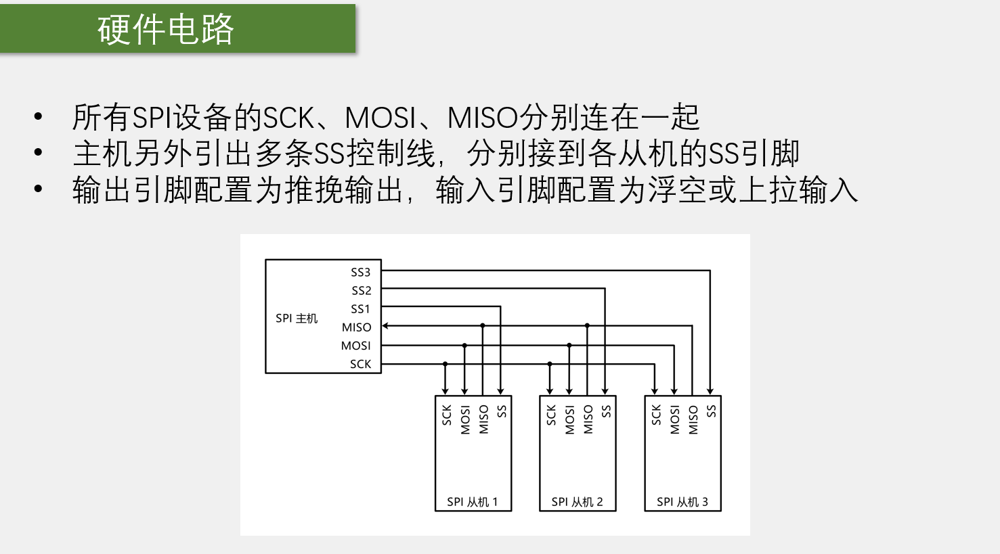

---

## 3. SPI 结构

### 3.1 SPI 基本结构

SPI的基本结构包括：

- **时钟发生器**：产生SCK时钟信号
- **移位寄存器**：用于数据的串行和并行转换
- **数据寄存器**：存储待发送或接收的数据
- **控制逻辑**：控制SPI的工作模式和时序

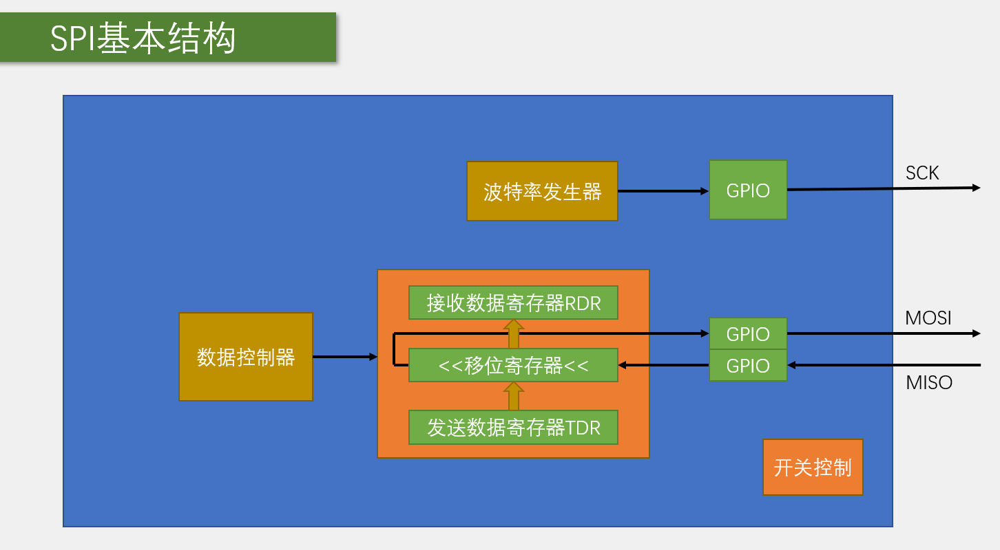

### 3.2 SPI 框图

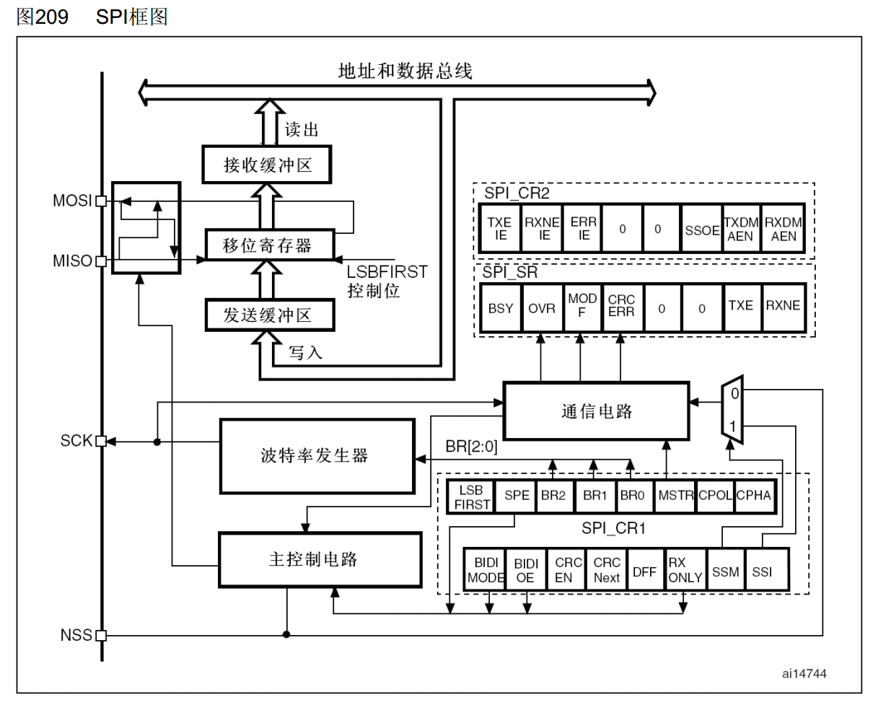

### 3.3 移位示意图

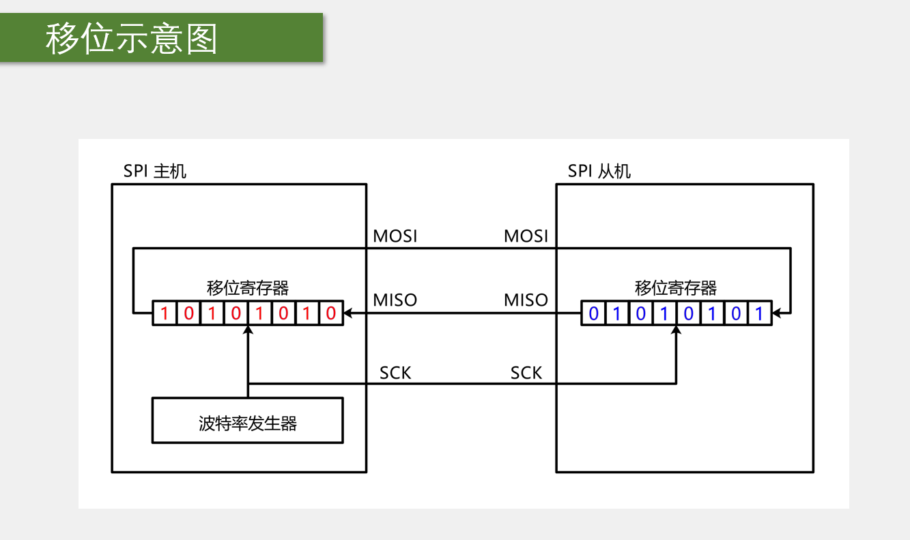

---

## 4. SPI 时序

### 4.1 基本时序单元

#### 4.1.1 起始条件和终止条件

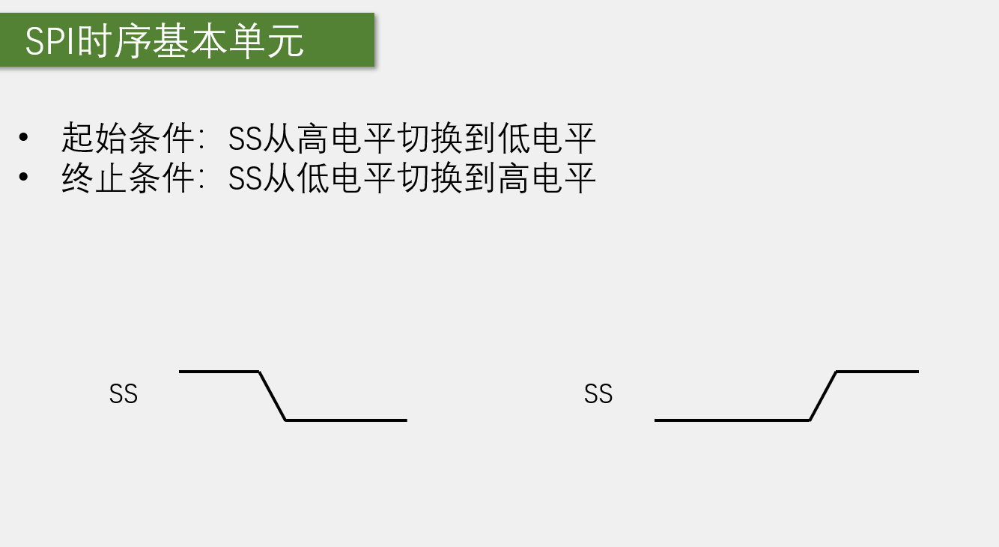

- **起始条件**：SS引脚拉低，表示通信开始
- **终止条件**：SS引脚拉高，表示通信结束

#### 4.1.2 交换一个字节

SPI有四种工作模式，由CPOL（时钟极性）和CPHA（时钟相位）决定：

**模式0**：CPOL=0, CPHA=0
- 空闲时SCK为低电平
- 数据在SCK的第一个边沿采样，第二个边沿切换

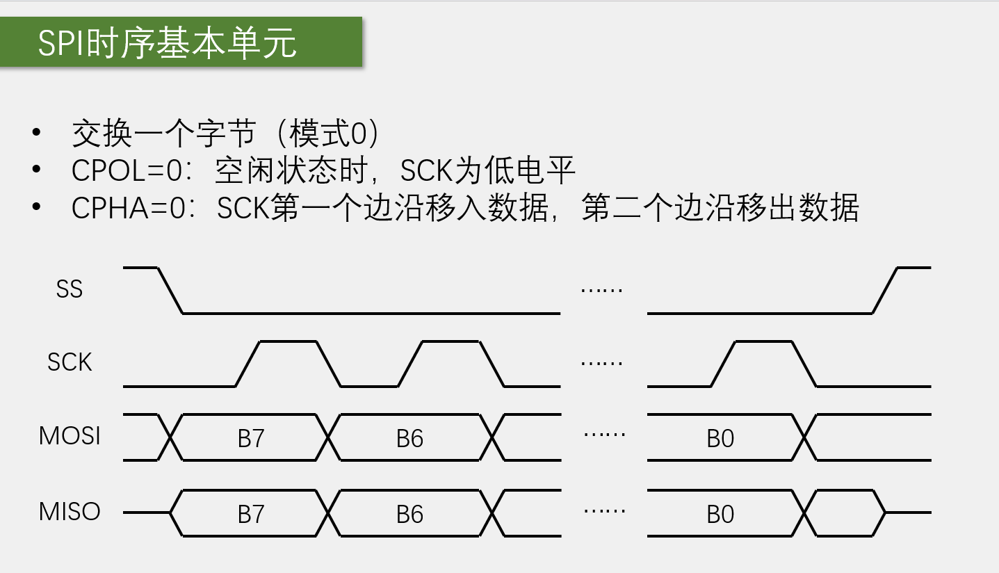

**模式1**：CPOL=0, CPHA=1
- 空闲时SCK为低电平
- 数据在SCK的第一个边沿切换，第二个边沿采样

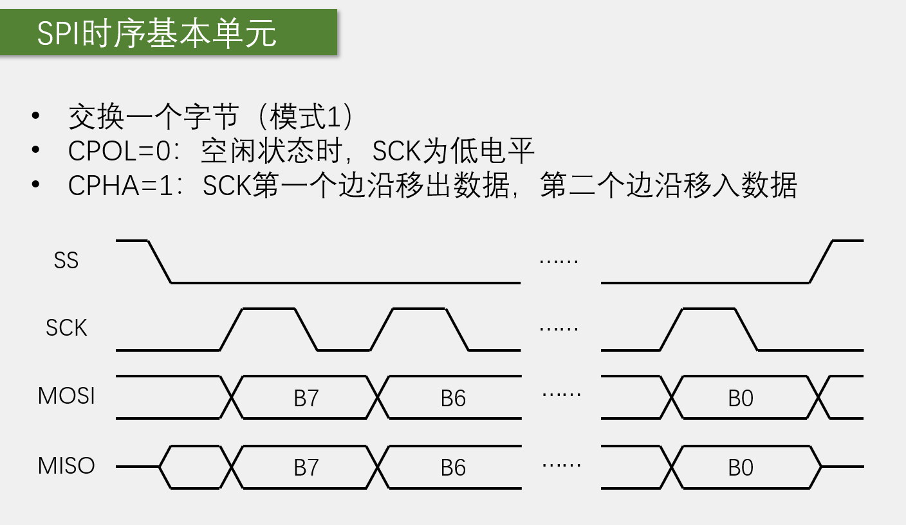

**模式2**：CPOL=1, CPHA=0
- 空闲时SCK为高电平
- 数据在SCK的第一个边沿采样，第二个边沿切换

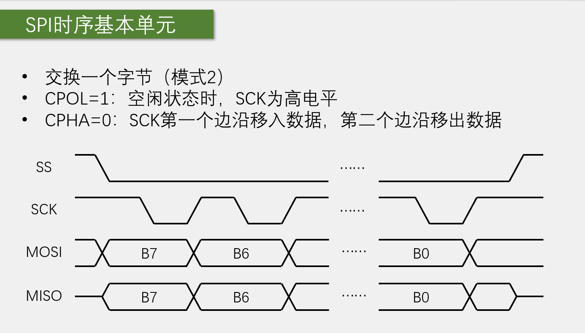

**模式3**：CPOL=1, CPHA=1
- 空闲时SCK为高电平
- 数据在SCK的第一个边沿切换，第二个边沿采样

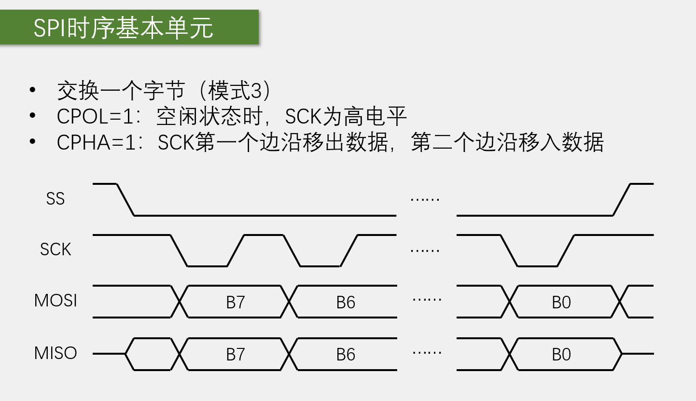

### 4.2 通信时序

#### 4.2.1 指定地址写

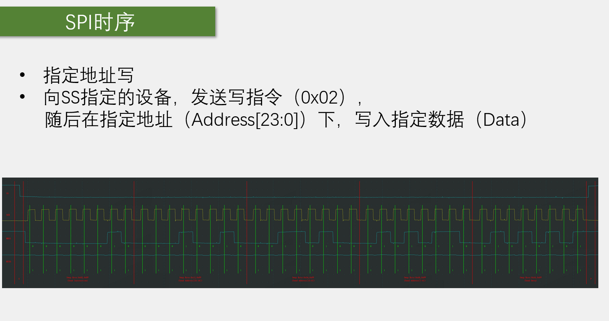

#### 4.2.2 指定地址读

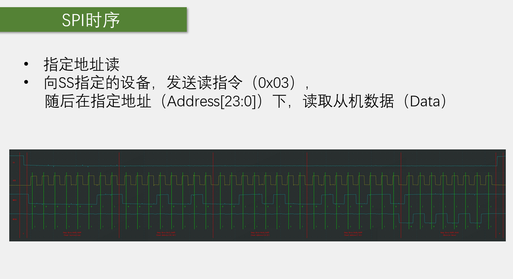

#### 4.2.3 发送指令

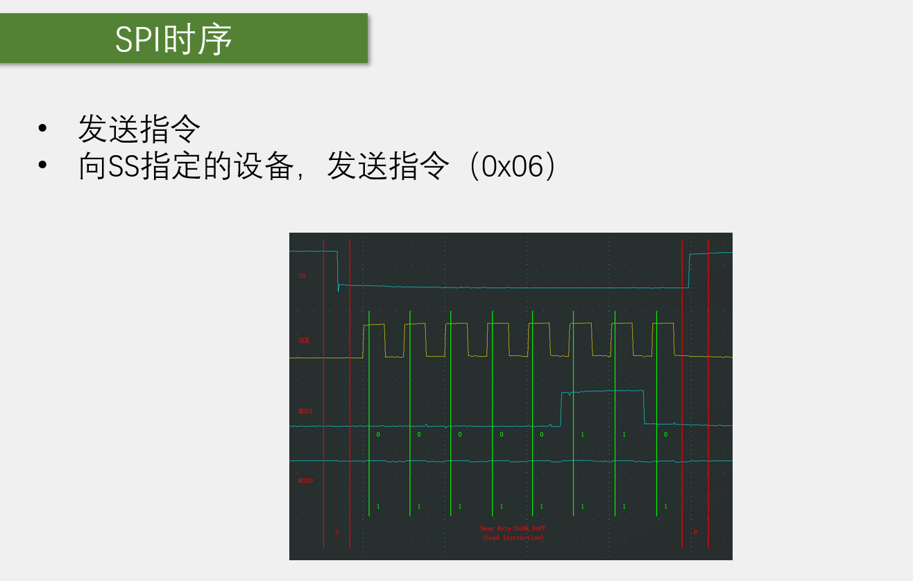

#### 4.2.4 主模式全双工连续传输

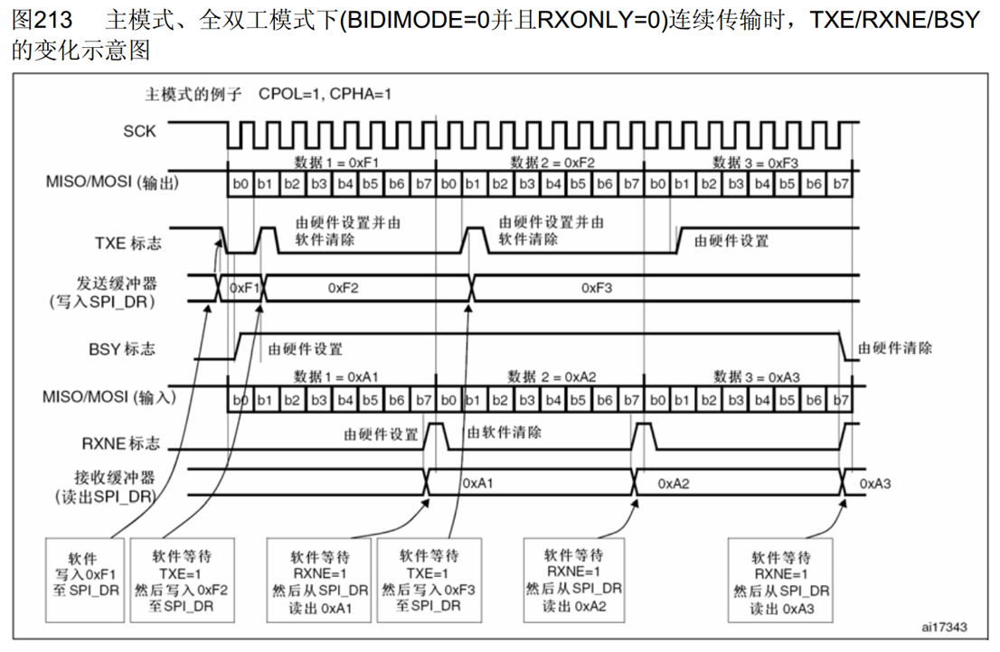

#### 4.2.5 非连续传输发送

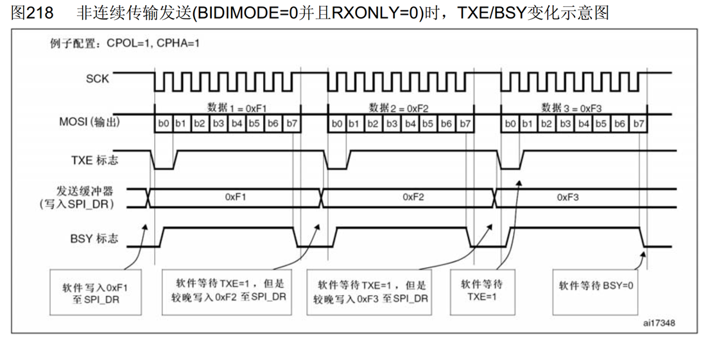

---

## 5. STM32 SPI 功能特点

### 5.1 硬件SPI特点

- **硬件自动执行**：由硬件自动执行时钟生成、数据收发等功能，减轻CPU的负担
- **数据帧**：可配置8位/16位数据帧
- **数据顺序**：可配置高位先行/低位先行
- **时钟频率**：fPCLK / (2, 4, 8, 16, 32, 64, 128, 256)
- **多主机模型**：支持多主机模型、主或从操作
- **精简模式**：可精简为半双工/单工通信
- **DMA支持**：支持DMA传输
- **I2S兼容**：兼容I2S协议

### 5.2 软件与硬件SPI对比

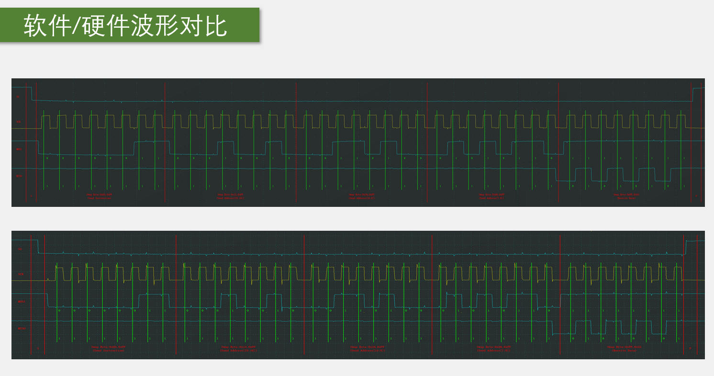

- **软件SPI**：使用GPIO模拟SPI时序，灵活性高，但占用CPU资源
- **硬件SPI**：由硬件自动执行，效率高，节省CPU资源

---

## 6. W25Q64 应用实例

### 6.1 W25Qxx 系列概述

W25Qxx系列是一种低成本、小型化、使用简单的非易失性存储器，常应用于数据存储、字库存储、固件程序存储等场景。

- **存储介质**：Nor Flash（闪存）
- **时钟频率**：80MHz / 160MHz (Dual SPI) / 320MHz (Quad SPI)

### 6.2 存储容量（24位地址）

| 型号 | 容量 |
|------|------|
| W25Q40 | 4Mbit / 512KByte |
| W25Q80 | 8Mbit / 1MByte |
| W25Q16 | 16Mbit / 2MByte |
| W25Q32 | 32Mbit / 4MByte |
| W25Q64 | 64Mbit / 8MByte |
| W25Q128 | 128Mbit / 16MByte |
| W25Q256 | 256Mbit / 32MByte |

### 6.3 W25Q64 硬件电路

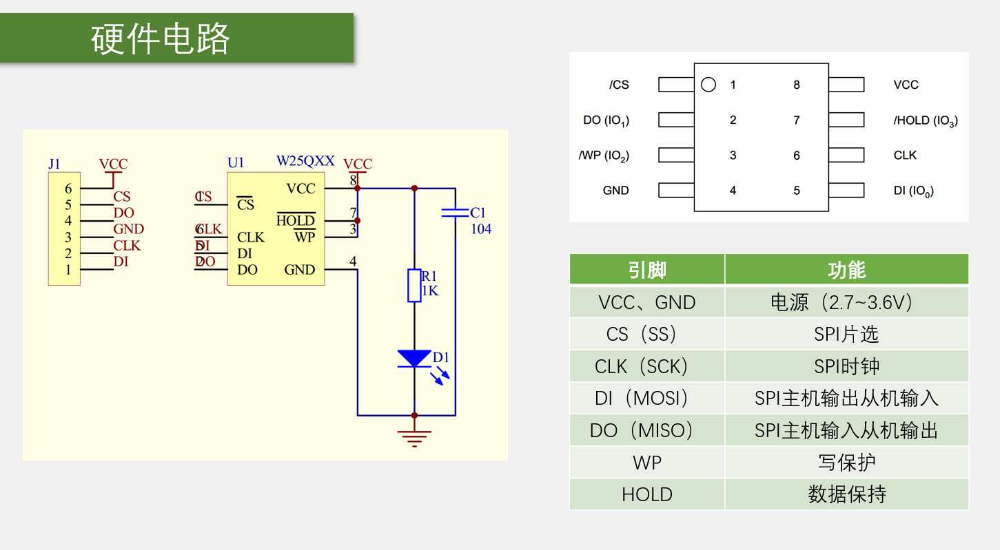

### 6.4 W25Q64 框图

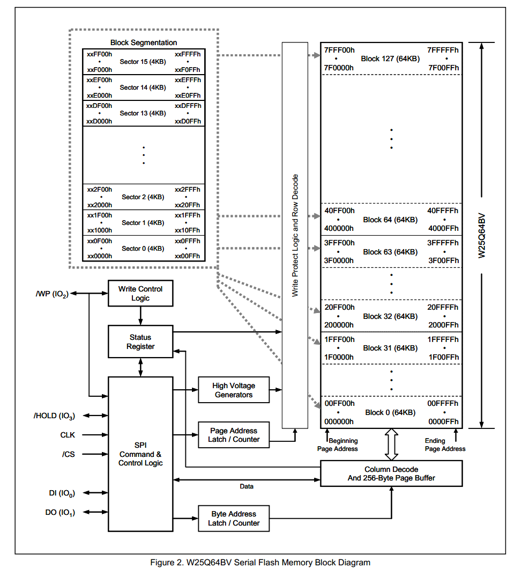

### 6.5 Flash 操作注意事项

#### 写入操作时：

- 写入操作前，必须先进行写使能
- 每个数据位只能由1改写为0，不能由0改写为1
- 写入数据前必须先擦除，擦除后，所有数据位变为1
- 擦除必须按最小擦除单元进行
- 连续写入多字节时，最多写入一页的数据，超过页尾位置的数据，会回到页首覆盖写入
- 写入操作结束后，芯片进入忙状态，不响应新的读写操作

#### 读取操作时：

- 直接调用读取时序，无需使能，无需额外操作
- 没有页的限制
- 读取操作结束后不会进入忙状态，但不能在忙状态时读取

---

## 7. SPI 相关函数

### 7.1 初始化函数

| 函数名称 | 功能说明 |
|---------|----------|
| SPI_DeInit() | 将SPI寄存器重置为默认值 |
| SPI_Init() | 初始化SPI配置 |
| SPI_StructInit() | 将SPI结构体初始化为默认值 |

### 7.2 控制函数

| 函数名称 | 功能说明 |
|---------|----------|
| SPI_Cmd() | 使能或禁用SPI |
| SPI_ITConfig() | 配置SPI中断 |
| SPI_DMACmd() | 使能或禁用SPI的DMA |
| SPI_SendData() | 发送数据 |
| SPI_ReceiveData() | 接收数据 |
| SPI_NSSInternalSoftwareConfig() | 配置内部NSS |
| SPI_SSOutputCmd() | 使能或禁用SS输出 |
| SPI_DataSizeConfig() | 配置数据帧大小 |
| SPI_BiDirectionalLineConfig() | 配置双向数据线 |

### 7.3 状态函数

| 函数名称 | 功能说明 |
|---------|----------|
| SPI_GetFlagStatus() | 获取SPI标志位状态 |
| SPI_ClearFlag() | 清除SPI标志位 |
| SPI_GetITStatus() | 获取SPI中断状态 |
| SPI_ClearITPendingBit() | 清除SPI中断挂起位 |

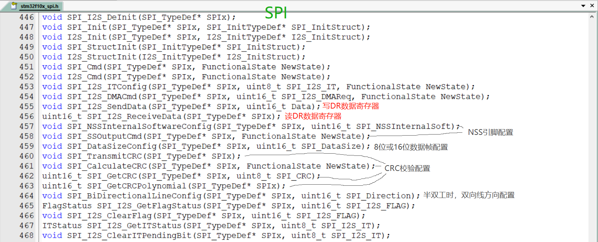

---

## 8. SPI 配置步骤

### 8.1 基本配置步骤

1. **使能SPI时钟**：调用`RCC_APB2PeriphClockCmd()`（SPI1）或`RCC_APB1PeriphClockCmd()`（SPI2）使能SPI时钟
2. **配置GPIO**：将SCK、MOSI、MISO配置为复用推挽输出，SS配置为通用推挽输出
3. **配置SPI**：设置SPI模式、数据大小、时钟极性、时钟相位、波特率等参数
4. **配置中断**：根据需要配置SPI中断
5. **使能SPI**：调用`SPI_Cmd()`使能SPI

### 8.2 主设备发送数据步骤

1. **拉低SS**：拉低SS引脚，选择从设备
2. **发送数据**：调用`SPI_SendData()`发送数据
3. **等待发送完成**：等待`SPI_FLAG_TXE`标志
4. **等待接收完成**：等待`SPI_FLAG_RXNE`标志
5. **读取数据**：调用`SPI_ReceiveData()`读取接收到的数据
6. **拉高SS**：拉高SS引脚，结束通信

### 8.3 主设备接收数据步骤

1. **拉低SS**：拉低SS引脚，选择从设备
2. **发送dummy数据**：调用`SPI_SendData()`发送dummy数据以产生时钟
3. **等待接收完成**：等待`SPI_FLAG_RXNE`标志
4. **读取数据**：调用`SPI_ReceiveData()`读取接收到的数据
5. **拉高SS**：拉高SS引脚，结束通信

---

## 9. 示例代码

### 9.1 SPI初始化示例

```c
// SPI1初始化函数
void SPI1_Init(void)
{
    GPIO_InitTypeDef GPIO_InitStructure;
    SPI_InitTypeDef SPI_InitStructure;
    
    // 使能SPI1和GPIOA时钟
    RCC_APB2PeriphClockCmd(RCC_APB2Periph_SPI1 | RCC_APB2Periph_GPIOA, ENABLE);
    
    // 配置PA5(SCK)、PA7(MOSI)为复用推挽输出
    GPIO_InitStructure.GPIO_Pin = GPIO_Pin_5 | GPIO_Pin_7;
    GPIO_InitStructure.GPIO_Mode = GPIO_Mode_AF_PP;
    GPIO_InitStructure.GPIO_Speed = GPIO_Speed_50MHz;
    GPIO_Init(GPIOA, &GPIO_InitStructure);
    
    // 配置PA6(MISO)为浮空输入
    GPIO_InitStructure.GPIO_Pin = GPIO_Pin_6;
    GPIO_InitStructure.GPIO_Mode = GPIO_Mode_IN_FLOATING;
    GPIO_Init(GPIOA, &GPIO_InitStructure);
    
    // 配置PA4(SS)为通用推挽输出
    GPIO_InitStructure.GPIO_Pin = GPIO_Pin_4;
    GPIO_InitStructure.GPIO_Mode = GPIO_Mode_Out_PP;
    GPIO_Init(GPIOA, &GPIO_InitStructure);
    
    // 初始化SS为高电平
    GPIO_SetBits(GPIOA, GPIO_Pin_4);
    
    // 配置SPI1
    SPI_InitStructure.SPI_Direction = SPI_Direction_2Lines_FullDuplex;
    SPI_InitStructure.SPI_Mode = SPI_Mode_Master;
    SPI_InitStructure.SPI_DataSize = SPI_DataSize_8b;
    SPI_InitStructure.SPI_CPOL = SPI_CPOL_Low;
    SPI_InitStructure.SPI_CPHA = SPI_CPHA_1Edge;
    SPI_InitStructure.SPI_NSS = SPI_NSS_Soft;
    SPI_InitStructure.SPI_BaudRatePrescaler = SPI_BaudRatePrescaler_16;
    SPI_InitStructure.SPI_FirstBit = SPI_FirstBit_MSB;
    SPI_InitStructure.SPI_CRCPolynomial = 7;
    SPI_Init(SPI1, &SPI_InitStructure);
    
    // 使能SPI1
    SPI_Cmd(SPI1, ENABLE);
}
```

### 9.2 SPI交换字节示例

```c
// SPI交换一个字节
uint8_t SPI1_SwapByte(uint8_t byte)
{
    // 等待发送缓冲区为空
    while(SPI_I2S_GetFlagStatus(SPI1, SPI_I2S_FLAG_TXE) == RESET);
    
    // 发送数据
    SPI_I2S_SendData(SPI1, byte);
    
    // 等待接收缓冲区非空
    while(SPI_I2S_GetFlagStatus(SPI1, SPI_I2S_FLAG_RXNE) == RESET);
    
    // 返回接收到的数据
    return SPI_I2S_ReceiveData(SPI1);
}
```

### 9.3 W25Q64读取示例

```c
// W25Q64读取数据
void W25Q64_ReadData(uint32_t addr, uint8_t *data, uint16_t len)
{
    // 拉低SS
    GPIO_ResetBits(GPIOA, GPIO_Pin_4);
    
    // 发送读指令
    SPI1_SwapByte(0x03);
    
    // 发送24位地址
    SPI1_SwapByte((addr >> 16) &amp; 0xFF);
    SPI1_SwapByte((addr &gt;&gt; 8) &amp; 0xFF);
    SPI1_SwapByte(addr &amp; 0xFF);
    
    // 读取数据
    while(len--)
    {
        *data++ = SPI1_SwapByte(0xFF);
    }
    
    // 拉高SS
    GPIO_SetBits(GPIOA, GPIO_Pin_4);
}
```

### 9.4 W25Q64写入示例

```c
// W25Q64写使能
void W25Q64_WriteEnable(void)
{
    // 拉低SS
    GPIO_ResetBits(GPIOA, GPIO_Pin_4);
    
    // 发送写使能指令
    SPI1_SwapByte(0x06);
    
    // 拉高SS
    GPIO_SetBits(GPIOA, GPIO_Pin_4);
}

// W25Q64页写入
void W25Q64_PageProgram(uint32_t addr, uint8_t *data, uint16_t len)
{
    // 写使能
    W25Q64_WriteEnable();
    
    // 拉低SS
    GPIO_ResetBits(GPIOA, GPIO_Pin_4);
    
    // 发送页写入指令
    SPI1_SwapByte(0x02);
    
    // 发送24位地址
    SPI1_SwapByte((addr &gt;&gt; 16) &amp; 0xFF);
    SPI1_SwapByte((addr &gt;&gt; 8) &amp; 0xFF);
    SPI1_SwapByte(addr &amp; 0xFF);
    
    // 写入数据
    while(len--)
    {
        SPI1_SwapByte(*data++);
    }
    
    // 拉高SS
    GPIO_SetBits(GPIOA, GPIO_Pin_4);
}
```

### 9.5 W25Q64擦除示例

```c
// W25Q64扇区擦除
void W25Q64_SectorErase(uint32_t addr)
{
    // 写使能
    W25Q64_WriteEnable();
    
    // 拉低SS
    GPIO_ResetBits(GPIOA, GPIO_Pin_4);
    
    // 发送扇区擦除指令
    SPI1_SwapByte(0x20);
    
    // 发送24位地址
    SPI1_SwapByte((addr &gt;&gt; 16) &amp; 0xFF);
    SPI1_SwapByte((addr &gt;&gt; 8) &amp; 0xFF);
    SPI1_SwapByte(addr &amp; 0xFF);
    
    // 拉高SS
    GPIO_SetBits(GPIOA, GPIO_Pin_4);
}

// W25Q64读取状态寄存器
uint8_t W25Q64_ReadStatusRegister(void)
{
    uint8_t status;
    
    // 拉低SS
    GPIO_ResetBits(GPIOA, GPIO_Pin_4);
    
    // 发送读状态寄存器指令
    SPI1_SwapByte(0x05);
    
    // 读取状态
    status = SPI1_SwapByte(0xFF);
    
    // 拉高SS
    GPIO_SetBits(GPIOA, GPIO_Pin_4);
    
    return status;
}

// W25Q64等待忙状态结束
void W25Q64_WaitBusy(void)
{
    while(W25Q64_ReadStatusRegister() &amp; 0x01);
}
```

---

## 10. 总结

SPI是一种常用的串行通信总线，具有以下特点：

- **高速传输**：支持较高的传输速率，适合高速数据传输
- **全双工通信**：同一时间可以同时发送和接收数据
- **多设备支持**：一个主设备可以控制多个从设备
- **硬件支持**：STM32内部集成了硬件SPI，减轻CPU负担
- **W25Q64应用**：常用于数据存储、字库存储、固件程序存储等场景

掌握SPI的配置和使用方法，对于STM32项目开发非常重要。通过本文档的学习，希望读者能够熟练掌握SPI的使用技巧，为STM32项目开发提供可靠的通信支持。
