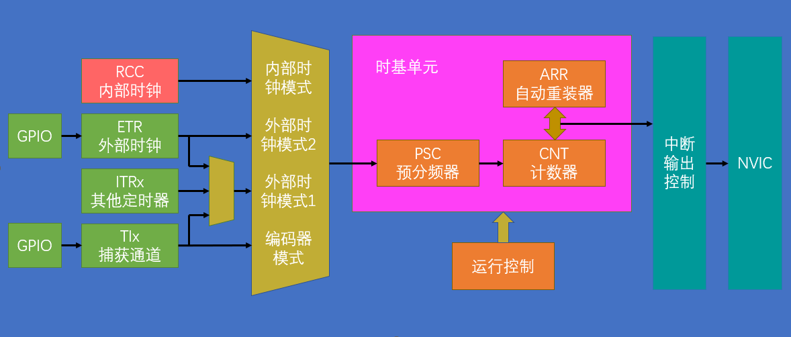
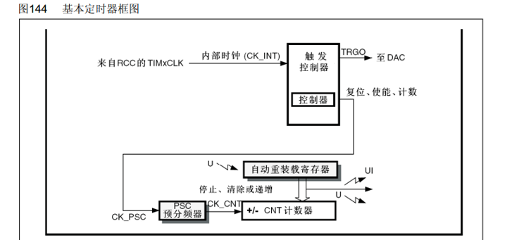
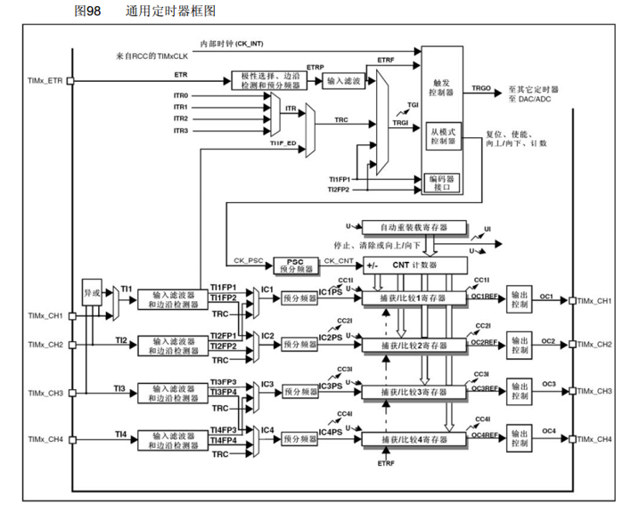
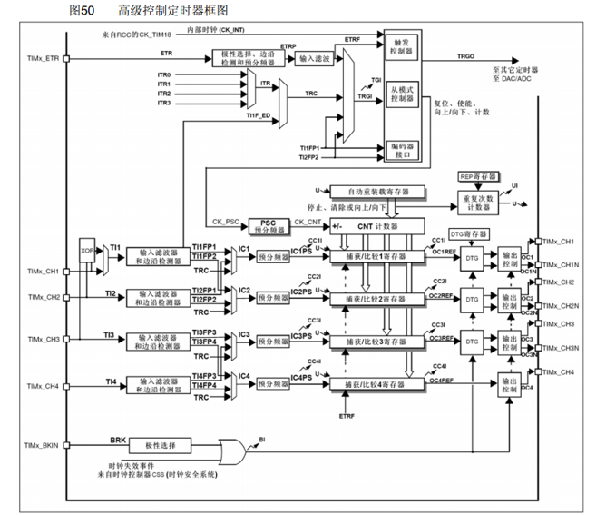
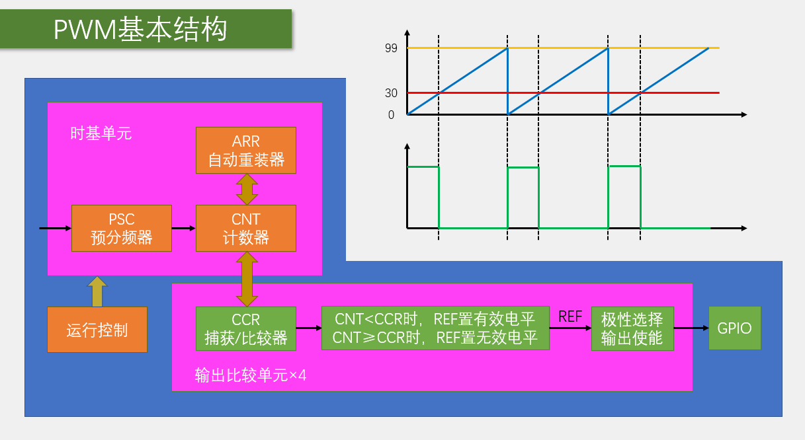

# STM32 Timer

---

## 1. Timer 简介

TIM（Timer）定时器是STM32微控制器中非常重要的外设，主要功能包括：

- **定时中断**：对输入时钟进行计数，当计数值达到设定值时触发中断
- **时基单元**：由16位计数器、预分频器、自动重装寄存器组成，在72MHz计数时钟下可实现最大59.65s的定时
- **丰富功能**：除基本定时中断外，还包含内外时钟源选择、输入捕获、输出比较、编码器接口、主从触发模式等
- **类型分类**：根据复杂度和应用场景分为高级定时器、通用定时器、基本定时器三种类型

---

## 2. Timer 类型及功能

### 2.1 定时器类型

| 类型 | 编号 | 总线 | 主要功能 |
|------|------|------|----------|
| 高级定时器 | TIM1、TIM8 | APB2 | 拥有通用定时器全部功能，额外具有重复计数器、死区生成、互补输出、刹车输入等功能 |
| 通用定时器 | TIM2、TIM3、TIM4、TIM5 | APB1 | 拥有基本定时器全部功能，额外具有内外时钟源选择、输入捕获、输出比较、编码器接口、主从触发模式等功能 |
| 基本定时器 | TIM6、TIM7 | APB1 | 拥有定时中断、主模式触发DAC的功能 |

### 2.2 主要功能

- 定时中断
- 输入捕获
- 输出比较
- PWM生成
- 编码器接口
- 主从触发模式

---

## 3. Timer 结构

### 3.1 定时器中断基本结构



### 3.2 基本定时器框图



### 3.3 通用定时器框图



### 3.4 高级定时器框图



---

## 4. Timer 相关函数

Timer相关函数主要包括初始化、配置、启动/停止等操作，具体函数如下：


### 4.1 常用函数说明

| 函数类型 | 函数名称 | 功能说明 |
|---------|---------|----------|
| 初始化函数 | TIM_TimeBaseInit() | 初始化定时器时基单元 |
| 中断配置 | TIM_ITConfig() | 配置定时器中断 |
| 启动/停止 | TIM_Cmd() | 使能或禁用定时器 |
| 计数器操作 | TIM_SetCounter() | 设置计数器值 |
| 自动重装值 | TIM_SetAutoreload() | 设置自动重装寄存器值 |
| 预分频器 | TIM_PrescalerConfig() | 配置预分频器 |

---

## 5. 输出比较

### 5.1 输出比较简介

OC（Output Compare）输出比较功能：

- 通过比较CNT（计数器值）与CCR（捕获/比较寄存器值）的关系，对输出电平进行置1、置0或翻转操作
- 主要用于输出一定频率和占空比的PWM波形
- 每个高级定时器和通用定时器都拥有4个输出比较通道
- 高级定时器的前3个通道额外拥有死区生成和互补输出功能

### 5.2 输出比较模式

| 模式 | 描述 |
|------|------|
| 冻结 | CNT=CCR时，REF保持为原状态 |
| 匹配时置有效电平 | CNT=CCR时，REF置有效电平 |
| 匹配时置无效电平 | CNT=CCR时，REF置无效电平 |
| 匹配时电平翻转 | CNT=CCR时，REF电平翻转 |
| 强制为无效电平 | CNT与CCR无效，REF强制为无效电平 |
| 强制为有效电平 | CNT与CCR无效，REF强制为有效电平 |
| PWM模式1 | 向上计数：CNT<CCR时，REF置有效电平，CNT≥CCR时，REF置无效电平<br>向下计数：CNT>CCR时，REF置无效电平，CNT≤CCR时，REF置有效电平 |
| PWM模式2 | 向上计数：CNT<CCR时，REF置无效电平，CNT≥CCR时，REF置有效电平<br>向下计数：CNT>CCR时，REF置有效电平，CNT≤CCR时，REF置无效电平 |

---

## 6. PWM 脉冲宽度调制

### 6.1 PWM简介

PWM（Pulse Width Modulation）脉冲宽度调制：

- 在具有惯性的系统中，通过对一系列脉冲的宽度进行调制，来等效地获得所需要的模拟参量
- 常应用于电机控速、灯光调节、音频输出等领域

### 6.2 PWM参数

- **频率**：Freq = 1 / Ts （Ts为PWM周期）
- **占空比**：Duty = Ton / Ts （Ton为高电平持续时间）
- **分辨率**：占空比变化步距



### 6.3 PWM配置步骤

1. **初始化定时器**：配置时基单元，设置预分频器和自动重装值
2. **配置输出比较通道**：选择PWM模式，设置初始占空比
3. **配置GPIO**：将对应引脚设置为复用推挽输出
4. **使能定时器**：启动定时器计数
5. **调节占空比**：通过修改CCR寄存器值调整PWM占空比

---

## 7. 参数计算

### 7.1 基本计算公式

- **计数器计数频率**：CK_CNT = CK_PSC / (PSC + 1)
- **计数器溢出频率**：CK_CNT_OV = CK_CNT / (ARR + 1) = CK_PSC / (PSC + 1) / (ARR + 1)
- **PWM频率**：Freq = CK_PSC / (PSC + 1) / (ARR + 1)
- **PWM占空比**：Duty = CCR / (ARR + 1)
- **PWM分辨率**：Reso = 1 / (ARR + 1)

### 7.2 计算示例

例如，要生成1kHz的PWM信号，占空比为50%：

- 假设系统时钟为72MHz（CK_PSC = 72MHz）
- 选择预分频器PSC = 71，则CK_CNT = 72MHz / (71 + 1) = 1MHz
- 要得到1kHz的PWM频率，ARR = (1MHz / 1kHz) - 1 = 999
- 占空比50%，则CCR = (ARR + 1) * 50% = 500

---

## 8. 编码器接口

### 8.1 编码器接口简介

编码器接口是STM32定时器的一个特殊功能，用于读取增量式编码器的输出信号，实现位置和速度的测量。

### 8.2 编码器计数模式

- **模式1**：仅在TI1边沿计数
- **模式2**：仅在TI2边沿计数
- **模式3**：在TI1和TI2边沿都计数（4倍频）

### 8.3 方向检测

- 当TI1领先TI2时，计数器递增
- 当TI2领先TI1时，计数器递减

### 8.4 编码器接口配置步骤

1. **初始化定时器**：选择编码器模式
2. **配置GPIO**：将编码器输入引脚设置为输入模式
3. **配置计数参数**：设置自动重装值和初始计数
4. **启动定时器**：开始计数
5. **读取计数值**：通过TIM_GetCounter()获取当前计数值

---

## 9. 示例代码

### 9.1 定时中断示例

```c
// 定时器初始化函数
void TIM3_Int_Init(u16 arr, u16 psc)
{
    TIM_TimeBaseInitTypeDef TIM_TimeBaseStructure;
    NVIC_InitTypeDef NVIC_InitStructure;
    
    RCC_APB1PeriphClockCmd(RCC_APB1Periph_TIM3, ENABLE); // 使能TIM3时钟
    
    // 初始化定时器TIM3
    TIM_TimeBaseStructure.TIM_Period = arr; // 设置自动重装值
    TIM_TimeBaseStructure.TIM_Prescaler = psc; // 设置预分频器
    TIM_TimeBaseStructure.TIM_ClockDivision = TIM_CKD_DIV1; // 设置时钟分割
    TIM_TimeBaseStructure.TIM_CounterMode = TIM_CounterMode_Up; // 向上计数模式
    TIM_TimeBaseInit(TIM3, &TIM_TimeBaseStructure); // 初始化TIM3
    
    TIM_ITConfig(TIM3, TIM_IT_Update, ENABLE); // 使能更新中断
    
    // 配置NVIC
    NVIC_InitStructure.NVIC_IRQChannel = TIM3_IRQn;
    NVIC_InitStructure.NVIC_IRQChannelPreemptionPriority = 0;
    NVIC_InitStructure.NVIC_IRQChannelSubPriority = 3;
    NVIC_InitStructure.NVIC_IRQChannelCmd = ENABLE;
    NVIC_Init(&NVIC_InitStructure);
    
    TIM_Cmd(TIM3, ENABLE); // 使能TIM3
}

// TIM3中断服务函数
void TIM3_IRQHandler(void)
{
    if (TIM_GetITStatus(TIM3, TIM_IT_Update) != RESET)
    {
        TIM_ClearITPendingBit(TIM3, TIM_IT_Update); // 清除中断标志位
        // 在这里添加定时中断处理代码
    }
}
```

### 9.2 PWM输出示例

```c
// PWM初始化函数
void TIM3_PWM_Init(u16 arr, u16 psc)
{
    GPIO_InitTypeDef GPIO_InitStructure;
    TIM_TimeBaseInitTypeDef TIM_TimeBaseStructure;
    TIM_OCInitTypeDef TIM_OCInitStructure;
    
    RCC_APB1PeriphClockCmd(RCC_APB1Periph_TIM3, ENABLE); // 使能TIM3时钟
    RCC_APB2PeriphClockCmd(RCC_APB2Periph_GPIOB, ENABLE); // 使能GPIOB时钟
    
    // 配置PB5为复用推挽输出
    GPIO_InitStructure.GPIO_Pin = GPIO_Pin_5;
    GPIO_InitStructure.GPIO_Mode = GPIO_Mode_AF_PP;
    GPIO_InitStructure.GPIO_Speed = GPIO_Speed_50MHz;
    GPIO_Init(GPIOB, &GPIO_InitStructure);
    
    // 初始化定时器TIM3
    TIM_TimeBaseStructure.TIM_Period = arr; // 设置自动重装值
    TIM_TimeBaseStructure.TIM_Prescaler = psc; // 设置预分频器
    TIM_TimeBaseStructure.TIM_ClockDivision = TIM_CKD_DIV1; // 设置时钟分割
    TIM_TimeBaseStructure.TIM_CounterMode = TIM_CounterMode_Up; // 向上计数模式
    TIM_TimeBaseInit(TIM3, &TIM_TimeBaseStructure); // 初始化TIM3
    
    // 配置PWM模式
    TIM_OCInitStructure.TIM_OCMode = TIM_OCMode_PWM1; // PWM模式1
    TIM_OCInitStructure.TIM_OutputState = TIM_OutputState_Enable; // 输出使能
    TIM_OCInitStructure.TIM_Pulse = 0; // 初始占空比为0
    TIM_OCInitStructure.TIM_OCPolarity = TIM_OCPolarity_High; // 输出极性为高
    TIM_OC2Init(TIM3, &TIM_OCInitStructure); // 初始化通道2
    
    TIM_OC2PreloadConfig(TIM3, TIM_OCPreload_Enable); // 使能预加载
    TIM_ARRPreloadConfig(TIM3, ENABLE); // 使能自动重装
    
    TIM_Cmd(TIM3, ENABLE); // 使能TIM3
}

// 设置PWM占空比
void TIM3_SetPWM(u16 compare)
{
    TIM_SetCompare2(TIM3, compare); // 设置通道2的比较值
}
```

### 9.3 编码器接口示例

```c
// 编码器接口初始化
void TIM4_Encoder_Init(void)
{
    GPIO_InitTypeDef GPIO_InitStructure;
    TIM_TimeBaseInitTypeDef TIM_TimeBaseStructure;
    TIM_ICInitTypeDef TIM_ICInitStructure;
    
    RCC_APB1PeriphClockCmd(RCC_APB1Periph_TIM4, ENABLE); // 使能TIM4时钟
    RCC_APB2PeriphClockCmd(RCC_APB2Periph_GPIOB, ENABLE); // 使能GPIOB时钟
    
    // 配置PB6和PB7为输入模式
    GPIO_InitStructure.GPIO_Pin = GPIO_Pin_6 | GPIO_Pin_7;
    GPIO_InitStructure.GPIO_Mode = GPIO_Mode_IN_FLOATING;
    GPIO_Init(GPIOB, &GPIO_InitStructure);
    
    // 初始化定时器TIM4
    TIM_TimeBaseStructure.TIM_Period = 65535; // 设置自动重装值
    TIM_TimeBaseStructure.TIM_Prescaler = 0; // 不分频
    TIM_TimeBaseStructure.TIM_ClockDivision = TIM_CKD_DIV1;
    TIM_TimeBaseStructure.TIM_CounterMode = TIM_CounterMode_Up;
    TIM_TimeBaseInit(TIM4, &TIM_TimeBaseStructure);
    
    // 配置编码器模式
    TIM_EncoderInterfaceConfig(TIM4, TIM_EncoderMode_TI12, TIM_ICPolarity_Rising, TIM_ICPolarity_Rising);
    
    // 配置输入捕获
    TIM_ICStructInit(&TIM_ICInitStructure);
    TIM_ICInitStructure.TIM_ICFilter = 10;
    TIM_ICInit(TIM4, &TIM_ICInitStructure);
    
    TIM_Cmd(TIM4, ENABLE); // 使能TIM4
}

// 读取编码器计数值
int16_t Get_Encoder_Count(void)
{
    int16_t count = TIM_GetCounter(TIM4);
    TIM_SetCounter(TIM4, 0); // 重置计数器
    return count;
}
```

---

## 10. 总结

STM32定时器是一个功能强大的外设，通过合理配置可以实现多种功能：

- **定时中断**：用于精确延时和周期性任务
- **PWM输出**：用于电机控制、灯光调节等
- **输入捕获**：用于测量信号频率和脉冲宽度
- **编码器接口**：用于读取编码器信号，实现位置和速度检测

掌握定时器的使用方法，对于STM32的开发非常重要，可以大大提高系统的性能和可靠性。