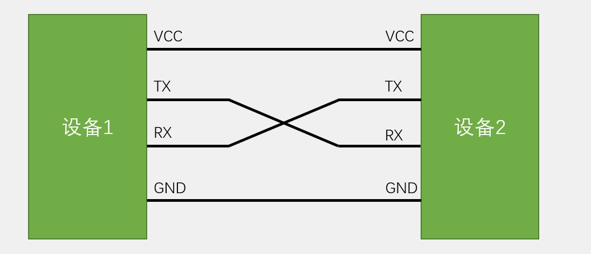
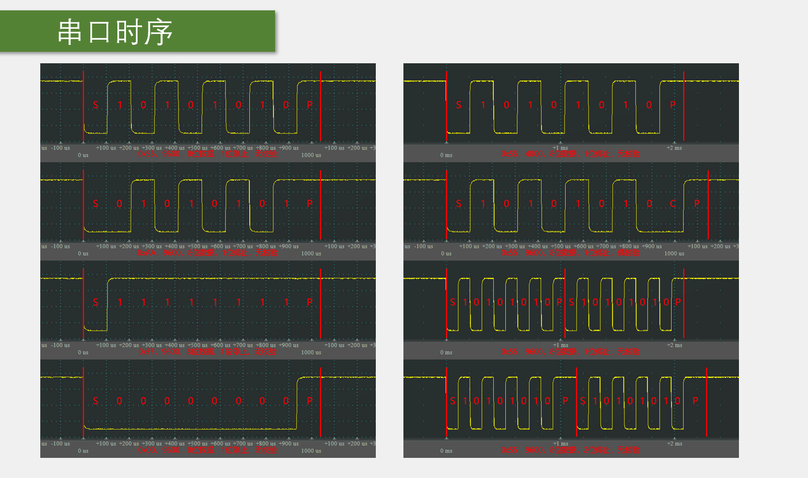
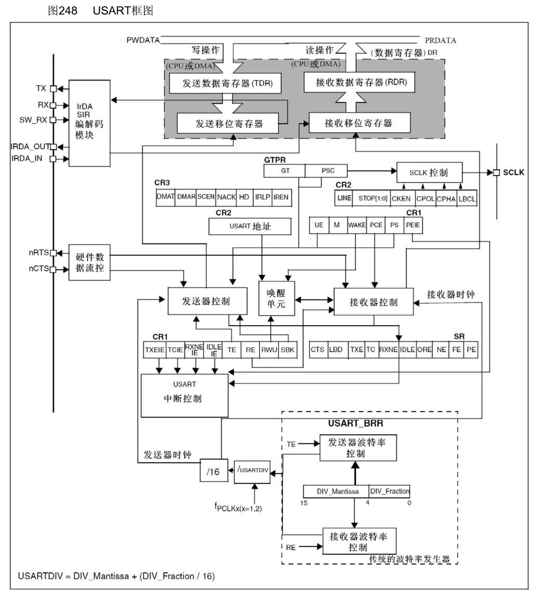
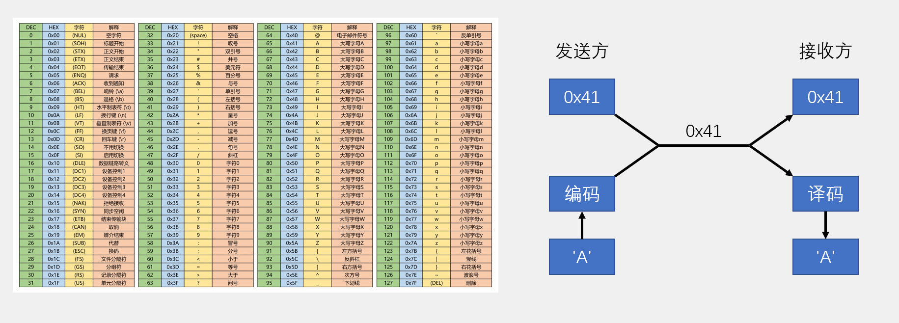
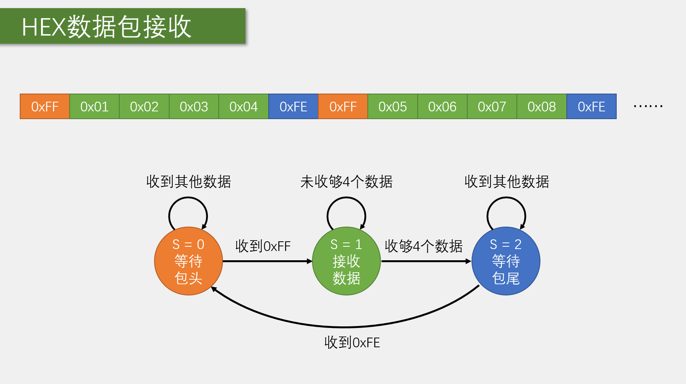
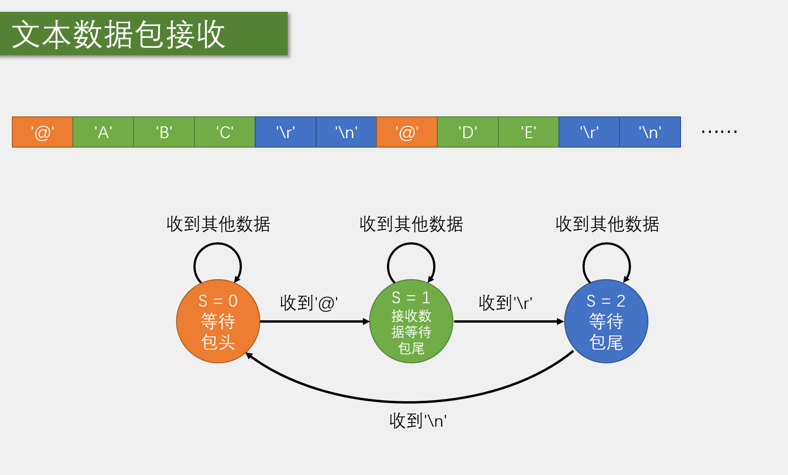
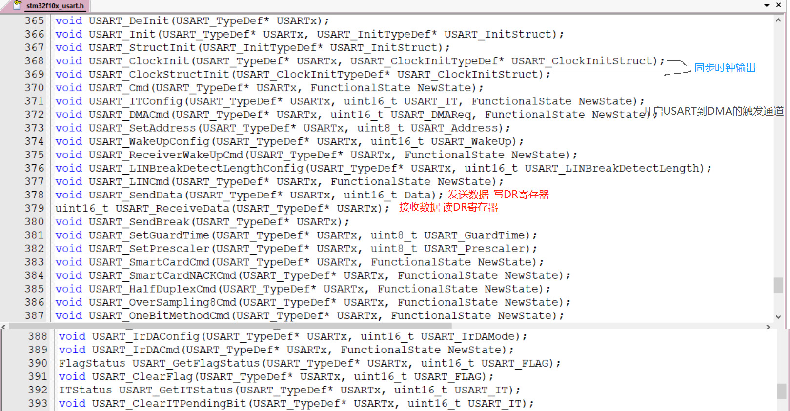

# STM32 USART

---

## 1. USART 简介

USART（Universal Synchronous/Asynchronous Receiver/Transmitter）通用同步/异步收发器，是STM32内部集成的硬件外设，用于实现设备之间的串行通信。

- **功能**：可根据数据寄存器的一个字节数据自动生成数据帧时序，从TX引脚发送出去，也可自动接收RX引脚的数据帧时序，拼接为一个字节数据，存放在数据寄存器里
- **波特率**：自带波特率发生器，最高达4.5Mbits/s
- **数据格式**：可配置数据位长度（8/9）、停止位长度（0.5/1/1.5/2）
- **校验位**：可选校验位（无校验/奇校验/偶校验）
- **支持模式**：支持同步模式、硬件流控制、DMA、智能卡、IrDA、LIN
- **STM32F103C8T6**：USART1、USART2、USART3

---

## 2. 通信接口概述

### 2.1 通信的目的

将一个设备的数据传送到另一个设备，扩展硬件系统。

### 2.2 通信协议

制定通信的规则，通信双方按照协议规则进行数据收发。

### 2.3 常用通信接口对比

| 名称 | 引脚 | 时钟 | 电平 | 设备 | 双工 |
|------|------|------|------|------|------|
| USART | TX、RX | 异步 | 单端 | 点对点 | 全双工/半双工 |
| I2C | SCL、SDA | 同步 | 单端 | 多设备 | 半双工 |
| SPI | SCLK、MOSI、MISO、CS | 同步 | 单端 | 多设备 | 全双工 |
| CAN | CAN_H、CAN_L | 异步 | 差分 | 多设备 | 半双工 |
| USB | DP、DM | 异步 | 差分 | 点对点 | 半双工 |

---

## 3. 串口通信基础

### 3.1 串口通信线路

- **简单双向串口通信**：有两根通信线（发送端TX和接收端RX）
- **TX与RX要交叉连接**：发送端连接到接收端，接收端连接到发送端
- **单向数据传输**：当只需单向的数据传输时，可以只接一根通信线
- **电平转换**：当电平标准不一致时，需要加电平转换芯片



### 3.2 电平标准

电平标准是数据1和数据0的表达方式，是传输线缆中人为规定的电压与数据的对应关系，串口常用的电平标准有如下三种：

- **TTL电平**：+3.3V或+5V表示1，0V表示0
- **RS232电平**：-3~-15V表示1，+3~+15V表示0
- **RS485电平**：两线压差+2~+6V表示1，-2~-6V表示0（差分信号）

### 3.3 串口通信协议

- **波特率**：串口通信的速率
- **起始位**：标志一个数据帧的开始，固定为低电平
- **数据位**：数据帧的有效载荷，1为高电平，0为低电平，低位先行
- **校验位**：用于数据验证，根据数据位计算得来
- **停止位**：用于数据帧间隔，固定为高电平



---

## 4. USART 结构

### 4.1 USART 基本结构


### 4.2 USART 框图



---

## 5. USART 功能特点

### 5.1 波特率计算

发送器和接收器的波特率由波特率寄存器BRR里的DIV确定，计算公式：

```
波特率 = fPCLK2/1 / (16 * DIV)
```

其中：
- fPCLK2/1 是USART时钟频率
- DIV 是波特率寄存器BRR中的分频值

### 5.2 数据模式

- **HEX模式/十六进制模式/二进制模式**：以原始数据的形式显示
- **文本模式/字符模式**：以原始数据编码后的形式显示







### 5.3 通信模式

- **异步模式**：不需要时钟信号，通过起始位和停止位来同步
- **同步模式**：需要时钟信号，由主机提供时钟
- **半双工模式**：同一时间只能发送或接收数据
- **全双工模式**：同一时间可以同时发送和接收数据

---

## 6. USART 相关函数

### 6.1 初始化函数

| 函数名称 | 功能说明 |
|---------|----------|
| USART_DeInit() | 将USART寄存器重置为默认值 |
| USART_Init() | 初始化USART配置 |
| USART_StructInit() | 将USART结构体初始化为默认值 |

### 6.2 控制函数

| 函数名称 | 功能说明 |
|---------|----------|
| USART_Cmd() | 使能或禁用USART |
| USART_ITConfig() | 配置USART中断 |
| USART_DMACmd() | 使能或禁用USART的DMA |
| USART_SetBreak() | 发送break字符 |
| USART_SendData() | 发送数据 |
| USART_ReceiveData() | 接收数据 |

### 6.3 状态函数

| 函数名称 | 功能说明 |
|---------|----------|
| USART_GetFlagStatus() | 获取USART标志位状态 |
| USART_ClearFlag() | 清除USART标志位 |
| USART_GetITStatus() | 获取USART中断状态 |
| USART_ClearITPendingBit() | 清除USART中断挂起位 |



---

## 7. USART 配置步骤

### 7.1 基本配置步骤

1. **使能USART时钟**：调用`RCC_APB2PeriphClockCmd()`（USART1）或`RCC_APB1PeriphClockCmd()`（USART2、USART3）使能USART时钟
2. **配置GPIO**：将TX引脚配置为复用推挽输出，RX引脚配置为浮空输入
3. **配置USART**：设置波特率、数据位、停止位、校验位等参数
4. **配置中断**：根据需要配置USART中断
5. **使能USART**：调用`USART_Cmd()`使能USART
6. **发送/接收数据**：使用`USART_SendData()`发送数据，使用`USART_ReceiveData()`接收数据

### 7.2 中断配置步骤

1. **配置NVIC**：设置中断优先级
2. **配置USART中断**：调用`USART_ITConfig()`使能需要的中断
3. **编写中断服务函数**：处理中断事件

### 7.3 DMA配置步骤

1. **使能DMA时钟**：调用`RCC_AHBPeriphClockCmd()`使能DMA时钟
2. **配置DMA通道**：设置传输方向、数据宽度等参数
3. **使能USART的DMA**：调用`USART_DMACmd()`使能USART的DMA请求
4. **使能DMA通道**：调用`DMA_Cmd()`使能DMA通道

---

## 8. 示例代码

### 8.1 基本发送示例

```c
// USART1初始化函数
void USART1_Init(uint32_t baudrate)
{
    GPIO_InitTypeDef GPIO_InitStructure;
    USART_InitTypeDef USART_InitStructure;
    
    // 使能USART1和GPIOA时钟
    RCC_APB2PeriphClockCmd(RCC_APB2Periph_USART1 | RCC_APB2Periph_GPIOA, ENABLE);
    
    // 配置PA9(TX)为复用推挽输出
    GPIO_InitStructure.GPIO_Pin = GPIO_Pin_9;
    GPIO_InitStructure.GPIO_Mode = GPIO_Mode_AF_PP;
    GPIO_InitStructure.GPIO_Speed = GPIO_Speed_50MHz;
    GPIO_Init(GPIOA, &GPIO_InitStructure);
    
    // 配置PA10(RX)为浮空输入
    GPIO_InitStructure.GPIO_Pin = GPIO_Pin_10;
    GPIO_InitStructure.GPIO_Mode = GPIO_Mode_IN_FLOATING;
    GPIO_Init(GPIOA, &GPIO_InitStructure);
    
    // 配置USART1
    USART_InitStructure.USART_BaudRate = baudrate;
    USART_InitStructure.USART_WordLength = USART_WordLength_8b;
    USART_InitStructure.USART_StopBits = USART_StopBits_1;
    USART_InitStructure.USART_Parity = USART_Parity_No;
    USART_InitStructure.USART_HardwareFlowControl = USART_HardwareFlowControl_None;
    USART_InitStructure.USART_Mode = USART_Mode_Tx | USART_Mode_Rx;
    USART_Init(USART1, &USART_InitStructure);
    
    // 使能USART1
    USART_Cmd(USART1, ENABLE);
}

// 发送一个字节
void USART1_SendByte(uint8_t byte)
{
    USART_SendData(USART1, byte);
    while(USART_GetFlagStatus(USART1, USART_FLAG_TXE) == RESET);
}

// 发送字符串
void USART1_SendString(char *str)
{
    while(*str)
    {
        USART1_SendByte(*str++);
    }
}
```

### 8.2 中断接收示例

```c
// 全局变量
uint8_t USART1_ReceiveBuffer[100];
uint8_t USART1_ReceiveIndex = 0;

// USART1中断服务函数
void USART1_IRQHandler(void)
{
    if(USART_GetITStatus(USART1, USART_IT_RXNE) != RESET)
    {
        // 接收数据
        USART1_ReceiveBuffer[USART1_ReceiveIndex] = USART_ReceiveData(USART1);
        USART1_ReceiveIndex++;
        
        // 接收完成判断
        if(USART1_ReceiveBuffer[USART1_ReceiveIndex - 1] == '\n')
        {
            // 处理接收到的数据
            USART1_ReceiveBuffer[USART1_ReceiveIndex] = '\0';
            USART1_SendString("Received: ");
            USART1_SendString((char *)USART1_ReceiveBuffer);
            USART1_ReceiveIndex = 0;
        }
        
        // 清除中断标志
        USART_ClearITPendingBit(USART1, USART_IT_RXNE);
    }
}

// USART1初始化函数（带中断）
void USART1_Init_IT(uint32_t baudrate)
{
    GPIO_InitTypeDef GPIO_InitStructure;
    USART_InitTypeDef USART_InitStructure;
    NVIC_InitTypeDef NVIC_InitStructure;
    
    // 使能USART1和GPIOA时钟
    RCC_APB2PeriphClockCmd(RCC_APB2Periph_USART1 | RCC_APB2Periph_GPIOA, ENABLE);
    
    // 配置PA9(TX)为复用推挽输出
    GPIO_InitStructure.GPIO_Pin = GPIO_Pin_9;
    GPIO_InitStructure.GPIO_Mode = GPIO_Mode_AF_PP;
    GPIO_InitStructure.GPIO_Speed = GPIO_Speed_50MHz;
    GPIO_Init(GPIOA, &GPIO_InitStructure);
    
    // 配置PA10(RX)为浮空输入
    GPIO_InitStructure.GPIO_Pin = GPIO_Pin_10;
    GPIO_InitStructure.GPIO_Mode = GPIO_Mode_IN_FLOATING;
    GPIO_Init(GPIOA, &GPIO_InitStructure);
    
    // 配置USART1
    USART_InitStructure.USART_BaudRate = baudrate;
    USART_InitStructure.USART_WordLength = USART_WordLength_8b;
    USART_InitStructure.USART_StopBits = USART_StopBits_1;
    USART_InitStructure.USART_Parity = USART_Parity_No;
    USART_InitStructure.USART_HardwareFlowControl = USART_HardwareFlowControl_None;
    USART_InitStructure.USART_Mode = USART_Mode_Tx | USART_Mode_Rx;
    USART_Init(USART1, &USART_InitStructure);
    
    // 配置NVIC
    NVIC_InitStructure.NVIC_IRQChannel = USART1_IRQn;
    NVIC_InitStructure.NVIC_IRQChannelPreemptionPriority = 1;
    NVIC_InitStructure.NVIC_IRQChannelSubPriority = 1;
    NVIC_InitStructure.NVIC_IRQChannelCmd = ENABLE;
    NVIC_Init(&NVIC_InitStructure);
    
    // 使能USART1接收中断
    USART_ITConfig(USART1, USART_IT_RXNE, ENABLE);
    
    // 使能USART1
    USART_Cmd(USART1, ENABLE);
}
```

### 8.3 DMA发送示例

```c
// USART1+DMA发送配置函数
void USART1_DMA_Send(uint8_t *data, uint16_t size)
{
    DMA_InitTypeDef DMA_InitStructure;
    
    // 使能DMA1时钟
    RCC_AHBPeriphClockCmd(RCC_AHBPeriph_DMA1, ENABLE);
    
    // 配置DMA1通道4
    DMA_DeInit(DMA1_Channel4);
    DMA_InitStructure.DMA_PeripheralBaseAddr = (uint32_t)&(USART1->DR);
    DMA_InitStructure.DMA_MemoryBaseAddr = (uint32_t)data;
    DMA_InitStructure.DMA_DIR = DMA_DIR_PeripheralDST;
    DMA_InitStructure.DMA_BufferSize = size;
    DMA_InitStructure.DMA_PeripheralInc = DMA_PeripheralInc_Disable;
    DMA_InitStructure.DMA_MemoryInc = DMA_MemoryInc_Enable;
    DMA_InitStructure.DMA_PeripheralDataSize = DMA_PeripheralDataSize_Byte;
    DMA_InitStructure.DMA_MemoryDataSize = DMA_MemoryDataSize_Byte;
    DMA_InitStructure.DMA_Mode = DMA_Mode_Normal;
    DMA_InitStructure.DMA_Priority = DMA_Priority_Medium;
    DMA_InitStructure.DMA_M2M = DMA_M2M_Disable;
    DMA_Init(DMA1_Channel4, &DMA_InitStructure);
    
    // 使能USART1的DMA发送
    USART_DMACmd(USART1, USART_DMAReq_Tx, ENABLE);
    
    // 使能DMA1通道4
    DMA_Cmd(DMA1_Channel4, ENABLE);
    
    // 等待传输完成
    while(DMA_GetFlagStatus(DMA1_FLAG_TC4) == RESET);
    
    // 清除传输完成标志
    DMA_ClearFlag(DMA1_FLAG_TC4);
}
```

---

## 9. 总结

USART是STM32微控制器中用于串行通信的重要外设，通过合理配置USART，可以实现：

- **设备间通信**：实现单片机与单片机、单片机与电脑、单片机与各种模块的通信
- **灵活配置**：支持多种数据格式、校验方式和通信模式
- **高速传输**：最高波特率可达4.5Mbits/s
- **多种功能**：支持同步模式、硬件流控制、DMA等高级功能

串口通信是一种应用十分广泛的通讯接口，串口成本低、容易使用、通信线路简单，可实现两个设备的互相通信。掌握USART的配置和使用方法，对于STM32项目开发非常重要。

通过本文档的学习，希望读者能够熟练掌握USART的使用技巧，为STM32项目开发提供可靠的通信支持。