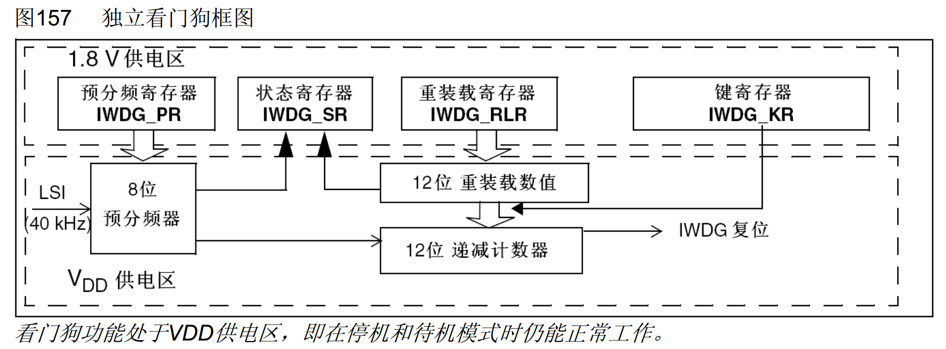
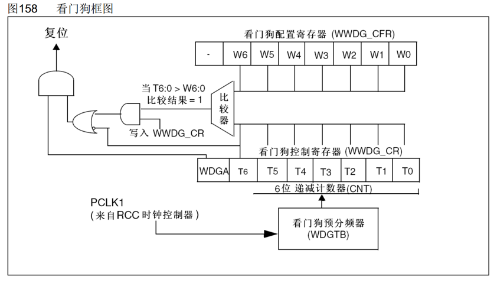
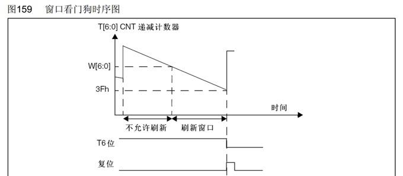
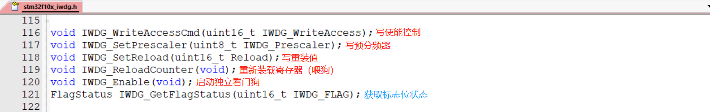
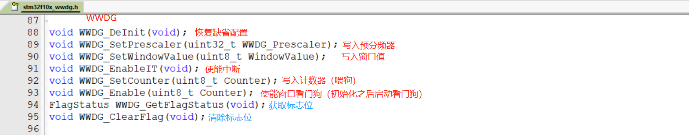

# STM32 WDG

---

## 1. WDG 简介

WDG（Watchdog）看门狗是嵌入式系统中重要的安全机制，用于监控程序的运行状态。当程序因为设计漏洞、硬件故障、电磁干扰等原因，出现卡死或跑飞现象时，看门狗能及时复位程序，避免程序陷入长时间的罢工状态，保证系统的可靠性和安全性。

### 1.1 看门狗工作原理

看门狗本质上是一个定时器，当指定时间范围内，程序没有执行喂狗（重置计数器）操作时，看门狗硬件电路就自动产生复位信号。

### 1.2 STM32内置看门狗

STM32内置两个看门狗，各有不同的特点和应用场景：

| 看门狗类型 | 特点 | 适用场景 |
|-----------|------|----------|
| **IWDG（独立看门狗）** | 独立工作，对时间精度要求较低 | 适用于主程序监控，需要独立运行 |
| **WWDG（窗口看门狗）** | 要求看门狗在精确计时窗口起作用 | 适用于对时序要求严格的场景 |

---

## 2. IWDG 独立看门狗

### 2.1 IWDG 概述

独立看门狗（Independent Watchdog，IWDG）使用LSI（低速内部振荡器，40kHz）作为时钟源，独立于主时钟工作，即使在主时钟停止时也能正常工作。

### 2.2 IWDG 框图



### 2.3 IWDG 键寄存器

键寄存器本质上是控制寄存器，用于控制硬件电路的工作。在可能存在干扰的情况下，一般通过在整个键寄存器写入特定值来代替控制寄存器写入一位的功能，以降低硬件电路受到干扰的概率。

| 写入值 | 作用 |
|--------|------|
| 0xCCCC | 启用独立看门狗 |
| 0xAAAA | IWDG_RLR中的值重新加载到计数器（喂狗） |
| 0x5555 | 解除IWDG_PR和IWDG_RLR的写保护 |
| 0x5555之外的其他值 | 启用IWDG_PR和IWDG_RLR的写保护 |

### 2.4 IWDG 超时时间计算

超时时间计算公式：

```
TIWDG = TLSI × PR预分频系数 × (RL + 1)
```

其中：TLSI = 1 / FLSI = 1 / 40kHz = 25μs

**看门狗超时时间表（40kHz输入时钟）：**

| 预分频系数 | PR[2:0]位 | 最短时间(ms)<br>RL=0x000 | 最长时间(ms)<br>RL=0xFFF |
|-----------|-----------|----------------------|----------------------|
| /4 | 0 | 0.1 | 409.6 |
| /8 | 1 | 0.2 | 819.2 |
| /16 | 2 | 0.4 | 1638.4 |
| /32 | 3 | 0.8 | 3276.8 |
| /64 | 4 | 1.6 | 6553.6 |
| /128 | 5 | 3.2 | 13107.2 |
| /256 | 6或7 | 6.4 | 26214.4 |

### 2.5 IWDG 特点

- **时钟源**：LSI（40kHz）
- **预分频系数**：4、8、32、64、128、256
- **计数器**：12位递减计数器
- **超时时间**：0.1ms - 26214.4ms
- **喂狗方式**：写入键寄存器（0xAAAA），重装固定值RLR
- **防误操作**：键寄存器和写保护机制

---

## 3. WWDG 窗口看门狗

### 3.1 WWDG 概述

窗口看门狗（Window Watchdog，WWDG）使用APB1总线时钟（PCLK1），要求在精确的时间窗口内进行喂狗操作，既能检测程序运行过慢，也能检测程序运行过快。

### 3.2 WWDG 框图



### 3.3 WWDG 工作特性

WWDG具有以下复位条件：

1. **计数器下溢**：递减计数器T[6:0]的值小于0x40时，WWDG产生复位
2. **过早喂狗**：递减计数器T[6:0]在窗口W[6:0]外被重新装载时，WWDG产生复位
3. **早期唤醒**：递减计数器T[6:0]等于0x40时可以产生早期唤醒中断（EWI），用于重装载计数器以避免WWDG复位

### 3.4 WWDG 时序图



从时序图可以看出：
- 计数器从设定的初始值开始递减
- 必须在窗口值（W[6:0]）和0x40之间的时间范围内喂狗
- 过早（在窗口之前）或过晚（在0x40之后）喂狗都会触发复位

### 3.5 WWDG 超时时间计算

**超时时间计算公式：**

```
TWWDG = TPCLK1 × 4096 × WDGTB预分频系数 × (T[5:0] + 1)
```

**窗口时间计算公式：**

```
TWIN = TPCLK1 × 4096 × WDGTB预分频系数 × (T[5:0] - W[5:0])
```

其中：TPCLK1 = 1 / FPCLK1

**在PCLK1=36MHz时的最小-最大超时值：**

| WDGTB | 预分频系数 | 最小超时值 | 最大超时值 |
|-------|-----------|-----------|-----------|
| 0 | 1 | 113μs | 7.28ms |
| 1 | 2 | 227μs | 14.56ms |
| 2 | 4 | 455μs | 29.12ms |
| 3 | 8 | 910μs | 58.25ms |

### 3.6 WWDG 特点

- **时钟源**：PCLK1（36MHz）
- **预分频系数**：1、2、4、8
- **计数器**：7位递减计数器（T[6:0]，有效计数位为T[5:0]）
- **超时时间**：113μs - 58.25ms
- **喂狗方式**：直接写入计数器，写多少重装多少
- **中断支持**：早期唤醒中断（EWI）
- **防误操作**：窗口机制

---

## 4. IWDG 与 WWDG 对比

| 特性 | IWDG 独立看门狗 | WWDG 窗口看门狗 |
|------|---------------|---------------|
| **复位条件** | 计数器减到0后 | 计数器T[5:0]减到0后、过早重装计数器 |
| **中断** | 无 | 早期唤醒中断（EWI） |
| **时钟源** | LSI（40kHz） | PCLK1（36MHz） |
| **预分频系数** | 4、8、32、64、128、256 | 1、2、4、8 |
| **计数器** | 12位 | 6位（有效计数T[5:0]） |
| **超时时间** | 0.1ms - 26214.4ms | 113μs - 58.25ms |
| **喂狗方式** | 写入键寄存器，重装固定值RLR | 直接写入计数器，写多少重装多少 |
| **防误操作** | 键寄存器和写保护 | 窗口机制 |
| **用途** | 独立工作，对时间精度要求较低 | 要求看门狗在精确计时窗口起作用 |

---

## 5. IWDG 相关函数



### 5.1 初始化与控制函数

| 函数名称 | 功能说明 |
|---------|----------|
| IWDG_WriteAccessCmd() | 启用或禁用对IWDG_PR和IWDG_RLR的写保护 |
| IWDG_SetPrescaler() | 设置IWDG预分频系数 |
| IWDG_SetReload() | 设置IWDG重装载值 |
| IWDG_ReloadCounter() | 重装载IWDG计数器（喂狗） |
| IWDG_Enable() | 使能IWDG |

### 5.2 状态函数

| 函数名称 | 功能说明 |
|---------|----------|
| IWDG_GetFlagStatus() | 获取IWDG标志位状态 |
| IWDG_ReloadCounter() | 也可以清除RVU和PVU标志位 |

---

## 6. WWDG 相关函数



### 6.1 初始化与控制函数

| 函数名称 | 功能说明 |
|---------|----------|
| WWDG_DeInit() | 将WWDG寄存器重置为默认值 |
| WWDG_SetPrescaler() | 设置WWDG预分频系数 |
| WWDG_SetWindowValue() | 设置WWDG窗口值 |
| WWDG_EnableIT() | 使能WWDG早期唤醒中断 |
| WWDG_SetCounter() | 设置WWDG计数器值 |
| WWDG_Enable() | 使能WWDG |

### 6.2 状态函数

| 函数名称 | 功能说明 |
|---------|----------|
| WWDG_GetFlagStatus() | 获取WWDG标志位状态 |
| WWDG_ClearFlag() | 清除WWDG标志位 |
| WWDG_GetEarlyWakeupOutputStatus() | 获取早期唤醒输出状态 |

---

## 7. IWDG 配置步骤

### 7.1 基本配置流程

1. **解除写保护**：调用`IWDG_WriteAccessCmd(IWDG_WriteAccess_Enable)`
2. **设置预分频系数**：调用`IWDG_SetPrescaler()`设置预分频系数
3. **设置重装载值**：调用`IWDG_SetReload()`设置RLR值
4. **喂狗**：调用`IWDG_ReloadCounter()`重载计数器
5. **使能看门狗**：调用`IWDG_Enable()`使能看门狗
6. **定期喂狗**：在主程序中定期调用`IWDG_ReloadCounter()`

---

## 8. WWDG 配置步骤

### 8.1 基本配置流程

1. **使能时钟**：调用`RCC_APB1PeriphClockCmd(RCC_APB1Periph_WWDG, ENABLE)`
2. **设置预分频系数**：调用`WWDG_SetPrescaler()`设置预分频系数
3. **设置窗口值**：调用`WWDG_SetWindowValue()`设置窗口值
4. **使能中断（可选）**：调用`WWDG_EnableIT()`使能早期唤醒中断
5. **设置计数器值**：调用`WWDG_SetCounter()`设置初始计数器值
6. **使能看门狗**：调用`WWDG_Enable()`使能看门狗
7. **定期喂狗**：在主程序中定期调用`WWDG_SetCounter()`重载计数器

---

## 9. 示例代码

### 9.1 IWDG 配置示例

```c
// IWDG初始化函数
void IWDG_Init_Config(void)
{
    // 解除PR和RLR的写保护
    IWDG_WriteAccessCmd(IWDG_WriteAccess_Enable);

    // 设置预分频系数为64
    IWDG_SetPrescaler(IWDG_Prescaler_64);

    // 设置重装载值，超时时间约1秒
    // T = 25us × 64 × (625 + 1) = 1s
    IWDG_SetReload(625);

    // 重载计数器
    IWDG_ReloadCounter();

    // 使能看门狗
    IWDG_Enable();
}

// IWDG喂狗函数
void IWDG_Feed(void)
{
    IWDG_ReloadCounter();
}

// 主循环中使用
int main(void)
{
    IWDG_Init_Config();

    while(1)
    {
        // 主程序代码
        Do_Something();

        // 定期喂狗（必须在超时时间内）
        IWDG_Feed();

        Delay_ms(100);
    }
}
```

### 9.2 WWDG 配置示例

```c
// WWDG初始化函数
void WWDG_Init_Config(void)
{
    // 使能WWDG时钟
    RCC_APB1PeriphClockCmd(RCC_APB1Periph_WWDG, ENABLE);

    // 设置预分频系数为8
    WWDG_SetPrescaler(WWDG_Prescaler_8);

    // 设置窗口值为0x50（必须在0x40-0x7F之间）
    WWDG_SetWindowValue(0x50);

    // 使能早期唤醒中断（可选）
    WWDG_EnableIT();

    // 设置计数器初始值为0x7F
    WWDG_SetCounter(0x7F);

    // 使能看门狗
    WWDG_Enable();
}

// WWDG喂狗函数
void WWDG_Feed(void)
{
    // 喂狗值必须在窗口值和0x40之间
    WWDG_SetCounter(0x7F);
}

// 早期唤醒中断处理函数（可选）
void WWDG_IRQHandler(void)
{
    // 清除标志位
    WWDG_ClearFlag(WWDG_FLAG_EWIF);

    // 可以在此处进行紧急喂狗或其他处理
    WWDG_SetCounter(0x7F);
}

// 主循环中使用
int main(void)
{
    WWDG_Init_Config();

    // 配置NVIC中断（如果使用了早期唤醒中断）
    NVIC_InitTypeDef NVIC_InitStructure;
    NVIC_InitStructure.NVIC_IRQChannel = WWDG_IRQn;
    NVIC_InitStructure.NVIC_IRQChannelPreemptionPriority = 0;
    NVIC_InitStructure.NVIC_IRQChannelSubPriority = 0;
    NVIC_InitStructure.NVIC_IRQChannelCmd = ENABLE;
    NVIC_Init(&NVIC_InitStructure);

    while(1)
    {
        // 主程序代码
        Do_Something();

        // 定期喂狗（必须在窗口内）
        WWDG_Feed();

        Delay_ms(10);
    }
}
```

### 9.3 计算超时时间示例

```c
// IWDG超时时间计算
// 目标超时时间：1秒
// 公式：T = TLSI × PR × (RL + 1)
// 其中 TLSI = 25us (1/40kHz)

void IWDG_Calc_Example(void)
{
    // 选择预分频系数为64
    IWDG_SetPrescaler(IWDG_Prescaler_64);

    // 计算RL值：RL = T / (TLSI × PR) - 1
    // RL = 1000ms / (0.025ms × 64) - 1 = 625 - 1 = 624
    // 为了方便计算，取整为625，实际时间约为1.006秒
    IWDG_SetReload(625);
}

// WWDG超时时间计算
// 目标超时时间：10ms（PCLK1 = 36MHz）
// 公式：T = TPCLK1 × 4096 × WDGTB × (T[5:0] + 1)
// 其中 TPCLK1 = 1/36000000 ≈ 0.0278us

void WWDG_Calc_Example(void)
{
    // 选择预分频系数为8 (WDGTB = 3)
    WWDG_SetPrescaler(WWDG_Prescaler_8);

    // 计算T[5:0]值
    // 10000us = 0.0278us × 4096 × 8 × (T[5:0] + 1)
    // T[5:0] + 1 ≈ 10000 / (0.0278 × 4096 × 8) ≈ 11
    // T[5:0] ≈ 10
    WWDG_SetCounter(0x7F);  // 设置初始值

    // 设置窗口值，例如0x60
    // 实际喂狗窗口时间：TWIN = 0.0278 × 4096 × 8 × (127 - 96) ≈ 2.8ms
    WWDG_SetWindowValue(0x60);
}
```

---

## 10. 应用场景

### 10.1 IWDG 典型应用

- **主程序监控**：监控主循环是否正常运行
- **死锁检测**：检测程序是否进入死锁状态
- **硬件故障恢复**：在硬件故障导致程序卡死时自动复位
- **恶劣环境运行**：在电磁干扰等恶劣环境下保证系统可靠性

### 10.2 WWDG 典型应用

- **时序精确控制**：需要精确控制程序执行时间的场景
- **程序过快检测**：检测程序是否运行过快（可能跳过了关键代码）
- **通信协议监控**：确保通信协议按时执行
- **实时系统**：要求严格时序控制的实时系统

---

## 11. 注意事项

### 11.1 IWDG 注意事项

1. **LSI时钟精度**：LSI时钟精度较低（约±40%），如果需要精确时间，请使用WWDG
2. **喂狗时间**：必须在超时时间内喂狗，否则会导致系统复位
3. **写保护**：配置PR和RLR前必须先解除写保护
4. **独立运行**：IWDG独立于主时钟，即使在调试模式下也会继续运行

### 11.2 WWDG 注意事项

1. **窗口范围**：窗口值必须大于0x40，小于等于计数器初始值
2. **喂狗时机**：必须在窗口范围内喂狗，过早或过晚都会导致复位
3. **时钟使能**：使用前必须先使能WWDG时钟
4. **早期唤醒**：利用早期唤醒中断可以在计数器到达0x40之前进行喂狗

---

## 12. 总结

看门狗（WDG）是STM32中重要的安全监控机制，具有以下特点：

- **IWDG独立看门狗**：使用LSI时钟，独立运行，适用于主程序监控
- **WWDG窗口看门狗**：使用APB1时钟，具有窗口机制，适用于精确时序控制
- **安全保障**：在程序异常时自动复位系统，保证系统可靠性
- **灵活配置**：可根据应用需求选择合适的看门狗类型和参数

掌握看门狗的配置和使用方法，对于提高嵌入式系统的可靠性非常重要。通过本文档的学习，希望读者能够熟练掌握IWDG和WWDG的使用技巧，为项目开发提供可靠的安全保障。
