# STM32 入门指南

---

## 目录

- [1. STM32 简介](#1-stm32-简介)
- [2. STM32 引脚图](#2-stm32-引脚图)
- [3. 基础外设](#3-基础外设)
  - [3.1 GPIO 通用输入输出](#31-gpio-通用输入输出)
  - [3.2 RCC 复位和时钟控制](#32-rcc-复位和时钟控制)
  - [3.3 NVIC 嵌套向量中断控制器](#33-nvic-嵌套向量中断控制器)
  - [3.4 EXTI 外部中断](#34-exti-外部中断)
- [4. 通信外设](#4-通信外设)
  - [4.1 USART 串行通信](#41-usart-串行通信)
  - [4.2 SPI 串行外设接口](#42-spi-串行外设接口)
  - [4.3 I2C 总线](#43-i2c-总线)
- [5. 功能外设](#5-功能外设)
  - [5.1 Timer 定时器](#51-timer-定时器)
  - [5.2 ADC 模数转换器](#52-adc-模数转换器)
  - [5.3 DMA 直接存储器访问](#53-dma-直接存储器访问)
- [6. 系统外设](#6-系统外设)
  - [6.1 RTC 实时时钟 & BKP 备份寄存器](#61-rtc-实时时钟--bkp-备份寄存器)
  - [6.2 PWR 电源控制](#62-pwr-电源控制)
  - [6.3 WDG 看门狗](#63-wdg-看门狗)
  - [6.4 FLASH 闪存](#64-flash-闪存)
- [7. 开发建议](#7-开发建议)

---

## 1. STM32 简介

STM32是意法半导体（ST）推出的基于ARM Cortex-M内核的32位微控制器系列，广泛应用于工业控制、消费电子、汽车电子等领域。

### 1.1 STM32F1系列特点

- **内核**：ARM Cortex-M3/M4内核
- **主频**：最高72MHz
- **Flash容量**：16KB~1MB
- **SRAM容量**：6KB~96KB
- **外设丰富**：GPIO、USART、SPI、I2C、ADC、DAC、定时器等
- **低功耗**：支持多种低功耗模式

### 1.2 STM32F103C8T6 常用参数

| 参数 | 数值 |
|------|------|
| Flash | 64KB |
| SRAM | 20KB |
| 主频 | 72MHz |
| GPIO | 37个 |
| USART | 3个 |
| SPI | 2个 |
| I2C | 2个 |
| ADC | 2个（12位） |
| 定时器 | 7个（通用、高级、基本） |

---

## 2. STM32 引脚图

STM32F103C8T6是48引脚的LQFP封装芯片，引脚分布如下：

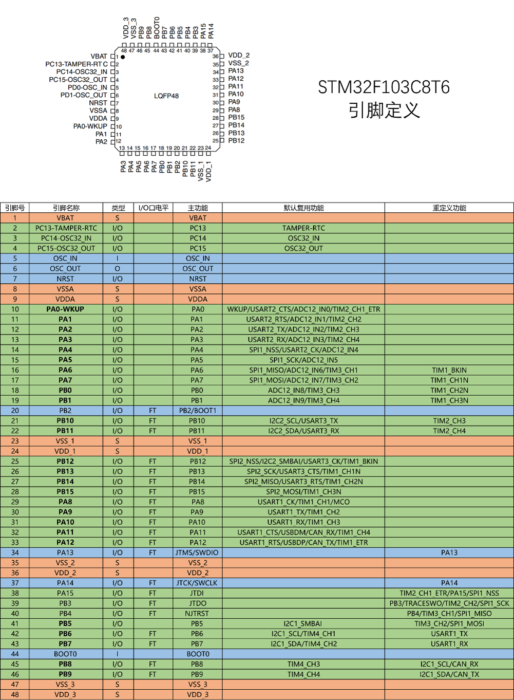

### 2.1 引脚分类

| 类型 | 引脚数 | 说明 |
|------|--------|------|
| GPIO | 37 | 通用输入输出口 |
| 电源 | 6 | VDD、VSS、VDDA、VSSA、VREF+、VREF- |
| 复位 | 1 | NRST |
| 晶振 | 4 | OSC_IN、OSC_OUT、OSC32_IN、OSC32_OUT |
| 启动配置 | 2 | BOOT0、BOOT1 |
| 备份电源 | 1 | VBAT |

### 2.2 GPIO端口分布

| 端口 | 引脚数 | 引脚范围 |
|------|--------|----------|
| GPIOA | 16 | PA0~PA15 |
| GPIOB | 16 | PB0~PB15 |
| GPIOC | 3 | PC13~PC15（部分复用功能引脚未引出） |

---

## 3. 基础外设

### 3.1 GPIO 通用输入输出

GPIO（General Purpose Input Output）是STM32最基本、最常用的外设。

#### 3.1.1 GPIO 工作模式

**输入模式：**
| 模式 | 说明 | 应用场景 |
|------|------|----------|
| AIN | 模拟输入 | ADC采集 |
| IN_FLOATING | 浮空输入 | 外部信号输入 |
| IPD | 下拉输入 | 默认低电平 |
| IPU | 上拉输入 | 默认高电平，如按键 |

**输出模式：**
| 模式 | 说明 | 应用场景 |
|------|------|----------|
| Out_OD | 开漏输出 | I2C通信 |
| Out_PP | 推挽输出 | LED驱动 |
| AF_OD | 复用开漏 | I2C通信 |
| AF_PP | 复用推挽 | UART、SPI通信 |

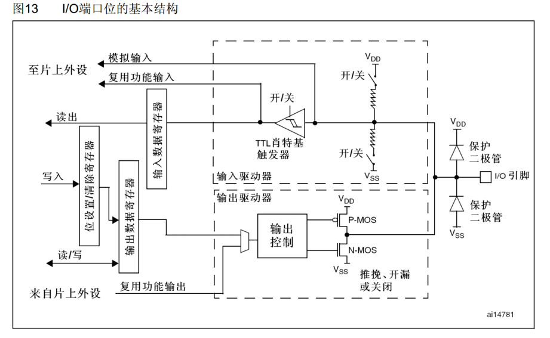

#### 3.1.2 GPIO 配置步骤

1. 使能GPIO时钟
2. 配置GPIO模式、速度等参数
3. 控制GPIO输出或读取GPIO输入

#### 3.1.3 GPIO 示例代码

```c
// LED初始化（PC13）
void LED_Init(void)
{
    GPIO_InitTypeDef GPIO_InitStructure;
    RCC_APB2PeriphClockCmd(RCC_APB2Periph_GPIOC, ENABLE);
    GPIO_InitStructure.GPIO_Pin = GPIO_Pin_13;
    GPIO_InitStructure.GPIO_Mode = GPIO_Mode_Out_PP;
    GPIO_InitStructure.GPIO_Speed = GPIO_Speed_50MHz;
    GPIO_Init(GPIOC, &GPIO_InitStructure);
    GPIO_SetBits(GPIOC, GPIO_Pin_13);
}
```

---

### 3.2 RCC 复位和时钟控制

RCC（Reset and Clock Control）负责管理和控制整个系统的时钟。

#### 3.2.1 时钟源

| 时钟源 | 频率 | 特点 | 应用场景 |
|-------|------|------|----------|
| HSI | 8MHz | 内部时钟，精度不高 | 系统启动、备用时钟 |
| HSE | 4-16MHz | 外部晶体，精度高 | 系统主时钟 |
| LSI | 40kHz | 内部低速 | 看门狗时钟 |
| LSE | 32.768kHz | 外部低速晶体 | RTC时钟 |

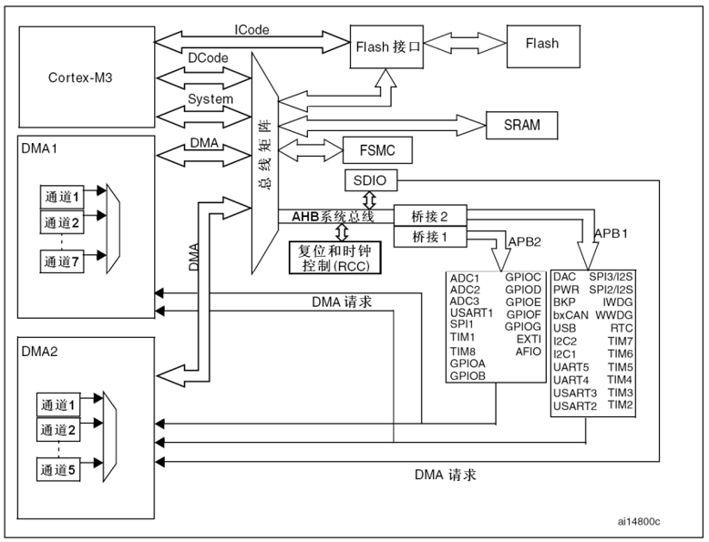

#### 3.2.2 时钟分配

| 时钟类型 | 最高频率 | 说明 |
|---------|----------|------|
| SYSCLK | 72MHz | 系统时钟 |
| HCLK | 72MHz | AHB总线时钟 |
| PCLK1 | 36MHz | APB1总线时钟 |
| PCLK2 | 72MHz | APB2总线时钟 |
| ADCCLK | 14MHz | ADC时钟 |

#### 3.2.3 RCC 配置示例

```c
// 系统时钟配置为72MHz
void SystemClock_Config(void)
{
    RCC_HSEConfig(RCC_HSE_ON);
    while(RCC_GetFlagStatus(RCC_FLAG_HSERDY) == RESET);

    RCC_PLLConfig(RCC_PLLSource_HSE_Div1, RCC_PLLMul_9);
    RCC_PLLCmd(ENABLE);
    while(RCC_GetFlagStatus(RCC_FLAG_PLLRDY) == RESET);

    RCC_SYSCLKConfig(RCC_SYSCLKSource_PLLCLK);
    while(RCC_GetSYSCLKSource() != 0x08);

    RCC_HCLKConfig(RCC_SYSCLK_Div1);
    RCC_PCLK1Config(RCC_HCLK_Div2);
    RCC_PCLK2Config(RCC_HCLK_Div1);
}
```

---

### 3.3 NVIC 嵌套向量中断控制器

NVIC（Nested Vectored Interrupt Controller）是ARM Cortex-M内核的重要组成部分。

#### 3.3.1 中断优先级

STM32支持16级可编程中断优先级，分为：
- **抢占优先级**：高优先级可以打断低优先级
- **响应优先级**：抢占优先级相同时，响应优先级高的先执行

| 分组方式 | 抢占优先级 | 响应优先级 |
|---------|----------|----------|
| 分组0 | 0位 | 4位 |
| 分组1 | 1位 | 3位 |
| 分组2 | 2位 | 2位 |
| 分组3 | 3位 | 1位 |
| 分组4 | 4位 | 0位 |


#### 3.3.2 NVIC 配置示例

```c
// 配置NVIC优先级分组和中断
void NVIC_Config(void)
{
    NVIC_InitTypeDef NVIC_InitStructure;

    NVIC_PriorityGroupConfig(NVIC_PriorityGroup_2); // 抢占2位，响应2位

    NVIC_InitStructure.NVIC_IRQChannel = TIM3_IRQn;
    NVIC_InitStructure.NVIC_IRQChannelPreemptionPriority = 0;
    NVIC_InitStructure.NVIC_IRQChannelSubPriority = 1;
    NVIC_InitStructure.NVIC_IRQChannelCmd = ENABLE;
    NVIC_Init(&NVIC_InitStructure);
}
```

---

### 3.4 EXTI 外部中断

EXTI（External Interrupt）用于检测外部信号变化。

#### 3.4.1 EXTI 功能特点

- **触发方式**：上升沿、下降沿、双边沿
- **通道数**：16个GPIO通道
- **响应方式**：中断响应和事件响应

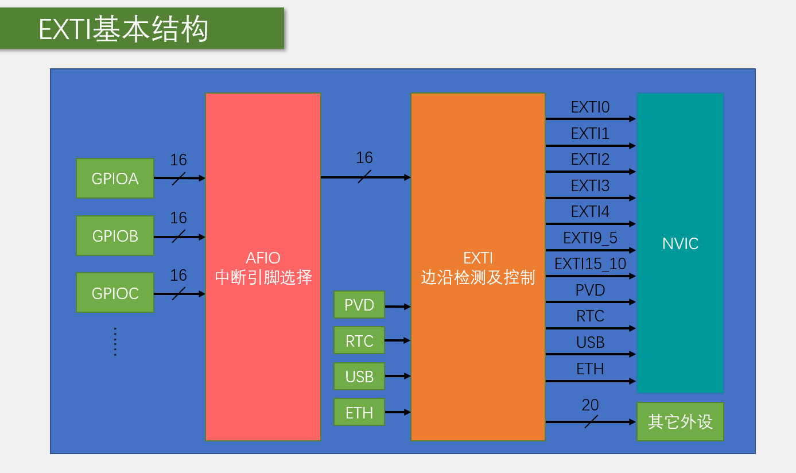

#### 3.4.2 EXTI 配置步骤

1. 使能GPIO和AFIO时钟
2. 配置GPIO为输入模式
3. 配置EXTI线映射
4. 配置EXTI中断触发方式
5. 配置NVIC中断优先级
6. 编写中断服务函数

#### 3.4.3 EXTI 配置示例

```c
// 外部中断配置（PA0）
void EXTI_Config(void)
{
    EXTI_InitTypeDef EXTI_InitStructure;

    RCC_APB2PeriphClockCmd(RCC_APB2Periph_GPIOA | RCC_APB2Periph_AFIO, ENABLE);

    GPIO_EXTILineConfig(GPIO_PortSourceGPIOA, GPIO_PinSource0);

    EXTI_InitStructure.EXTI_Line = EXTI_Line0;
    EXTI_InitStructure.EXTI_Mode = EXTI_Mode_Interrupt;
    EXTI_InitStructure.EXTI_Trigger = EXTI_Trigger_Falling;
    EXTI_InitStructure.EXTI_LineCmd = ENABLE;
    EXTI_Init(&EXTI_InitStructure);
}
```

---

## 4. 通信外设

### 4.1 USART 串行通信

USART（Universal Synchronous/Asynchronous Receiver/Transmitter）用于实现串行通信。

#### 4.1.1 USART 特点

- **波特率**：最高4.5Mbits/s
- **数据格式**：8/9位数据位，0.5/1/1.5/2位停止位
- **校验位**：无校验/奇校验/偶校验
- **通信模式**：全双工/半双工

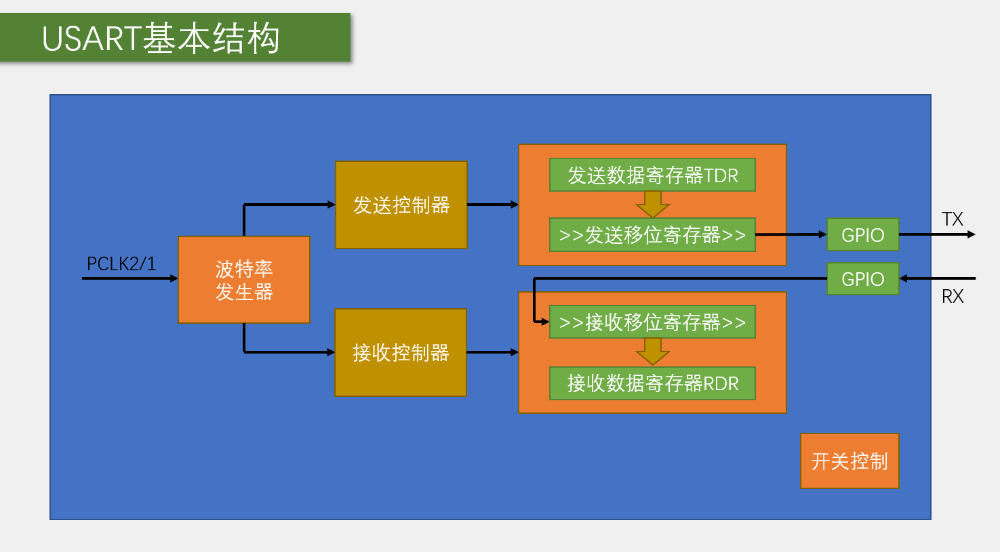

#### 4.1.2 通信接口对比

| 名称 | 引脚 | 时钟 | 电平 | 双工 |
|------|------|------|------|------|
| USART | TX、RX | 异步 | 单端 | 全双工 |
| I2C | SCL、SDA | 同步 | 单端 | 半双工 |
| SPI | SCLK、MOSI、MISO、CS | 同步 | 单端 | 全双工 |

#### 4.1.3 USART 配置示例

```c
// USART1初始化
void USART1_Init(uint32_t baudrate)
{
    GPIO_InitTypeDef GPIO_InitStructure;
    USART_InitTypeDef USART_InitStructure;

    RCC_APB2PeriphClockCmd(RCC_APB2Periph_USART1 | RCC_APB2Periph_GPIOA, ENABLE);

    GPIO_InitStructure.GPIO_Pin = GPIO_Pin_9;
    GPIO_InitStructure.GPIO_Mode = GPIO_Mode_AF_PP;
    GPIO_InitStructure.GPIO_Speed = GPIO_Speed_50MHz;
    GPIO_Init(GPIOA, &GPIO_InitStructure);

    USART_InitStructure.USART_BaudRate = baudrate;
    USART_InitStructure.USART_WordLength = USART_WordLength_8b;
    USART_InitStructure.USART_StopBits = USART_StopBits_1;
    USART_InitStructure.USART_Parity = USART_Parity_No;
    USART_InitStructure.USART_HardwareFlowControl = USART_HardwareFlowControl_None;
    USART_InitStructure.USART_Mode = USART_Mode_Tx | USART_Mode_Rx;
    USART_Init(USART1, &USART_InitStructure);

    USART_Cmd(USART1, ENABLE);
}
```

---

### 4.2 SPI 串行外设接口

SPI（Serial Peripheral Interface）是一种高速同步串行通信接口。

#### 4.2.1 SPI 特点

- **通信方式**：全双工同步通信
- **时钟频率**：最高18MHz
- **传输模式**：4种时钟极性和相位组合
- **设备数量**：主机+多个从机

#### 4.2.2 SPI 模式

| 模式 | CPOL | CPHA | 说明 |
|------|------|------|------|
| 模式0 | 0 | 0 | 空闲低电平，第一个边沿采样 |
| 模式1 | 0 | 1 | 空闲低电平，第二个边沿采样 |
| 模式2 | 1 | 0 | 空闲高电平，第一个边沿采样 |
| 模式3 | 1 | 1 | 空闲高电平，第二个边沿采样 |

#### 4.2.3 SPI 配置示例

```c
// SPI初始化
void SPI1_Init(void)
{
    GPIO_InitTypeDef GPIO_InitStructure;
    SPI_InitTypeDef SPI_InitStructure;

    RCC_APB2PeriphClockCmd(RCC_APB2Periph_SPI1 | RCC_APB2Periph_GPIOA, ENABLE);

    // 配置SPI引脚
    GPIO_InitStructure.GPIO_Pin = GPIO_Pin_5 | GPIO_Pin_6 | GPIO_Pin_7;
    GPIO_InitStructure.GPIO_Mode = GPIO_Mode_AF_PP;
    GPIO_InitStructure.GPIO_Speed = GPIO_Speed_50MHz;
    GPIO_Init(GPIOA, &GPIO_InitStructure);

    SPI_InitStructure.SPI_Direction = SPI_Direction_2Lines_FullDuplex;
    SPI_InitStructure.SPI_Mode = SPI_Mode_Master;
    SPI_InitStructure.SPI_DataSize = SPI_DataSize_8b;
    SPI_InitStructure.SPI_CPOL = SPI_CPOL_High;
    SPI_InitStructure.SPI_CPHA = SPI_CPHA_2Edge;
    SPI_InitStructure.SPI_NSS = SPI_NSS_Soft;
    SPI_InitStructure.SPI_BaudRatePrescaler = SPI_BaudRatePrescaler_16;
    SPI_InitStructure.SPI_FirstBit = SPI_FirstBit_MSB;
    SPI_Init(SPI1, &SPI_InitStructure);

    SPI_Cmd(SPI1, ENABLE);
}
```

---

### 4.3 I2C 总线

I2C（Inter-IC Bus）是两线式串行总线，用于连接低速外设。

#### 4.3.1 I2C 特点

- **通信线路**：SCL（时钟线）、SDA（数据线）
- **设备数量**：支持多主多从
- **通信速率**：标准模式100kHz、快速模式400kHz
- **硬件要求**：开漏输出，上拉电阻

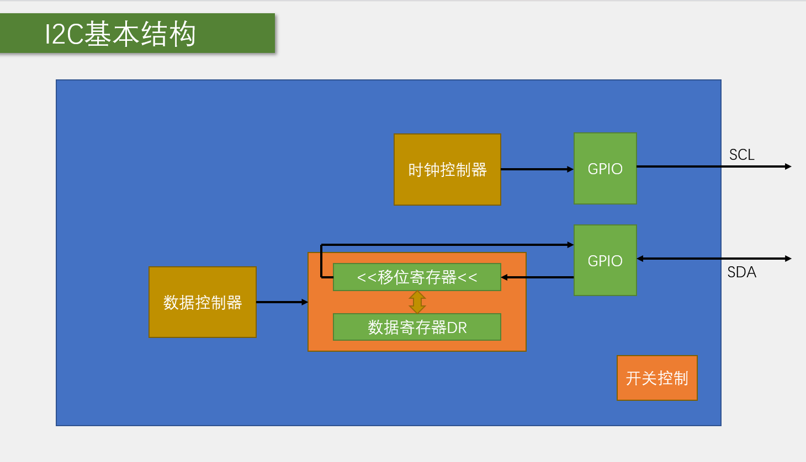

#### 4.3.2 I2C 时序

| 时序单元 | 说明 |
|----------|------|
| 起始条件 | SCL高电平时，SDA从高变低 |
| 停止条件 | SCL高电平时，SDA从低变高 |
| 发送字节 | 8位数据+1位应答 |
| 应答位 | 接收方拉低SDA表示应答 |

#### 4.3.3 I2C 配置示例

```c
// I2C初始化
void I2C1_Init(void)
{
    GPIO_InitTypeDef GPIO_InitStructure;
    I2C_InitTypeDef I2C_InitStructure;

    RCC_APB2PeriphClockCmd(RCC_APB2Periph_GPIOB, ENABLE);
    RCC_APB1PeriphClockCmd(RCC_APB1Periph_I2C1, ENABLE);

    GPIO_InitStructure.GPIO_Pin = GPIO_Pin_6 | GPIO_Pin_7;
    GPIO_InitStructure.GPIO_Mode = GPIO_Mode_AF_OD;
    GPIO_InitStructure.GPIO_Speed = GPIO_Speed_50MHz;
    GPIO_Init(GPIOB, &GPIO_InitStructure);

    I2C_InitStructure.I2C_Mode = I2C_Mode_I2C;
    I2C_InitStructure.I2C_DutyCycle = I2C_DutyCycle_2;
    I2C_InitStructure.I2C_OwnAddress1 = 0;
    I2C_InitStructure.I2C_Ack = I2C_Ack_Enable;
    I2C_InitStructure.I2C_AcknowledgedAddress = I2C_AcknowledgedAddress_7bit;
    I2C_InitStructure.I2C_ClockSpeed = 100000;
    I2C_Init(I2C1, &I2C_InitStructure);

    I2C_Cmd(I2C1, ENABLE);
}
```

---

## 5. 功能外设

### 5.1 Timer 定时器

TIM（Timer）定时器是STM32功能最丰富的外设之一。

#### 5.1.1 定时器类型

| 类型 | 编号 | 总线 | 主要功能 |
|------|------|------|----------|
| 高级定时器 | TIM1、TIM8 | APB2 | 通用功能+死区生成、互补输出、刹车 |
| 通用定时器 | TIM2~TIM5 | APB1 | 定时中断、输入捕获、输出比较、编码器接口 |
| 基本定时器 | TIM6、TIM7 | APB1 | 定时中断、主模式触发DAC |

#### 5.1.2 PWM 输出

PWM（Pulse Width Modulation）脉冲宽度调制：
- **频率**：Freq = CK_PSC / (PSC + 1) / (ARR + 1)
- **占空比**：Duty = CCR / (ARR + 1)

#### 5.1.3 定时器配置示例

```c
// TIM3 PWM初始化
void TIM3_PWM_Init(u16 arr, u16 psc)
{
    GPIO_InitTypeDef GPIO_InitStructure;
    TIM_TimeBaseInitTypeDef TIM_TimeBaseStructure;
    TIM_OCInitTypeDef TIM_OCInitStructure;

    RCC_APB1PeriphClockCmd(RCC_APB1Periph_TIM3, ENABLE);
    RCC_APB2PeriphClockCmd(RCC_APB2Periph_GPIOB, ENABLE);

    GPIO_InitStructure.GPIO_Pin = GPIO_Pin_5;
    GPIO_InitStructure.GPIO_Mode = GPIO_Mode_AF_PP;
    GPIO_InitStructure.GPIO_Speed = GPIO_Speed_50MHz;
    GPIO_Init(GPIOB, &GPIO_InitStructure);

    TIM_TimeBaseStructure.TIM_Period = arr;
    TIM_TimeBaseStructure.TIM_Prescaler = psc;
    TIM_TimeBaseStructure.TIM_ClockDivision = TIM_CKD_DIV1;
    TIM_TimeBaseStructure.TIM_CounterMode = TIM_CounterMode_Up;
    TIM_TimeBaseInit(TIM3, &TIM_TimeBaseStructure);

    TIM_OCInitStructure.TIM_OCMode = TIM_OCMode_PWM1;
    TIM_OCInitStructure.TIM_OutputState = TIM_OutputState_Enable;
    TIM_OCInitStructure.TIM_Pulse = 0;
    TIM_OCInitStructure.TIM_OCPolarity = TIM_OCPolarity_High;
    TIM_OC2Init(TIM3, &TIM_OCInitStructure);

    TIM_Cmd(TIM3, ENABLE);
}
```

---

### 5.2 ADC 模数转换器

ADC（Analog-Digital Converter）用于将模拟信号转换为数字信号。

#### 5.2.1 ADC 特点

- **转换精度**：12位
- **转换时间**：1us
- **输入范围**：0~3.3V
- **输入通道**：18个（16外部+2内部）

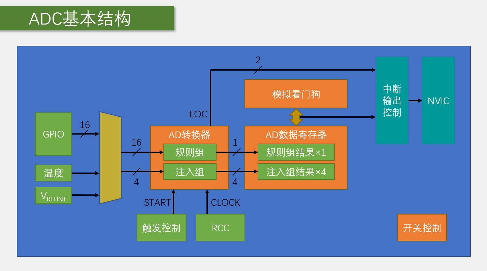

#### 5.2.2 ADC 模式

| 模式 | 说明 |
|------|------|
| 单次转换，非扫描 | 转换一个通道，转换一次后停止 |
| 连续转换，非扫描 | 转换一个通道，连续转换 |
| 单次转换，扫描 | 转换多个通道，转换一次后停止 |
| 连续转换，扫描 | 转换多个通道，连续转换 |

#### 5.2.3 ADC 配置示例

```c
// ADC1初始化
void ADC1_Init(void)
{
    GPIO_InitTypeDef GPIO_InitStructure;
    ADC_InitTypeDef ADC_InitStructure;

    RCC_APB2PeriphClockCmd(RCC_APB2Periph_ADC1 | RCC_APB2Periph_GPIOA, ENABLE);

    GPIO_InitStructure.GPIO_Pin = GPIO_Pin_0;
    GPIO_InitStructure.GPIO_Mode = GPIO_Mode_AIN;
    GPIO_Init(GPIOA, &GPIO_InitStructure);

    ADC_InitStructure.ADC_Mode = ADC_Mode_Independent;
    ADC_InitStructure.ADC_ScanConvMode = DISABLE;
    ADC_InitStructure.ADC_ContinuousConvMode = DISABLE;
    ADC_InitStructure.ADC_ExternalTrigConv = ADC_ExternalTrigConv_None;
    ADC_InitStructure.ADC_DataAlign = ADC_DataAlign_Right;
    ADC_InitStructure.ADC_NbrOfChannel = 1;
    ADC_Init(ADC1, &ADC_InitStructure);

    ADC_RegularChannelConfig(ADC1, ADC_Channel_0, 1, ADC_SampleTime_55Cycles5);
    ADC_Cmd(ADC1, ENABLE);
    ADC_ResetCalibration(ADC1);
    while(ADC_GetResetCalibrationStatus(ADC1));
    ADC_StartCalibration(ADC1);
    while(ADC_GetCalibrationStatus(ADC1));
}
```

---

### 5.3 DMA 直接存储器访问

DMA（Direct Memory Access）可以在没有CPU干预的情况下进行数据传输。

#### 5.3.1 DMA 特点

- **传输方向**：外设到存储器、存储器到外设、存储器到存储器
- **数据宽度**：字节、半字、字
- **传输模式**：正常模式、循环模式
- **优先级**：低、中、高、非常高

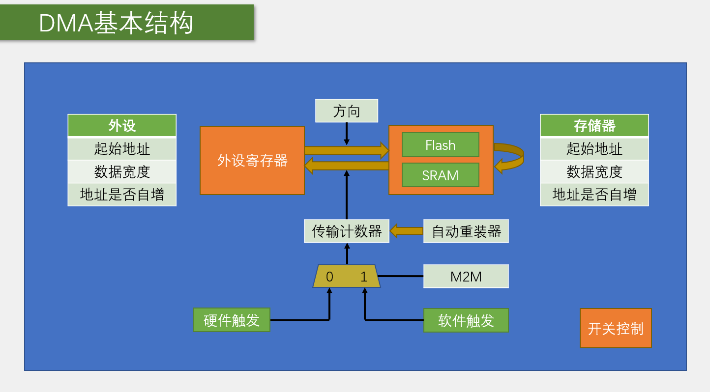

#### 5.3.2 DMA 配置示例

```c
// DMA1通道1配置（用于ADC）
void DMA1_Channel1_Config(void)
{
    DMA_InitTypeDef DMA_InitStructure;

    RCC_AHBPeriphClockCmd(RCC_AHBPeriph_DMA1, ENABLE);

    DMA_DeInit(DMA1_Channel1);
    DMA_InitStructure.DMA_PeripheralBaseAddr = (uint32_t)&(ADC1->DR);
    DMA_InitStructure.DMA_MemoryBaseAddr = (uint32_t)ADC_Value;
    DMA_InitStructure.DMA_DIR = DMA_DIR_PeripheralSRC;
    DMA_InitStructure.DMA_BufferSize = 3;
    DMA_InitStructure.DMA_PeripheralInc = DMA_PeripheralInc_Disable;
    DMA_InitStructure.DMA_MemoryInc = DMA_MemoryInc_Enable;
    DMA_InitStructure.DMA_PeripheralDataSize = DMA_PeripheralDataSize_HalfWord;
    DMA_InitStructure.DMA_MemoryDataSize = DMA_MemoryDataSize_HalfWord;
    DMA_InitStructure.DMA_Mode = DMA_Mode_Circular;
    DMA_InitStructure.DMA_Priority = DMA_Priority_High;
    DMA_InitStructure.DMA_M2M = DMA_M2M_Disable;
    DMA_Init(DMA1_Channel1, &DMA_InitStructure);

    DMA_Cmd(DMA1_Channel1, ENABLE);
}
```

---

## 6. 系统外设

### 6.1 RTC 实时时钟 & BKP 备份寄存器

RTC（Real Time Clock）和 BKP（Backup Registers）用于提供实时时钟和数据备份功能。

#### 6.1.1 RTC 特点

- **时钟源**：LSI（40kHz）或LSE（32.768kHz）
- **计数器**：32位可编程计数器
- **中断**：秒中断、闹钟中断
- **备份电源**：VBAT引脚供电，主电源断电后继续运行

#### 6.1.2 BKP 备份寄存器

- **容量**：42个16位备份寄存器
- **特点**：VBAT供电时数据不丢失
- **用途**：保存重要配置和用户数据

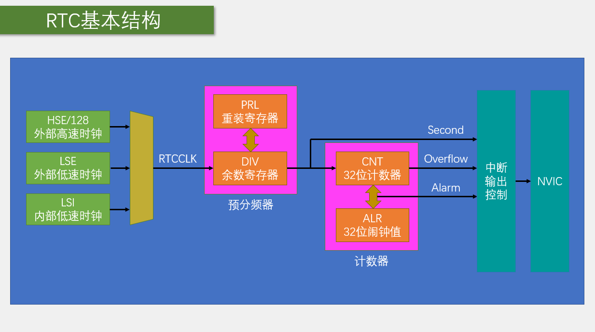

---

### 6.2 PWR 电源控制

PWR（Power Control）负责管理STM32的电源供电。

#### 6.2.1 PWD 功能

- **PVD**：可编程电压监测器
- **低功耗模式**：睡眠、停机、待机三种模式

#### 6.2.2 低功耗模式对比

| 模式 | 功耗 | 唤醒时间 | 保留内容 |
|------|------|----------|----------|
| 睡眠模式 | 中等 | 短 | 全部寄存器和SRAM |
| 停机模式 | 低 | 中等 | SRAM和寄存器 |
| 待机模式 | 最低 | 长 | 仅备份寄存器 |

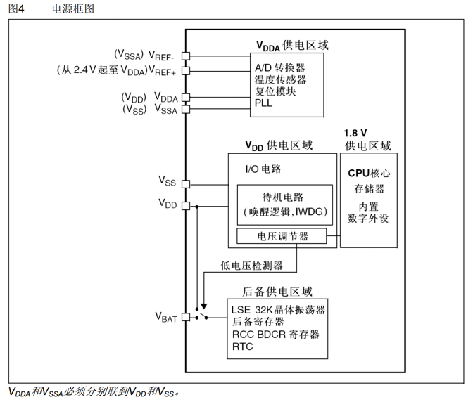

---

### 6.3 WDG 看门狗

WDG（Watchdog）用于监控程序运行状态，程序异常时自动复位。

#### 6.3.1 IWDG 独立看门狗

- **时钟源**：LSI（40kHz）
- **超时时间**：0.1ms~26214.4ms
- **特点**：独立运行，对时间精度要求较低

#### 6.3.2 WWDG 窗口看门狗

- **时钟源**：PCLK1（36MHz）
- **超时时间**：113μs~58.25ms
- **特点**：精确计时窗口，过早或过晚喂狗都会复位

#### 6.3.3 IWDG 配置示例

```c
// IWDG初始化
void IWDG_Init_Config(void)
{
    IWDG_WriteAccessCmd(IWDG_WriteAccess_Enable);
    IWDG_SetPrescaler(IWDG_Prescaler_64);
    IWDG_SetReload(625);
    IWDG_ReloadCounter();
    IWDG_Enable();
}

// IWDG喂狗
void IWDG_Feed(void)
{
    IWDG_ReloadCounter();
}
```

---

### 6.4 FLASH 闪存

FLASH是STM32的程序存储器，也可用于存储用户数据。

#### 6.4.1 FLASH 组成

| 组成部分 | 地址范围 | 大小 | 说明 |
|---------|----------|------|------|
| 程序存储器 | 0x08000000~0x0800FFFF | 64KB | 存放程序代码 |
| 系统存储器 | 0x1FFFF000~0x1FFFF7FF | 2KB | Bootloader |
| 选项字节 | 0x1FFFF800~0x1FFFF80F | 16字节 | 配置选项 |

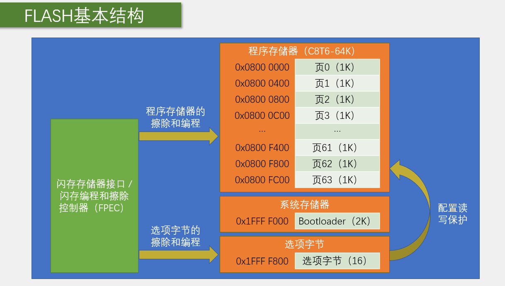

#### 6.4.2 FLASH 编程方式

| 方式 | 说明 | 应用场景 |
|------|------|----------|
| ICP | 在线编程，通过JTAG/SWD下载 | 开发阶段烧录 |
| IAP | 在程序中编程，使用通信接口下载 | OTA远程升级 |

#### 6.4.3 FLASH 操作示例

```c
// 读取FLASH数据
uint16_t FLASH_ReadHalfWord(uint32_t Address)
{
    return *(__IO uint16_t *)Address;
}

// 写入FLASH数据
FLASH_Status FLASH_WriteHalfWord(uint32_t Address, uint16_t Data)
{
    FLASH_Status status = FLASH_COMPLETE;

    FLASH_Unlock();
    status = FLASH_WaitForLastOperation(ProgramTimeout);

    if(status == FLASH_COMPLETE)
    {
        FLASH_ProgramHalfWord(Address, Data);
        status = FLASH_WaitForLastOperation(ProgramTimeout);
    }

    FLASH_Lock();
    return status;
}
```

---

## 7. 开发建议

### 7.1 学习路径建议

1. **第一阶段：基础外设**
   - GPIO：输入输出控制
   - RCC：时钟配置
   - NVIC：中断管理
   - EXTI：外部中断

2. **第二阶段：通信外设**
   - USART：串口通信
   - I2C：I2C总线通信
   - SPI：SPI接口通信

3. **第三阶段：功能外设**
   - Timer：定时中断和PWM
   - ADC：模拟信号采集
   - DMA：数据传输优化

4. **第四阶段：系统外设**
   - RTC/BKP：实时时钟
   - PWR：低功耗设计
   - WDG：看门狗保护
   - FLASH：数据存储

### 7.2 开发技巧

- **善用库函数**：STM32标准外设库提供了丰富的API
- **参考例程**：ST官方例程是最好的学习资料
- **调试技巧**：使用printf调试、逻辑分析仪、示波器
- **模块化编程**：将功能封装成独立模块
- **注释规范**：养成良好的代码注释习惯

### 7.3 常见问题

1. **GPIO不工作**：检查时钟是否使能
2. **中断不触发**：检查NVIC配置和中断标志位
3. **串口乱码**：检查波特率是否匹配
4. **ADC读数不准**：检查参考电压和采样时间
5. **看门狗复位**：检查喂狗时间间隔

---

## 8. 总结

STM32是一款功能强大、外设丰富的32位微控制器，通过系统学习掌握以下内容：

- **基础外设**：GPIO、RCC、NVIC、EXTI
- **通信外设**：USART、SPI、I2C
- **功能外设**：Timer、ADC、DMA
- **系统外设**：RTC/BKP、PWR、WDG、FLASH

掌握这些外设的配置和使用方法，可以满足大部分嵌入式项目的开发需求。通过不断实践和深入学习，你将能够独立完成STM32项目的开发。

祝学习顺利！
