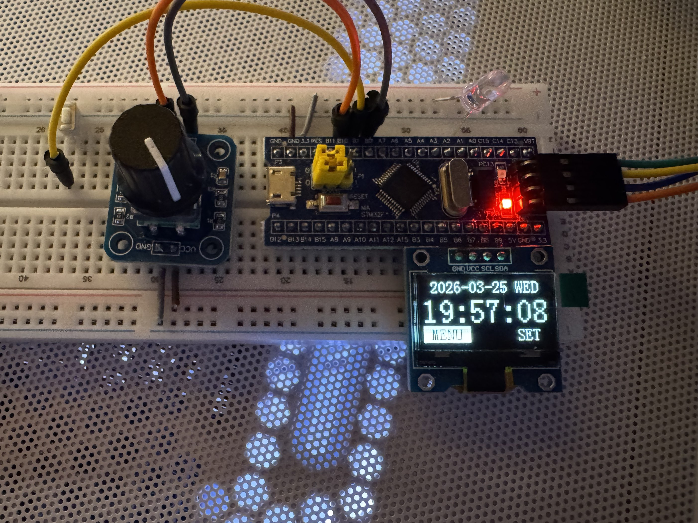
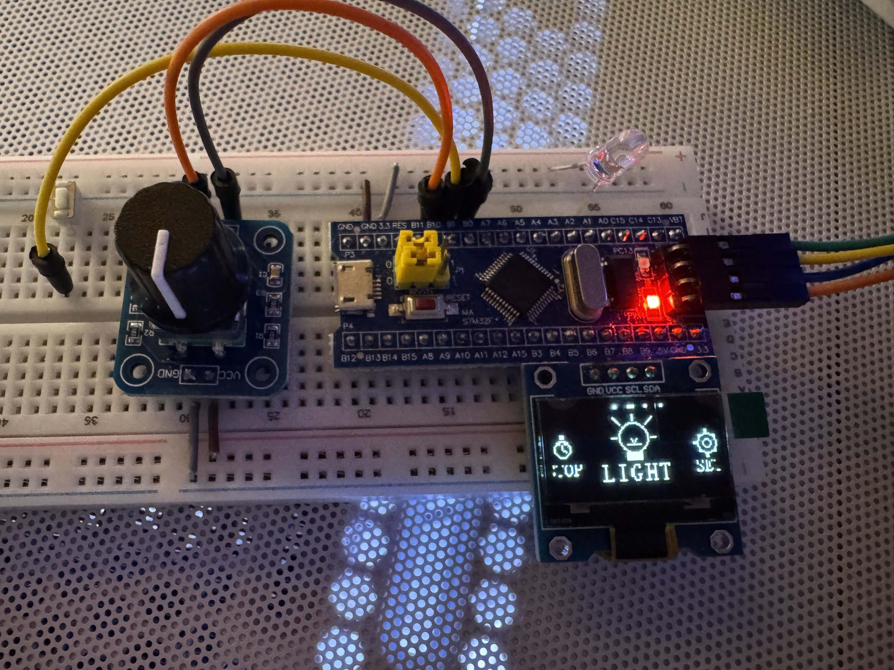

# STM32 Watch

基于 `STM32F103C8`、`SSD1306 128x64 OLED`、旋转编码器和独立按键实现的桌面手表小项目。项目使用 `Keil MDK` 工程组织代码，完成了主页时钟、图标菜单、秒表、LED 手电筒，以及时间/日期设置等功能。

## 项目概览

这个项目围绕一个“小型可交互手表界面”展开，核心目标是把常见的嵌入式基础模块组合起来：

- `OLED` 负责显示主页、菜单和功能页面
- `Encoder + Button` 负责选项切换、进入和确认
- `Timer` 提供毫秒级时间基准
- `RTC` 负责维护年、月、日、时、分、秒和星期
- `Menu` 负责状态机、界面渲染和功能逻辑

当前工程已经实现的主要能力：

- 主页显示日期、星期与大字号时间
- 图标化菜单，支持左右切换与居中高亮
- 秒表功能，支持开始/暂停、复位、返回
- 手电筒功能，控制 `PA1` 外接 LED
- 设置功能，分别支持时间设置和日期设置
- 自动计算星期，支持闰年判断

## 实物与界面展示

### 主页

主页显示日期、星期、当前时间，并在底部提供 `MENU` 与 `SET` 两个入口。



### 菜单

菜单页采用横向图标轮播效果，当前版本包含 `STOP`、`LIGHT`、`SET`、`BACK` 四个菜单项。



## 硬件组成与引脚连接

| 模块 | 引脚 | 说明 |
| --- | --- | --- |
| OLED SCL | `PB8` | 软件 I2C 时钟线 |
| OLED SDA | `PB9` | 软件 I2C 数据线 |
| 编码器 A 相 | `PB0` | 外部中断输入 |
| 编码器 B 相 | `PB10` | 外部中断输入 |
| 独立按键 | `PB1` | 上拉输入，用于确认/选择 |
| LED 手电筒 | `PA1` | 低电平点亮，高电平熄灭 |

硬件实物从图片可以看到，当前搭建方式以面包板原型验证为主，适合做课程设计、模块联调和嵌入式 UI 练习。

## 交互方式

- 旋转编码器顺时针：切换到下一个选项或增加当前字段值
- 旋转编码器逆时针：切换到上一个选项或减小当前字段值
- 独立按键单击：进入菜单、确认选择、切换编辑状态或保存

在设置界面中，先选择字段，再按键进入编辑模式；调整完成后再次按键退出编辑，选中 `SAVE` 后按键保存。

## 功能说明

### 1. 主页时钟

- 顶部显示 `YYYY-MM-DD` 和星期
- 中间显示大字号 `HH:MM:SS`
- 底部显示 `MENU` 和 `SET`

### 2. 图标菜单

`System/Menu.c` 中实现了一个简洁的横向轮播菜单：

- `STOP`：进入秒表
- `LIGHT`：进入手电筒控制
- `SET`：进入设置入口
- `BACK`：返回主页

菜单图标由 OLED 基础绘图函数直接绘制，不依赖位图资源。

### 3. 秒表

- 支持开始和暂停
- 支持清零复位
- 最大显示到 `99:59.99`

### 4. 手电筒

- 通过 `PA1` 控制外接 LED
- 因为采用低电平点亮，所以代码里 `LED_On()` 实际输出为低电平

### 5. 时间与日期设置

设置页分成两部分：

- 时间设置：时、分、秒
- 日期设置：年、月、日

保存日期时会自动重新计算星期，避免日期与星期不一致。

## 软件架构

### 主流程

`User/main.c` 的主循环逻辑比较清晰：

1. 初始化 `OLED`、`Timer`、`Button`、`Encoder`、`LED`、`RTC`
2. 读取毫秒计数，推进软件 RTC
3. 读取编码器步进和按键事件
4. 调用 `Menu_Update()` 更新状态
5. 在需要时调用 `Menu_Render()` 刷新界面

### 关键模块

- `User/main.c`：系统初始化与主循环
- `System/Menu.c`：状态机、菜单动画、页面渲染、秒表逻辑
- `System/RTC.c`：软件 RTC，支持时间推进、日期换算、星期计算、闰年判断
- `System/Timer.c`：基于 `TIM2` 提供毫秒计时
- `Hardware/OLED.c`：软件 I2C 驱动与图形绘制函数
- `Hardware/Encoder.c`：基于外部中断的编码器状态采样
- `Hardware/Button.c`：按键消抖与事件输出
- `Hardware/LED.c`：LED 控制接口

### 状态机

项目当前包含以下主要状态：

- `STATE_HOME`
- `STATE_MENU`
- `STATE_STOPWATCH`
- `STATE_FLASHLIGHT`
- `STATE_TIMESETTING`

其中设置状态内部又细分为设置入口页、时间设置页和日期设置页。

## 目录结构

```text
STM32_Watch/
├── Hardware/       硬件驱动，包含 OLED / Encoder / Button / LED
├── Library/        STM32 标准外设库
├── Start/          启动文件与内核相关文件
├── System/         系统功能模块，包含 Timer / RTC / Menu
├── User/           主函数与中断文件
├── images/         README 展示图片
├── Project.uvprojx Keil 工程文件
└── 设计方案.md      项目设计说明
```

## 编译与烧录

1. 使用 `Keil MDK` 打开根目录下的 `Project.uvprojx`
2. 确认目标芯片为 `STM32F103C8`
3. 按照上表连接 OLED、编码器、按键和 LED
4. 编译工程并下载到开发板
5. 上电后即可通过编码器和按键进行交互

## 使用说明

- 上电后默认进入主页
- 旋转编码器可在主页底部 `MENU` 和 `SET` 间切换
- 按键确认后可进入菜单或设置页
- 在菜单中选择对应功能后按键进入
- 在设置页中完成修改后选择 `SAVE` 保存

## 说明与注意事项

- 当前 `RTC` 是软件维护的时间，并非使用备份域硬件 RTC
- 系统初始化时间来自固件编译时的 `__DATE__` 与 `__TIME__`
- 如果设备断电重启，时间会回到本次固件编译时间，需要重新设置
- `LED` 为低电平点亮，请按实际接线方式连接

## 适合的学习方向

这个项目很适合继续扩展成一个完整的嵌入式综合练习，例如：

- 增加真正的硬件 RTC 与掉电保持
- 增加蜂鸣器、闹钟或倒计时
- 增加电池供电与低功耗模式
- 优化菜单动画和图标设计
- 增加更多可切换页面或传感器信息显示

